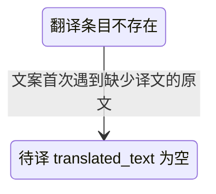

## 一句话价值

为内容人员生成当日职业赛事与场次汇总文案。

## 核心概念

- 职业赛事  从公开数据源采集的 ATP/WTA 赛事，用于赛程、比分和内容展示，不接受本产品用户报名。
- 赛程  职业比赛的日期、时间、场地和对阵安排；与签表结构不是同一份数据。
- 翻译条目  某类业务文本、原文和目标语言组成的一项待译或已译内容。
- 赛事组  比赛日期范围重叠且举办城市相同的一组职业赛事，用于合并呈现同期 ATP、WTA 等赛事。

## 业务对象

### 每日赛程文案

| 业务名称 | 描述 | 取值说明 |
|---|---|---|
| 赛事标题 | 参与展示的不同赛事名称，以全角竖线连接。 | — |
| 赛程摘要 | 由已识别的巡回赛类型和当前日期组成。 | 男子职业巡回赛、女子职业巡回赛，或两者组合。 |
| 日期段 | 按同期赛事组和比赛日期形成的文案段，包含赛事名称、日期及首场可用轮次。 | — |
| 场地段 | 日期段内按比赛场地归组的内容，场地名称优先采用简体中文译名。 | — |
| 比赛行 | 展示对阵球员、排期或状态以及逐盘比分。 | — |
| 比赛轮次 | 日期段首场可展示比赛的轮次。 | 一百二十八强、一百强以内的特殊轮次、六十四强、三十二强、十六强、八强、半决赛或决赛。 |
| 开赛安排 | 比赛的计划开赛口径。 | 固定时间：展示具体时分；随后：上一场结束后开赛；不早于：不得早于指定时间；待定：排期无法识别。 |
| 比赛状态 | 表示比赛当前所处阶段。 | 待开始、待定、进行中或已结束。 |

## 状态机

| 当前状态 | 触发操作 | 新状态 | 前置条件 | 谁能触发 |
|---|---|---|---|---|
| 翻译条目不存在 | 生成文案时登记缺译内容 | 待译 | 赛事名、场地名或球员名没有可用的简体中文译文 | 内容人员，由文案生成带动 |

职业赛事、职业比赛和职业球员状态均不由本服务改变；已有待译或已译条目也不在本服务内推进。

## 主流程

触发源：内容人员 HTTP 请求；终态：返回一份简体中文优先的职业赛事赛程汇总文案。

1. 选出当前日期附近且符合展示级别的职业赛事，并将同期同城赛事归入同一赛事组。
2. 为每个赛事组取得未结束比赛，以及与其处于相同比赛日期的已结束比赛；没有明确对阵双方的空签比赛不参与展示。
3. 只保留确有可展示比赛的赛事，并取得比赛双方的姓名、国家或地区、种子及各盘比分。
4. 读取赛事名、场地名和球员名的简体中文译文；缺少译文时登记待译条目，本次仍使用原文。
5. 先生成全部展示赛事的标题和 ATP、WTA 赛程日期摘要，再按赛事组、比赛日期和场地形成赛程段落。
6. 每场比赛依次写入双方球员、开赛安排或比赛状态、各盘比分和状态，返回完整文案。

## 分支与异常

| 什么情况 | 怎么处理 | 对外提示 | 做了一半的怎么收场 |
|---|---|---|---|
| 当前日期附近没有符合展示条件的职业赛事 | 不生成标题和赛程段落 | 返回“暂无比赛” | 不改变职业赛事与比赛数据 |
| 所有赛事组都没有可展示比赛 | 不生成标题和赛程段落 | 返回“暂无比赛” | 不改变职业赛事与比赛数据 |
| 比赛的两位球员均未确定 | 从文案中排除该场比赛 | 无单场提示 | 其他比赛继续生成 |
| 比赛只有一位球员未确定 | 保留该场比赛，缺失的一方显示“待定” | 无 | 其他内容照常生成 |
| 球员资料不存在 | 以 `player_id` 作为球员姓名展示，不补充旗帜 | 无 | 其他内容照常生成 |
| 国家或地区三字码无法识别 | 展示球员姓名，不展示旗帜 | 无 | 其他内容照常生成 |
| 赛事名、场地名或球员名没有简体中文译文 | 登记待译条目并保留原文 | 无 | 文案仍可交付，后续翻译由独立服务处理 |
| 比赛轮次无法识别 | 日期段不追加轮次中文名 | 无 | 其他内容照常生成 |
| 比赛排期口径无法识别 | 将排期显示为“待定” | 无 | 其他内容照常生成 |
| 某日期段或场地段没有比赛 | 跳过空段 | 无 | 其他段落继续生成 |

## 业务边界

本服务负责从已采集的职业赛事、赛程、球员、种子、比分与已有翻译中生成并立即交付一份赛程文案，同时登记缺少的简体中文翻译条目。它不负责采集或修正职业赛事数据，不负责产出缺失译文，不保存生成后的文案，也不负责赛事海报、种子名单或图片生产。

## 遗留与待定

- 文案日期固定取服务运行当天且固定输出简体中文，是否允许指定日期与语言由内容业务负责人确定。
- 当前赛事窗口写死为开始日期不晚于明日、结束日期不早于昨日；该缓冲口径及跨时区日期归属由内容业务负责人确定。
- 数字赛事级别低于 `250` 时被排除，空值和非数字级别则保留；该展示门槛和异常值口径缺少业务说明，由职业赛事数据与内容负责人确定。
- 赛事固定按 `GS`、`1000`、`500`、`250`、其他级别排序，再按开始日期、结束日期和赛事标识排序；优先级及同级规则由内容业务负责人确定。
- 同城且日期范围重叠的赛事会被传递性合并为赛事组；城市缺失或日期缺失不合并，是否符合内容编排意图待内容业务负责人确认。
- 未结束比赛全部纳入，并只补入“至少有一场未结束比赛”的日期上的已结束比赛；每日文案是否应限制为自然日、展示几天及是否展示完赛场次待内容业务负责人确定。
- 场地分组的排序规则写死：带 `Court + 数字` 的场地按数字升序但排在非数字场地之后，非数字场地按组内最小种子号排序；其业务意图待内容业务负责人确认。
- 标题连接符、巡回赛摘要顺序、日期格式、段落模板、“vs”“待定”等文案均写死；没有配置入口，也未限制最多赛事、场地或比赛数量，由内容业务负责人确定。
- 日期段只取排序后第一个非空场地的首场比赛轮次作为整段轮次，混合轮次时可能失真，展示口径待内容业务负责人确定。
- 进行中和已结束比赛会先以排期位置展示一次状态，并在比分后再次追加相同状态；重复状态是否保留由内容业务负责人确定。
- 盘分当前只展示 `p1Games-p2Games`，抢七分、盘序和胜方不直接展示；比分呈现规则由内容业务负责人确定。
- `tour_match.status` 的空值或未识别值会按未结束比赛参与查询，但不会生成状态文案；异常状态的展示与治理责任待职业赛事数据负责人确定。
- 缺译条目登记失败不会阻止文案交付，也没有对内容人员的提示；是否需要暴露缺译或登记失败信息由翻译与内容业务负责人确定。
