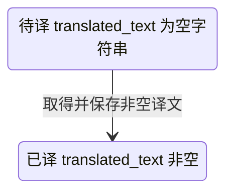

## 一句话价值

为内容人员翻译全部待处理内容并保存成功译文。

## 核心概念

- 翻译条目  某类业务文本、原文和目标语言组成的一项待译或已译内容。
- 待译内容  `translated_text` 为空字符串、尚未取得可保存译文的翻译条目。

## 业务对象

### 待译条目

| 业务名称 | 描述 | 取值说明 |
|---|---|---|
| 业务语境 | 指明原文所属对象，帮助译文采用对应的网球表达。 | 球场；球员：优先采用职业巡回赛官方中文译名；职业赛事：优先采用官方中文名称并避免重复赛事类型；场地类型；城市。 |
| 原文 | 尚未取得译文的业务文本。 | — |
| 目标语言 | 该条目需要生成的译文语言。 | 简体中文、繁体中文、英语、日语或韩语。 |
| 译文 | 翻译成功后保存的文本；空白表示仍待翻译。 | — |

### 批处理结果

| 业务名称 | 描述 | 取值说明 |
|---|---|---|
| 成功翻译条数 | 本次取得非空译文并成功保存的条目数量；没有待译内容时为零。 | — |

## 状态机

| 当前状态 | 触发操作 | 新状态 | 前置条件 | 谁能触发 |
|---|---|---|---|---|
| 待译 | 批量翻译 | 已译 | DeepSeek 按原顺序返回该条目的非空译文 | 内容人员 |

外部翻译失败、返回数量不一致或单条译文为空时，相关条目保持待译，不新增失败状态。

## 主流程

触发源：内容人员发起 HTTP 请求；终态：所有取得非空译文的待译条目变为已译，并返回本次成功条数。

1. 取得全部 `translated_text` 为空字符串的翻译条目，不区分业务对象类型或目标语言。
2. 将待译条目的原文、业务对象类型和目标语言交给 DeepSeek 翻译。
3. DeepSeek 按原顺序为每条内容返回对应译文。
4. 去除每条译文首尾空白，只保留非空译文，并将其保存到对应翻译条目。
5. 继续处理其余待译内容，最后返回本次成功保存的译文总数。

## 分支与异常

| 什么情况 | 怎么处理 | 对外提示 | 做了一半的怎么收场 |
|---|---|---|---|
| 没有 `translated_text` 为空字符串的翻译条目 | 不发起翻译，直接结束 | 返回成功条数 `0` | 不改变任何翻译条目 |
| DeepSeek 未返回有效结果，或返回译文数量与该批原文数量不一致 | 整批不保存，继续处理下一批 | 仅通过最终成功条数体现，未说明失败批次和原因 | 该批全部条目保持待译，之前成功批次保留已译状态 |
| DeepSeek 对某条内容返回空白译文 | 跳过该条，保存同批其他非空译文 | 仅通过最终成功条数体现，不说明具体条目 | 该条保持待译，同批其他成功条目变为已译 |
| 保存某批译文失败 | 本次处理异常终止 | 未定义统一业务提示 | 此前批次已保存的译文保留；当前批及后续批次是否已处理取决于失败位置，没有业务补偿约定 |
| 待译内容读取失败 | 本次处理异常终止 | 未定义统一业务提示 | 不产生新的译文 |

## 业务边界

本服务负责选出当前全部待译条目、委托 DeepSeek 生成译文、保存其中的非空结果，并交付成功条数。它不负责发现或登记缺译内容，不直接向调用者交付译文，不翻译临时输入，不审核译文质量，也不修改原始职业赛事、球员、球场、城市或场地类型资料。

## 遗留与待定

- 每批最多 `50` 条为写死规则，没有业务依据或配置入口；批量上限与调整责任人需由内容及翻译负责人确定。
- 本服务一次处理全部业务对象类型和目标语言，没有筛选、优先级、数量上限或稳定顺序；大批积压时的处理次序和单次范围待内容负责人确定。
- DeepSeek 使用的模型写死为 `deepseek-v4-pro`，且没有备用翻译来源；模型选型、不可用时的降级方式及维护责任人待定。
- DeepSeek 必须按输入顺序逐行返回且数量完全一致，结果没有携带翻译条目标识；错序但行数一致时无法识别，对应关系与验收机制待翻译负责人确定。
- 外部整批失败或返回数量不一致时只跳过该批，没有重试，也不向内容人员说明失败条目和原因；失败反馈与重处理方式待定。
- 单条空白译文会保持待译，但没有失败原因、尝试次数或最后尝试时间；长期无法翻译条目的治理方式待定。
- 非空译文只做首尾空白清理，不校验语言、专有名词、长度或内容质量；自动保存前是否需要审核及质量标准待翻译负责人确定。
- 现有查询只把 `translated_text` 为空字符串视为待译，但领域注释把 `NULL` 也描述为待译；历史 `NULL` 数据是否存在、应否纳入处理需由数据负责人确认。
- `translation` 表注释中的 `entity_type`、`language` 示例与实际枚举口径不一致；数据库说明应以何种值为准需由数据负责人统一。
- 翻译条目以业务对象类型、原文前 200 个字符和目标语言保证唯一，超过 200 字符但前缀相同的原文可能冲突；唯一性口径待数据负责人确定。
- 入口未体现内容人员身份或权限校验；谁可以触发全量翻译及费用控制规则待产品与安全负责人确定。
