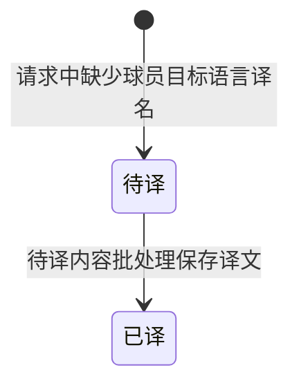

## 一句话价值

按选定职业赛事交付目标语言的种子名单文案。

## 核心概念

- 职业赛事  从公开数据源采集的 ATP/WTA 赛事，用于赛程、比分和内容展示，不接受本产品用户报名。
- 种子  职业赛事中用于体现重点球员及签表排序的编号。
- 翻译条目  某类业务文本、原文和目标语言组成的一项待译或已译内容。
- 赛事组  同城且日期相交的所选赛事形成的文案分组；可通过与第三项赛事相交而间接合并。
- 淘汰轮次  种子球员在已完成比赛中落败的轮次，用于说明其已淘汰到哪一阶段。

## 业务对象

### 种子名单文案

| 业务名称 | 描述 | 取值说明 |
|---|---|---|
| 文案标题 | 文案的固定主题名称。 | 种子名单。 |
| 赛事组标题 | 由同期同城赛事的名称和巡回赛组成。 | — |
| 巡回赛子标题 | 同一赛事组包含多个巡回赛时，用于区分各巡回赛种子。 | ATP、WTA、ITF 或大满贯。 |
| 签表项目 | 种子所属的比赛项目。 | 男子单打、女子单打、男子双打、女子双打或混合双打。 |
| 种子号 | 球员在签表中的非零种子顺位。 | — |
| 球员 | 优先采用目标语言的已有译名，否则使用球员原名。 | — |
| 国家或地区 | 球员所属国家或地区的三位代码。 | — |
| 种子状态 | 表示种子是否仍在赛事中。 | 参赛中：尚未在已结束比赛中落败；已淘汰：已有落败记录，并在可识别时附带淘汰轮次。 |
| 目标语言 | 球员姓名希望采用的语言；未指定时使用简体中文。 | 简体中文、繁体中文、英语、日语或韩语。 |

## 状态机

| 当前状态 | 触发操作 | 新状态 | 前置条件 | 谁能触发 |
|---|---|---|---|---|
| 不存在 | 生成种子名单文案 | 待译 | 球员原名与目标语言的翻译条目不存在 | 内容人员 |
| 待译 | 待译内容批处理 | 已译 | 翻译条目尚无译文 | 内容人员 |

本服务只负责第一条流转；第二条流转属于“待译内容批处理”。已有译文时不发生状态变化。

## 主流程

触发源：内容人员发起 HTTP 请求；终态：交付所选职业赛事的种子名单文案，缺失译名登记为待译。

1. 接收一个或多个职业赛事编号及目标语言；未指定语言时采用简体中文。
2. 取得编号对应的职业赛事，并将同城且日期相交的赛事归为同一赛事组。
3. 按赛事组读取全部签表中的非 `0` 种子报名，并补齐球员姓名、国家或地区及巡回赛类型。
4. 根据所选赛事已完成比赛的胜负结果，将种子标为参赛中或已淘汰；已淘汰时尽可能附上落败轮次。
5. 以已有目标语言译名替换球员原名；没有译名时保留原名，并登记一条待译内容。
6. 依次编排赛事组、巡回赛和种子表格，按种子号升序列出球员、国家或地区与状态。
7. 交付完整文本，不改变职业赛事、签表、报名、球员或比赛资料。

## 分支与异常

| 什么情况 | 怎么处理 | 对外提示 | 做了一半的怎么收场 |
|---|---|---|---|
| 未提供职业赛事编号，或提供空列表 | 直接交付无赛事信息文案 | `无赛事信息` | 不读取或修改职业赛事资料。 |
| 所有编号都找不到职业赛事 | 直接交付无赛事信息文案 | `无赛事信息` | 不登记翻译条目。 |
| 只有部分编号能找到职业赛事 | 忽略未找到的编号，用已找到赛事继续生成 | 返回已找到赛事的种子名单 | 已找到赛事照常交付，不说明哪些编号被忽略。 |
| 某个赛事组没有非 `0` 种子 | 跳过整个赛事组 | 不单独提示 | 其他赛事组照常进入文案。 |
| 所有已找到赛事都没有非 `0` 种子 | 只交付文案标题 | `种子名单` | 不登记球员翻译条目。 |
| 球员译名不存在或译文为空 | 使用球员原名，并登记待译内容 | 正常返回文案 | 待译内容留给独立的翻译批处理完成。 |
| 国家或地区代码无法识别 | 原样使用采集到的代码 | 正常返回文案 | 不修改球员资料。 |
| 淘汰比赛的轮次无法识别 | 标为已淘汰，但不附轮次 | 正常返回文案 | 不修改比赛资料。 |
| 目标语言不是受支持取值 | 拒绝生成 | 请求参数不合法 | 未生成文案，也不登记翻译条目。 |
| 读取赛事、签表、球员或比赛资料失败 | 终止生成，不交付不完整文案 | 未定义统一业务提示 | 失败前登记的待译内容可能保留，职业赛事数据不变。 |

## 业务边界

本服务负责依据当前已存的职业赛事、签表、种子报名、球员、完赛结果和已有译名，生成并即时交付一份文本，到文案返回为止。它不采集或修正职业赛事数据，不执行缺失译名的翻译，不保存生成文案，也不负责赛事海报或每日赛程文案。目标语言当前只作用于球员姓名；赛事名称、国家或地区代码、栏目标题和状态文字均不做本地化。

## 遗留与待定

- 文案标题、表头、状态文字及标点模板均写死为简体中文，目标语言却只转换球员姓名；完整本地化范围应由内容产品负责人确认。
- 赛事按同城且日期相交合组，并允许经第三项赛事间接合并；这一合组规则没有业务说明，应由赛事内容负责人确认。
- 赛事组及组内赛事按 `GS`、`1000`、`500`、`250` 的固定优先级排列，其他级别再按级别文本、开始日期、结束日期和赛事编号排列；排序口径及未知级别位置应由赛事内容负责人确认。
- 同一赛事组下的巡回赛子分组顺序没有稳定业务口径；相同种子号较多时，`ATP` 与 `WTA` 谁先出现可能受原始数据顺序影响。
- 所选赛事的全部签表项目会合并为一张种子表，不区分 `MS`、`WS`、`MD`、`WD`、`XD`，同一球员也可能重复出现；是否应按签表项目拆分或去重待确认。
- 种子报名未按 `status` 或 `entry_type` 筛选，`WITHDRAWN`、`RETIRED` 等记录只要有非 `0` 种子号也会进入文案；有效种子口径待赛事数据负责人确认。
- 淘汰判断只按球员编号汇总全部所选赛事的完赛记录，没有同时区分赛事；同一球员参加多个所选赛事时，可能把一站赛事的淘汰结果带到另一站，需由赛事数据负责人确认并修正口径。
- 同一球员存在多次落败记录时采用哪一条淘汰轮次没有明确顺序；应展示最近、最深或指定赛事的轮次待确认。
- 职业球员以 `player_id` 与 `tour` 共同唯一，但本服务关联姓名时只使用 `player_id`；ATP 与 WTA 编号碰撞时采用哪份资料待确认。
- 职业赛事以 `tournament_id` 与 `year` 共同唯一，但请求不提供年份；同一编号跨年复用时应选择哪一年待确认。
- 缺少球员资料时，球员名称及翻译原文可能为空，当前没有明确的跳过、占位或报错规则，待内容产品负责人确认。
- 首次遇到缺失译名时只登记待译，本次仍返回原名；内容人员是否应等待翻译完成后重试，当前没有流程提示。
- 部分无效赛事编号会被静默忽略，且全部赛事无种子时只返回标题，与“无赛事信息”的提示不一致；空内容提示口径待统一。
- 代码入口未体现内容人员角色校验；该文案及待译内容登记是否应限制访问者，需由产品与安全负责人确认。
