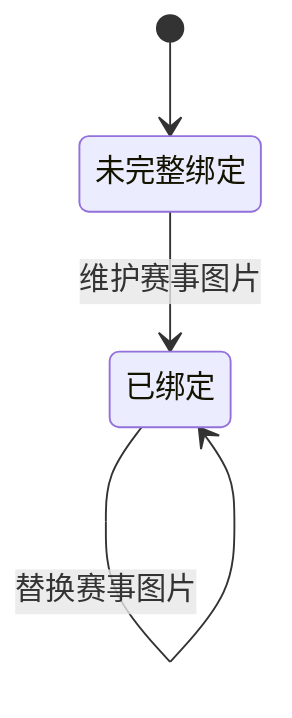

## 一句话价值

为内容人员生成并绑定职业赛事主图和背景图。

## 核心概念

- 职业赛事  从公开数据源采集的 ATP/WTA 赛事，用于赛程、比分和内容展示，不接受本产品用户报名。
- 赛事主图  用于代表职业赛事的主要图片，由本次原图转为 JPEG 后保存并绑定。
- 赛事背景图  由同一原图生成、以较小文件体积为目标的职业赛事背景图片。
- 图片绑定  将七牛云图片资源标识记录到职业赛事资料，使后续内容展示可以找到对应图片。

## 业务对象

### 赛事图片

| 业务名称 | 描述 | 取值说明 |
|---|---|---|
| 赛事编号 | 指明本次维护图片的职业赛事；当前不区分赛事年份。 | — |
| 原始图片 | 本次提交的图片，同时用于生成赛事主图和背景图。 | — |
| 赛事主图 | 统一转换后的赛事主图资源，成功后绑定到目标赛事。 | — |
| 赛事背景图 | 统一转换并压缩后的背景图资源，成功后绑定到目标赛事。 | — |

## 交付内容

类型: 执行类

消费者当场取得主流程所述的外部处理效果与成功结果；重复发起、下游失败和已完成结果的处理，以本节下列规则及分支与异常为准。

图片绑定状态由 `image_path` 与 `background_path` 是否已有值推导，不是单独保存的状态字段。

| 当前状态 | 触发操作 | 新状态 | 前置条件 | 谁能触发 |
|---|---|---|---|---|
| 未完整绑定 | 维护赛事图片 | 已绑定 | 原图能够生成两张图片，且存在可更新的赛事记录 | 内容人员 |
| 已绑定 | 替换赛事图片 | 已绑定 | 原图能够生成两张图片，且存在可更新的赛事记录 | 内容人员 |

## 主流程

触发方式（并列）：HTTP（内容赛事图片入口）、HTTP（职业赛事上传入口）；终态：主图和背景图已保存到七牛云并绑定到同编号的职业赛事，返回两项图片资源标识；职业赛事上传入口还返回手工同步语句。

1. 内容人员指定职业赛事编号并提交一张原图。
2. 从原图生成 JPEG 赛事主图，并以 75% 编码质量形成主图文件。
3. 从同一原图生成 JPEG 赛事背景图，并以不超过 50KB 为压缩目标形成背景图文件。
4. 将赛事主图和背景图分别保存到七牛云中该赛事编号对应的固定资源标识。
5. 将两项七牛云资源标识绑定到所有 `tournament_id` 相同的职业赛事记录，赛事图片绑定进入已绑定状态。
6. 向内容人员交付 `imageKey` 和 `backgroundKey`；从职业赛事上传入口触发时，同时交付一条按赛事编号手工同步图片绑定的 `sql`。

## 分支与异常

| 什么情况 | 怎么处理 | 对外提示 | 做了一半的怎么收场 |
|---|---|---|---|
| 未提交赛事编号或图片，或提交内容超过 5MB | 终止维护 | 系统异常，请稍后重试 | 不生成或绑定赛事图片 |
| 图片格式无法读取或无法转为 JPEG | 终止维护 | 系统异常，请稍后重试 | 两张图片均未保存，职业赛事资料不变 |
| 赛事主图无法保存到七牛云 | 终止维护 | 系统异常，请稍后重试 | 职业赛事资料不变；是否已经产生不可用资源由七牛云本次保存结果决定 |
| 赛事主图已保存，但背景图无法保存到七牛云 | 终止维护 | 系统异常，请稍后重试 | 已保存的主图不会主动删除，职业赛事资料不变 |
| 两张图片已保存，但职业赛事图片字段更新失败 | 终止维护 | 系统异常，请稍后重试 | 两张七牛云图片不会主动删除，职业赛事仍保留此前图片绑定 |
| 没有 `tournament_id` 相同的职业赛事记录 | 仍返回两项七牛云资源标识；职业赛事上传入口仍返回手工同步语句 | 维护成功 | 两张图片保留在七牛云，但没有职业赛事绑定它们 |
| 多个年份存在相同 `tournament_id` | 将所有命中记录绑定到同一组图片 | 维护成功 | 各年份原有图片绑定均被本次资源标识替换 |
| 背景图经过既定压缩过程后仍大于 50KB | 仍保存并绑定最终生成的背景图 | 维护成功 | 保留实际生成的背景图，不再继续缩小 |

## 业务边界

- 本服务负责接收一张原图，生成主图和背景图，保存到七牛云，更新职业赛事的图片绑定并交付资源标识。
- 本服务不负责生成图片创意或提示词；赛事海报提示词和待制作海报名单由其他业务服务交付。
- 本服务不创建或修改职业赛事的名称、巡回赛、级别、日期等资料，也不负责赛事采集。
- 本服务止于资源标识和图片绑定，不交付图片访问地址，也不验证图片在前台各展示位的最终效果。
- 职业赛事上传入口额外交付手工同步语句，但本服务不会执行该语句之外的人工操作。

## 遗留与待定

| 等级 | 待定的是什么 | 要谁来定 |
|---|---|---|
| P2 | 主图 75% JPEG 编码质量、背景图 50KB 目标均为写死规则，没有业务依据或可配置来源；图片质量和体积标准需内容负责人确定。 | 产品与内容运营负责人 |
| P2 | 配置中另有赛事图片 10KB 压缩值，但当前图片维护未使用它；背景图应以 10KB 还是 50KB 为目标需内容与技术负责人统一。 | 产品与内容运营负责人 |
| P2 | 背景图压缩以 50KB 为目标但不保证最终一定达标；允许的最大体积及超限时是否应拒绝保存需内容负责人确定。 | 产品与内容运营负责人 |
| P1 | 当前没有明确的图片格式、尺寸、宽高比、文件内容和安全审核规则，只要现有图片读取方式能够解析就继续处理；图片准入标准需内容与安全负责人确定。 | 产品与内容运营负责人 |
| P1 | 图片资源标识完全由外部提交的 `tournamentId` 拼成，没有看到字符范围和目录越界方面的业务校验；允许的赛事编号格式需数据与安全负责人确定。 | 产品与内容运营负责人 |
| P1 | `tour_tournament` 以 `tournament_id` 与 `year` 共同保证唯一，但本服务只按 `tournament_id` 更新，因此同一编号跨年份时会同时替换多届赛事图片；应指定届次还是共享图片需内容负责人确定。 | 产品与内容运营负责人 |
| P2 | 当前不先验证赛事是否存在，也不检查图片字段是否实际更新成功；不存在赛事时仍会保存图片并返回成功结果，正式成功判据和提示需产品负责人确定。 | 产品与内容运营负责人 |
| P1 | 两个入口对同一承诺交付的结果不一致：职业赛事上传入口额外返回可手工更新数据库的 `sql`，而图片字段在返回前已经自动更新；该语句的使用场景、是否应继续对外交付及数据误操作风险需产品与安全负责人确定。 | 产品与内容运营负责人 |
| P2 | 使用固定七牛云资源标识保存图片时，已存在图片应覆盖、拒绝还是保留版本，以及浏览器或内容分发缓存何时刷新，代码没有业务说明；替换和版本策略需内容与技术负责人确定。 | 产品与内容运营负责人 |
| P1 | 主图已保存后若背景图或赛事绑定失败，已保存资源不会回收；部分成功的识别、补偿和孤立图片清理责任需产品与运维负责人确定。 | 产品与内容运营负责人 |
| P1 | 两个入口只要求登录，未见对“内容人员”角色的明确权限判断；可维护赛事图片的角色范围需产品与安全负责人确定。 | 产品与内容运营负责人 |
