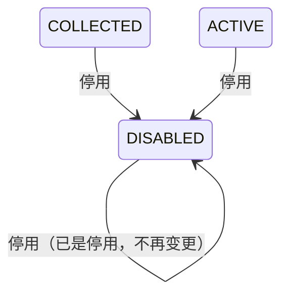

## 一句话价值

为运营下架一个不再可用的球场，使它从用户端球场清单中消失。

## 核心概念

- 球场  可供网球活动选择的线下场地，包含位置、环境和联系资料。
- 停用  把球场状态置为 `DISABLED`，球场记录保留在球场库中，但不再出现在用户端的球场清单和球场搜索里。
- 已停用球场  状态为 `DISABLED` 的球场；已被约球或赛事引用的历史记录仍能查到它的资料。

## 业务对象

### 停用指令

| 字段 | 类型 | 必填 | 说明 |
|---|---|---|---|
| `courtId` | 字符串 | 是 | 要停用的球场业务编号。 |

### 球场（`rally_court`）

| 字段 | 类型 | 必填 | 说明 |
|---|---|---|---|
| `biz_id` | `VARCHAR(32)` | 是 | 球场业务编号，用来定位要停用的球场。 |
| `status` | `VARCHAR(32)` | 是 | 球场状态，本服务改写为 `DISABLED`。 |

`status` 的取值：

| 取值 | 业务含义 |
|---|---|
| `COLLECTED` | 已收录，待审核；不出现在用户端球场清单中。 |
| `ACTIVE` | 可用；出现在用户端球场清单中。 |
| `DISABLED` | 已停用；不出现在用户端球场清单中。 |

本服务只改写 `status`，其余字段一概不动。

### 停用结果

无

## 状态机

| 当前状态 | 触发操作 | 新状态 | 前置条件 | 谁能触发 |
|---|---|---|---|---|
| `COLLECTED` | 停用 | `DISABLED` | 球场存在 | 运营 |
| `ACTIVE` | 停用 | `DISABLED` | 球场存在 | 运营 |
| `DISABLED` | 停用 | `DISABLED` | 球场存在 | 运营 |

停用是终点操作，本服务不提供把已停用球场改回可用的能力，恢复走 `court.court-update`。

## 主流程

触发源：运营在后台发起 HTTP 停用；终态：该球场状态为 `DISABLED`，不再出现在用户端球场清单中。

1. 接收球场业务编号。
2. 按业务编号取得该球场。
3. 把球场状态置为 `DISABLED`，其余资料保持原值。
4. 保存球场，结束。

## 分支与异常

| 什么情况 | 怎么处理 | 对外提示 | 做了一半的怎么收场 |
|---|---|---|---|
| 球场业务编号为空或只含空白字符 | 拒绝停用 | `courtId: 请选择球场` | 未修改任何业务数据。 |
| 球场业务编号对应的球场不存在 | 拒绝停用 | `球场不存在` | 未修改任何业务数据。 |
| 球场已是停用状态 | 视为已达成终态，直接结束 | 无 | 未修改任何业务数据。 |
| 球场库写入失败 | 停用失败 | `系统异常，请稍后重试` | 未修改任何业务数据。 |

## 业务边界

本服务负责把一个球场置为停用，使它不再出现在用户端球场清单与搜索中，到球场保存完成为止。服务只对运营开放，不面向普通用户。服务不物理删除球场记录，不改写球场的其他资料，不提供恢复可用，不处理已引用该球场的约球与赛事，不校验球场是否仍被引用。

## 遗留与待定

- 停用不校验该球场是否仍被进行中的约球或赛事引用，也不通知相关用户；进行中的活动怎么处理，应由产品与运营确认。
- 停用不记录停用原因、操作人和操作时间，无法追溯；是否需要操作留痕，应由产品与运营确认。
- 已停用球场在下一次全量覆盖抓取时会被重新置为 `ACTIVE`，停用效果被抹掉；停用是否应对抓取生效，应由产品与运营确认，与 `court.court-collection` 的同名待定项一并处理。
- 后台没有球场清单查询能力，运营无法在后台看到已停用球场，也就无法找到它去恢复；后台是否需要一个含全部状态的球场清单，应由产品与运营确认。
- 平台没有物理删除球场的能力，误录入的球场只能停用后长期留在库中；是否需要真正的删除，应由产品与运营确认。
