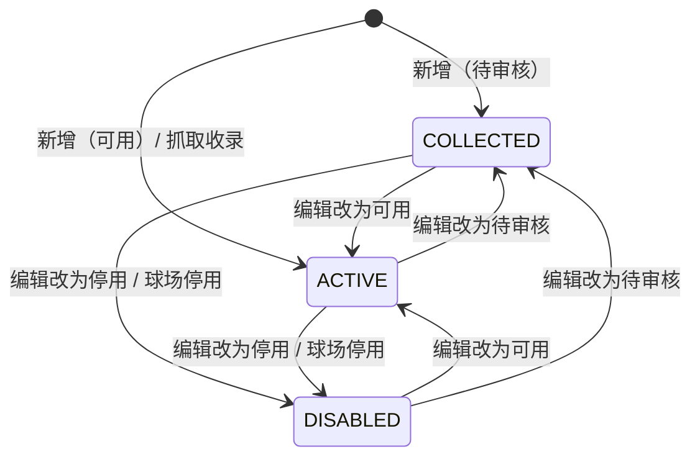

## 一句话价值

为运营改写一个已收录球场的资料，即改即对用户生效。

## 核心概念

- 球场  可供网球活动选择的线下场地，包含位置、环境和联系资料。
- 球场业务编号  球场在平台内的唯一标识，编辑时用来指定要改哪一个球场，本身不可改。
- 按项改写  指令里填了的字段才改写，没填的字段保持原值不动。

## 业务对象

### 编辑指令

| 字段 | 类型 | 必填 | 说明 |
|---|---|---|---|
| `courtId` | 字符串 | 是 | 要编辑的球场业务编号。 |
| `name` | 字符串 | 否 | 球场名称，最长 128 字符。 |
| `cityCode` | 字符串 | 否 | 所属城市编码，取自平台城市名录的六位城市编码。 |
| `alias` | 字符串列表 | 否 | 球场别名，存入时以英文逗号连接，连接后最长 128 字符。 |
| `address` | 字符串 | 否 | 球场详细地址，最长 256 字符。 |
| `lng` | 小数 | 否 | 球场经度，取值范围 -180 到 180。 |
| `lat` | 小数 | 否 | 球场纬度，取值范围 -90 到 90。 |
| `districtCode` | 字符串 | 否 | 所属区域编码，取自平台区县名录。 |
| `remark` | 字符串 | 否 | 球场备注，最长 255 字符。 |
| `type` | 枚举 | 否 | 球场环境，取值 `INDOOR` 或 `OUTDOOR`。 |
| `surface` | 枚举 | 否 | 场地材质，取值 `HARD`、`CLAY` 或 `GRASS`。 |
| `tags` | 字符串列表 | 否 | 球场标签，存入时以英文逗号连接，连接后最长 512 字符。 |
| `rating` | 字符串 | 否 | 评分展示值，存入球场扩展资料。 |
| `cost` | 字符串 | 否 | 费用展示值，存入球场扩展资料。 |
| `opentime` | 字符串 | 否 | 开放时间展示值，存入球场扩展资料。 |
| `tel` | 字符串 | 否 | 联系电话，存入球场扩展资料。 |
| `status` | 枚举 | 否 | 球场状态，取值 `COLLECTED`、`ACTIVE` 或 `DISABLED`。 |

### 球场（`rally_court`）

本服务可改写的字段：`name`、`alias`、`address`、`lng`、`lat`、`city_code`、`district_code`、`city_name`、`district_name`、`remark`、`type`、`surface`、`tags`、`ext_data`、`status`。

本服务不改写的字段：

| 字段 | 说明 |
|---|---|
| `biz_id` | 球场业务编号，一经生成不再变更。 |
| `source_id` | 三方来源编号，由抓取收录维护。 |
| `source` | 来源，由录入方式决定。 |
| `meetup_count` | 约球次数统计，由球场热度结算维护。 |

改写的连带规则：

| 改了什么 | 连带改什么 |
|---|---|
| `city_code` | `city_name` 按新城市编码在城市名录中重新取得。 |
| `district_code` | `district_name` 按新区域编码在区县名录中重新取得。 |
| `name` | `ext_data` 中的 `pinyin` 与 `pinyinInitial` 按新名称重新生成。 |
| `rating`、`cost`、`opentime`、`tel` 中的任一项 | `ext_data` 中对应项按新值改写，其余项保持原值。 |

### 编辑结果

无

## 状态机

球场状态可由本服务在三种取值之间任意改写。

| 当前状态 | 触发操作 | 新状态 | 前置条件 | 谁能触发 |
|---|---|---|---|---|
| `COLLECTED` | 编辑并填写状态为 `ACTIVE` | `ACTIVE` | 球场存在 | 运营 |
| `COLLECTED` | 编辑并填写状态为 `DISABLED` | `DISABLED` | 球场存在 | 运营 |
| `ACTIVE` | 编辑并填写状态为 `COLLECTED` | `COLLECTED` | 球场存在 | 运营 |
| `ACTIVE` | 编辑并填写状态为 `DISABLED` | `DISABLED` | 球场存在 | 运营 |
| `DISABLED` | 编辑并填写状态为 `ACTIVE` | `ACTIVE` | 球场存在 | 运营 |
| `DISABLED` | 编辑并填写状态为 `COLLECTED` | `COLLECTED` | 球场存在 | 运营 |

## 主流程

触发源：运营在后台发起 HTTP 编辑；终态：该球场的资料已按指令改写。

1. 接收球场业务编号与要改写的资料。
2. 按业务编号取得该球场。
3. 填了城市编码时，在城市名录中确认存在并取得新的城市名称；填了区域编码时，在区县名录中确认存在并取得新的区域名称。
4. 填了球场名称时，按新名称重新生成拼音与拼音首字母。
5. 把指令中填了的字段逐项改写到该球场，没填的字段保持原值；扩展资料中填了的展示项逐项改写，其余项保持原值。
6. 保存球场，结束。

## 分支与异常

| 什么情况 | 怎么处理 | 对外提示 | 做了一半的怎么收场 |
|---|---|---|---|
| 球场业务编号为空或只含空白字符 | 拒绝编辑 | `courtId: 请选择球场` | 未修改任何业务数据。 |
| 球场业务编号对应的球场不存在 | 拒绝编辑 | `球场不存在` | 未修改任何业务数据。 |
| 城市编码在城市名录中不存在 | 拒绝编辑 | `城市不存在` | 未修改任何业务数据。 |
| 区域编码在区县名录中不存在 | 拒绝编辑 | `区域不存在` | 未修改任何业务数据。 |
| 球场环境、场地材质或球场状态不是允许的取值 | 拒绝编辑 | `参数不正确` | 未修改任何业务数据。 |
| 经度或纬度超出取值范围 | 拒绝编辑 | `参数不正确` | 未修改任何业务数据。 |
| 名称、别名、地址、备注或标签超出长度上限 | 拒绝编辑 | `参数不正确` | 未修改任何业务数据。 |
| 除球场业务编号外一项都没填 | 视为无需改写，直接结束 | 无 | 未修改任何业务数据。 |
| 球场库写入失败 | 编辑失败 | `系统异常，请稍后重试` | 未修改任何业务数据。 |

## 业务边界

本服务负责按运营填写的资料改写一个已收录球场，包括直接改写球场状态，到球场保存完成为止。服务只对运营开放，不面向普通用户。服务不改写球场业务编号、三方来源编号、来源和约球次数，不负责球场的新增与停用，不负责从高德重新抓取资料，不负责通知已引用该球场的约球或赛事。

## 遗留与待定

- 编辑无法把一个已有值的字段清空，填空白与不填无法区分；清空字段的诉求怎么表达，应由产品与运营确认。
- 编辑不做并发控制，两个运营同时改同一个球场时后写的覆盖先写的；是否需要版本校验，应由产品与技术确认。
- 编辑改写的城市编码可能与球场坐标不一致，系统不做校验；是否需要按坐标反查校验，应由产品确认。
- 编辑不记录操作人、操作时间和改动前后的值，无法追溯；是否需要操作留痕，应由产品与运营确认。
- 从抓取收录得到的球场被编辑后，下一次全量覆盖抓取会把改动覆盖掉；是否应保护人工修改，应由产品与运营确认，与 `court.court-collection` 的同名待定项一并处理。
- 编辑可直接把球场状态改成任意取值，与 `court.court-disable` 的停用职责重叠；状态改写是否应只由停用服务负责，应由产品确认。
- 已被约球或赛事引用的球场被改名或改地址后，历史记录展示的球场资料随之变化；历史记录是否应保留当时的球场资料，应由产品确认。
