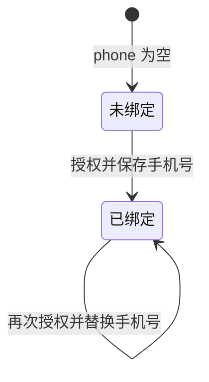

## 一句话价值

将本人经授权取得的手机号绑定到账户。

## 核心概念

- 账户  用户获得访问身份的载体，可关联登录凭据、手机号和个人资料。

## 业务对象

### 用户资料

| 业务名称 | 描述 | 取值说明 |
|---|---|---|
| 用户编号 | 标识本次绑定手机号的当前用户。 | — |
| 手机号 | 微信授权确认的手机号；绑定成功后覆盖原有号码。 | — |

## 交付内容

类型: 变更类

成功后按主流程改写或撤销既有业务事实；允许变更的内容、前置状态、对外可见结果与原值留痕，以本节下列规则、业务对象及分支与异常为准。

| 当前状态 | 触发操作 | 新状态 | 前置条件 | 谁能触发 |
|---|---|---|---|---|
| 未绑定 | 提交手机号授权 | 已绑定 | 已登录；动态令牌有效；微信小程序返回有效手机号；用户资料存在 | 用户本人 |
| 已绑定 | 再次提交手机号授权 | 已绑定 | 已登录；动态令牌有效；微信小程序返回有效手机号；用户资料存在 | 用户本人 |

## 主流程

触发源：接口（用户）；终态：用户资料中的手机号更新为本次微信授权手机号，并返回绑定成功。

1. 用户提交微信小程序签发的手机号动态令牌。
2. 微信小程序确认本次授权并交付手机号。
3. 依据当前登录身份找到本人的用户资料。
4. 将授权手机号保存到用户资料；若原来已有号码，则以本次号码替换。
5. 向用户确认手机号绑定成功。

## 分支与异常

| 什么情况 | 怎么处理 | 对外提示 | 做了一半的怎么收场 |
|---|---|---|---|
| 未携带登录凭证 | 不受理绑定 | 登录已过期，请重新登录 | 用户资料中的手机号保持原值 |
| 登录凭证无效 | 不受理绑定 | 登录凭证无效，请重新登录 | 用户资料中的手机号保持原值 |
| `code` 为空 | 不请求手机号授权，不受理绑定 | 微信手机号动态令牌不能为空 | 用户资料中的手机号保持原值 |
| 微信手机号授权服务不可用 | 终止绑定 | 获取微信手机号失败 | 用户资料中的手机号保持原值 |
| 无法取得微信小程序访问授权 | 终止绑定 | 微信授权失败 | 用户资料中的手机号保持原值 |
| 微信小程序返回失败、空结果或无有效 `phoneNumber` | 终止绑定 | 获取微信手机号失败 | 用户资料中的手机号保持原值 |
| 授权手机号为空 | 终止绑定 | 参数错误 | 用户资料中的手机号保持原值 |
| 当前登录身份对应的用户资料不存在 | 终止绑定 | 用户不存在 | 不创建用户资料或账户，也不保存手机号 |
| 保存前用户资料已不存在或保存发生未预期错误 | 终止绑定 | 系统异常，请稍后重试 | 本次手机号绑定不成立，原用户资料保持不变 |

## 业务边界

- 本服务从用户提交微信手机号授权开始，到授权手机号写入当前用户资料并确认成功为止。
- 本服务只修改 `user` 表中的手机号，不创建用户资料或账户，也不新增或修改 `account` 表中的登录渠道。
- 本服务允许已绑定账户用新的微信授权手机号替换原号码。
- 本服务不负责手机号解绑、短信验证、手机号登录或手机号变更通知。
- 微信小程序未成功交付手机号时，本服务不承诺完成绑定。

## 遗留与待定

| 等级 | 待定的是什么 | 要谁来定 |
|---|---|---|
| P1 | 同一手机号是否只允许绑定一个账户尚未定义；当前没有重复绑定校验，需要产品负责人确定唯一性规则及冲突处理。 | 产品与账号安全负责人 |
| P2 | 已绑定账户再次绑定时是否需要提示、二次确认或频率限制尚未定义；当前直接覆盖原号码，需要产品负责人确定变更规则。 | 产品与账号安全负责人 |
| P2 | 当前仅保存微信小程序返回的 `phoneNumber`，不保存 `purePhoneNumber` 与 `countryCode`；是否需要统一号码格式及保留国家或地区码，需要产品负责人确定。 | 产品与账号安全负责人 |
