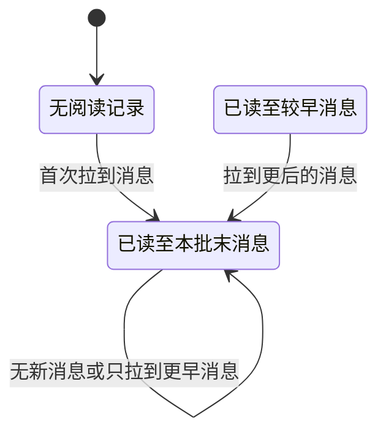

## 一句话价值

向约球成员交付新消息并推进本人的已读位置。

## 核心概念

- 约球  围绕一次明确时间、场地、人数和参与条件组织的网球活动，不只是两人邀约。
- 约球发布者  创建约球并负责活动信息、费用和报名审批的人，也是首位参与者。
- 约球报名  用户与约球之间的参与关系，可处于待审批、已加入、已拒绝、已撤回、已退出、已评价或已跳过。
- 消息游标  一条约球消息的编号，调用方用它表示本次只要该消息之后的消息。
- 已读位置  本人在该约球群聊中已读到的最新消息；只能向后推进，不参与决定下次从哪里拉取。
- 未读用户  除本人外，尚未读到约球群聊当前最新消息的有效参与者。

## 业务对象

### 约球群聊消息

| 业务名称 | 描述 | 取值说明 |
|---|---|---|
| 消息编号 | 唯一标识一条群聊消息，也可作为继续拉取的消息游标。 | — |
| 所属约球 | 消息所在的约球。 | — |
| 发送者 | 发布消息的用户。 | — |
| 发送者资料 | 消息发送时保留的昵称和头像。 | — |
| 消息内容 | 本次发布的文本、图片或位置信息。 | — |
| 消息类型 | 表示消息内容的呈现方式。 | 文本：文字内容；图片：图片内容；位置：地点信息。 |
| 发送时间 | 消息发布的时间。 | — |

### 消息拉取结果

| 业务名称 | 描述 | 取值说明 |
|---|---|---|
| 消息列表 | 按发送先后交付本批拉取到的消息。 | — |
| 本人已读位置 | 本次拉取后本人已读到的最新消息。 | — |
| 未读用户 | 需要时一并交付尚未读到当前最新消息的有效参与者。 | — |

## 交付内容

类型: 查询类

向消费者交付当前业务事实的查询结果；身份与状态造成的展示差异，以及列表的排序、分页和无结果口径，以本节下列规则及主流程、分支与异常为准。

| 当前状态 | 触发操作 | 新状态 | 前置条件 | 谁能触发 |
|---|---|---|---|---|
| 无阅读记录 | 拉取到至少一条消息 | 已读至本批末消息 | 本人具有拉取资格 | 约球发布者或当前被允许的报名用户 |
| 已读至较早消息 | 拉取到已读位置之后的消息 | 已读至本批末消息 | 本批末消息晚于原已读位置 | 约球发布者或当前被允许的报名用户 |
| 已读至本批末消息 | 未拉到消息，或本批末消息不晚于原位置 | 已读至本批末消息 | 本人具有拉取资格 | 约球发布者或当前被允许的报名用户 |

每次实际推进后，`unread_count` 终态为新已读位置之后的消息数；读到当前最新消息时为 `0`，分页尚未读到最新消息时可大于 `0`。

## 主流程

触发源：约球发布者或报名用户发起 HTTP 拉取；终态：交付本批消息，必要时推进本人已读位置并重算剩余未读数。

1. 识别当前用户并取得指定约球及全部报名关系。
2. 确认本人是约球发布者，或具有 `PENDING`、`JOINED`、`REVIEWED`、`SKIPPED` 报名。
3. 本次带消息游标时，从该编号之后开始；未带游标时，将可回溯范围限定为最近 `200` 条消息。
4. 在可回溯范围内按消息编号从早到晚交付本批消息，缺省最多 `20` 条。
5. 本批有消息且末条消息晚于原已读位置时，把本人已读位置推进至本批末条，并将未读数重算为该位置之后的消息数；没有群聊成员记录时同时补建记录。
6. 若要求附带未读用户，以约球当前最新消息为准，找出除本人外尚未读到该消息的 `JOINED`、`REVIEWED`、`SKIPPED` 用户，并补充昵称、头像及最后阅读时间。
7. 交付消息列表及按需生成的未读用户列表；消息拉取游标由调用方依据本批消息编号继续维护。

## 分支与异常

| 什么情况 | 怎么处理 | 对外提示 | 做了一半的怎么收场 |
|---|---|---|---|
| 未登录、登录过期或登录凭证无效 | 拒绝拉取 | 对应的登录提示 | 不交付消息，不改变已读位置和未读数。 |
| 指定约球不存在 | 拒绝拉取 | 约球不存在 | 不交付消息，不改变已读位置和未读数。 |
| 本人不是发布者，且没有 `PENDING`、`JOINED`、`REVIEWED`、`SKIPPED` 报名 | 拒绝拉取 | 你未报名该约球 | 不交付消息，不改变已读位置和未读数。 |
| 未带消息游标且历史消息超过 `200` 条 | 忽略更早消息，从最近 `200` 条范围开始分批交付 | 无 | 更早消息不在本次及后续正向拉取范围内。 |
| 游标之后没有消息 | 成功交付空消息列表 | 无 | 已读位置、已读时间和未读数均保持不变。 |
| 本批末消息不晚于本人原已读位置 | 正常交付消息，不回退已读位置 | 无 | 已读位置、已读时间和未读数均保持不变。 |
| `withUnreadUsers=false` 或未提供 | 不计算未读用户 | 无 | `unreadUsers` 为 `null`，消息和本人已读结果不受影响。 |
| 要求未读用户，但约球尚无消息 | 成功交付空未读用户列表 | 无 | 没有人的阅读状态发生变化。 |
| 其他有效参与者没有群聊成员记录 | 将其视为尚未读到最新消息 | 无 | 该用户进入未读用户列表，最后阅读时间为空，不补建其记录。 |
| 未读用户的个人资料不存在 | 仍交付该用户的未读事实 | 无 | 该用户昵称和头像为空，不影响其他结果。 |
| 消息或阅读数据取得、保存失败 | 拉取失败 | 系统异常，请稍后重试 | 当前没有明确的业务补偿规则；可能需要重新拉取核对阅读状态。 |

## 业务边界

- 本服务从符合资格的用户请求约球群聊消息开始，到交付本批消息并按需交付未读用户为止。
- 本服务只读取已有消息，不发布、修改或删除消息；消息发布属于“约球消息发送”。
- 本服务以调用方提供的消息游标决定拉取起点；数据库已读位置只用于未读状态，不替代调用方游标。
- 本服务一次只把本人标记为读到本批末条消息，不会因发起拉取就直接读到群聊最新消息。
- 本服务的未读用户表示谁尚未读到群聊当前最新消息，不表示谁尚未读到本批消息，也不返回各人的未读条数。
- 本服务不因约球处于草稿、开放、进行中、已结束或已关闭而改变拉取资格。
- 本服务不审批待审批报名、不恢复已退出报名，也不建立其他用户的群聊成员关系。

## 遗留与待定

| 等级 | 待定的是什么 | 要谁来定 |
|---|---|---|
| P2 | 待产品负责人确认：`PENDING` 报名当前可以拉取约球群聊消息，但不属于未读用户统计范围，是否符合报名审批前的信息隔离要求。 | 产品与约球运营负责人 |
| P2 | 待产品负责人确认：无游标时写死只回溯最近 `200` 条消息的业务依据，以及更早历史是否需要另行查阅。 | 产品与约球运营负责人 |
| P2 | 待产品负责人确定：`limit` 的最小值和最大值；当前 `0` 或负数会取消条数限制，正数也没有上限。 | 产品与约球运营负责人 |
| P2 | 待产品负责人确定：消息游标不存在、属于其他约球或晚于当前最新消息时是否应拒绝；当前均按该编号继续查询并可能返回空列表。 | 产品与约球运营负责人 |
| P1 | 待产品负责人确定：已读位置推进成功但未读数重算失败时的业务收场与校准规则。 | 产品与约球运营负责人 |
