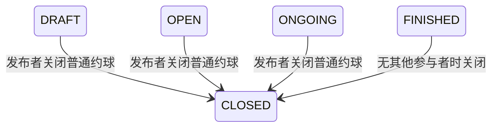

## 一句话价值

关闭本人发布的约球并通知仍在活动的人。

## 核心概念

- 约球  围绕一次明确时间、场地、人数和参与条件组织的网球活动，不只是两人邀约。
- 约球发布者  创建约球并负责活动信息、费用和报名审批的人，也是首位参与者。
- 约球报名  用户与约球之间的参与关系，可处于待审批、已加入、已拒绝、已撤回、已退出、已评价或已跳过。

## 业务对象

### 约球

| 业务名称 | 描述 | 取值说明 |
|---|---|---|
| 约球编号 | 唯一标识要关闭的约球。 | — |
| 活动性质 | 区分日常约球与赛事产生的赛约。 | 普通约球：可由发布者按规则关闭；赛事约球：须回到比赛流程处理。 |
| 发布者 | 创建约球并有权关闭活动的人。 | — |
| 标题 | 约球的展示名称。 | — |
| 参与人数 | 当前已加入人数，包含发布者。 | — |
| 活动时间 | 包含开始时间和结束时间，用于判断约球实际进度。 | — |
| 场地 | 约球举办的场地名称。 | — |
| 约球状态 | 关闭成功后进入已关闭。 | 草稿：尚未发布；报名中：开放报名；进行中：活动已开始；已结束：活动已结束；已关闭：发布者已关闭活动。 |

## 交付内容

类型: 变更类

成功后按主流程改写或撤销既有业务事实；允许变更的内容、前置状态、对外可见结果与原值留痕，以本节下列规则、业务对象及分支与异常为准。

| 当前状态 | 触发操作 | 新状态 | 前置条件 | 谁能触发 |
|---|---|---|---|---|
| `DRAFT` | 关闭约球 | `CLOSED` | 普通约球，尚未关闭 | 约球发布者 |
| `OPEN` | 关闭约球 | `CLOSED` | 普通约球，按开始与结束时间判断后仍未结束或没有其他参与者 | 约球发布者 |
| `ONGOING` | 关闭约球 | `CLOSED` | 普通约球 | 约球发布者 |
| `FINISHED` | 关闭约球 | `CLOSED` | 普通约球，且不存在发布者之外的 `JOINED`、`REVIEWED` 或 `SKIPPED` 报名 | 约球发布者 |

## 主流程

触发源：发布者接口；终态：普通约球为 `CLOSED`，并已发起符合条件参与者的取消通知。

1. 识别当前登录用户，并取得指定约球及其全部约球报名。
2. 确认当前用户是约球发布者、约球不是赛事约球，且当前状态允许关闭。
3. 将约球状态改为 `CLOSED`，报名状态保持不变。
4. 从报名仍为 `JOINED`、`REVIEWED` 或 `SKIPPED` 的用户中排除发布者，形成取消通知候选名单。
5. 对仍符合报名条件且有可用取消通知额度的候选人，通过微信发送约球名称、时间、地点和“创建人取消”。

## 分支与异常

| 什么情况 | 怎么处理 | 对外提示 | 做了一半的怎么收场 |
|---|---|---|---|
| 未提供登录凭证 | 拒绝关闭 | 登录已过期，请重新登录 | 约球和报名均不变 |
| 登录凭证无效 | 拒绝关闭 | 登录凭证无效，请重新登录 | 约球和报名均不变 |
| 指定约球不存在 | 拒绝关闭 | 约球不存在 | 约球和报名均不变 |
| 当前用户不是约球发布者 | 拒绝关闭 | 仅发布者可操作 | 约球和报名均不变 |
| 指定约球是赛事约球 | 拒绝关闭，要求回到比赛流程处理 | 这是赛事约球，无法在此关闭，请返回比赛页面进行相关操作 | 约球和报名均不变 |
| 约球已经关闭 | 拒绝重复关闭 | 约球状态不允许该操作 | 约球和报名均不变 |
| 约球已结束且仍有其他参与者 | 拒绝关闭 | 约球状态不允许该操作 | 约球和报名均不变 |
| 没有发布者之外的参与者 | 关闭约球，不产生参与者通知 | 关闭成功 | 约球停在 `CLOSED`，报名不变 |
| 参与者未授权取消通知、额度已使用或已过期 | 跳过该参与者的通知 | 关闭成功 | 约球保持 `CLOSED`；通知额度保持原状态 |
| 参与者在通知发送前已退出 | 跳过该参与者的通知 | 关闭成功 | 约球保持 `CLOSED`；该用户额度不消费 |
| 参与者没有微信小程序接收身份，或微信发送失败 | 记录通知失败，不影响关闭结果 | 关闭成功 | 约球保持 `CLOSED`；已占用额度记为 `FAILED` |

## 业务边界

- 本服务负责由发布者关闭普通约球，并发起对仍在活动参与者的取消通知。
- 本服务不负责关闭赛事约球；赛事约球须由比赛流程处理。
- 本服务不撤销、退出或删除任何约球报名，也不清理群聊、比分、评价或费用资料。
- 关闭结果不等待微信通知结果；通知额度或渠道失败不改变约球的 `CLOSED` 终态，也不保证参与者一定收到消息。
- 本服务不交付更新后的约球详情，只确认关闭请求完成。

## 遗留与待定

| 等级 | 待定的是什么 | 要谁来定 |
|---|---|---|
| P2 | 代码会按距开始时间和配置值计算发布者关闭处罚，但实际信誉分扣减尚未实现；需产品负责人确认处罚是否启用，并由用户档案负责人明确扣分落点与生效时机。 | 产品与约球运营负责人 |
| P1 | 普通草稿和已经进行中的约球目前都可被关闭，已结束约球在没有其他参与者时也可被改为关闭；这些状态边界缺少业务说明，需产品负责人确认是否符合预期。 | 产品与约球运营负责人 |
| P2 | 处罚触发依据使用 `current_players > 1`，关闭资格依据报名记录是否存在其他参与者；两种人数口径可能不一致，需产品负责人确认统一口径。 | 产品与约球运营负责人 |
