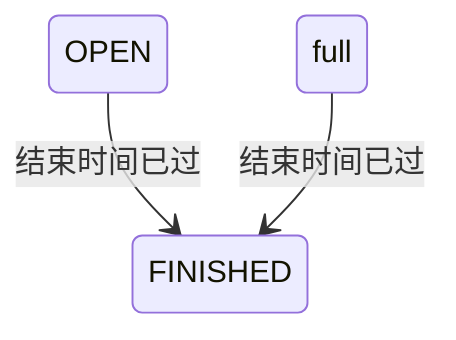

## 一句话价值

将已过结束时间的开放约球置为已结束。

## 核心概念

- 约球  围绕一次明确时间、场地、人数和参与条件组织的网球活动，不只是两人邀约。

## 业务对象

### 约球

| 业务名称 | 描述 | 取值说明 |
|---|---|---|
| 约球编号 | 唯一标识本次结算的约球。 | — |
| 结束时间 | 活动约定的结束时刻；超过后才会被本服务结算。 | — |
| 约球状态 | 本服务将已过结束时间且仍在报名中的约球置为已结束。 | 报名中：尚未结算；已结束：已完成结束结算。 |

## 交付内容

类型: 批处理类

一次处理主流程界定的一批业务对象；处理范围、成功失败统计、部分成功口径与失败对象的收场方式，以本节下列规则及分支与异常为准。

| 当前状态 | 触发操作 | 新状态 | 前置条件 | 谁能触发 |
|---|---|---|---|---|
| `OPEN` | 结束结算 | `FINISHED` | `end_time` 早于本次结算时刻 | 每日定时规则 |
| `full` | 结束结算 | `FINISHED` | `end_time` 早于本次结算时刻 | 每日定时规则 |

## 主流程

触发源：每日定时任务；终态：所有符合条件的约球均为 `FINISHED`。

1. 到达每日结算时刻后，确定本次结算基准时间。
2. 找出状态为 `OPEN` 或兼容值 `full`，且结束时间早于结算时刻的约球。
3. 将这些约球统一置为 `FINISHED`，其他约球保持原状。

## 分支与异常

| 什么情况 | 怎么处理 | 对外提示 | 做了一半的怎么收场 |
|---|---|---|---|
| 没有符合条件的约球 | 正常结束本轮结算 | 无 | 不改变任何约球。 |
| 约球尚未到结束时间 | 跳过该约球 | 无 | 约球状态保持不变，后续每日结算时重新判断。 |
| 约球状态不是 `OPEN` 或 `full` | 跳过该约球 | 无 | 约球状态保持不变。 |
| 结算过程发生异常 | 终止本轮结算 | 无 | 未完成结算的约球留待后续每日结算再次处理。 |

## 业务边界

- 本服务负责每日把结束时间已过且状态为 `OPEN` 或 `full` 的约球归档为 `FINISHED`。
- 本服务同时处理普通约球和赛事约球，不按发布者、参与者、人数或报名结果筛选。
- 本服务不把 `OPEN` 约球持久化为 `ONGOING`；进行中状态只由其他读取流程按时间判断。
- 本服务不修改约球报名、比分、评价、费用、群聊或赛事比赛状态，也不发送结束通知。
- 球场约球次数统计属于另一个定时服务，不在本服务内完成。
- 本服务没有面向用户的同步结果，只以约球状态完成结算。

## 遗留与待定

| 等级 | 待定的是什么 | 要谁来定 |
|---|---|---|
| P1 | 批量规则接受小写 `full`，但正式约球状态枚举没有该取值；其业务含义、历史来源和是否继续兼容需产品与数据负责人确认。 | 产品与约球运营负责人 |
| P1 | 正式状态包含 `ONGOING`，但本服务只结算 `OPEN` 和 `full`；持久化为 `ONGOING` 且已过结束时间的约球是否也应结算，需产品负责人确认。 | 产品与约球运营负责人 |
| P2 | 普通约球和赛事约球使用同一结束规则，代码没有说明赛事约球结束是否还应同步赛事比赛；需赛事产品负责人确认。 | 产品与约球运营负责人 |
| P1 | 当前结算每天执行一次，约球实际结束到状态落库之间可能存在延迟；允许的最大延迟需产品负责人确认。 | 产品与约球运营负责人 |
