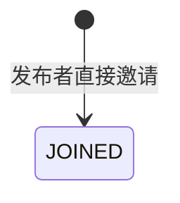

## 一句话价值

由约球发布者将指定用户直接加入约球。

## 核心概念

- 约球  围绕一次明确时间、场地、人数和参与条件组织的网球活动，不只是两人邀约。
- 约球发布者  创建约球并负责活动信息、费用和报名审批的人，也是首位参与者。
- 约球报名  用户与约球之间的参与关系，可处于待审批、已加入、已拒绝、已撤回、已退出、已评价或已跳过。
- 组团成功  约球的有效参与人数达到人数上限，表示活动成员已经组成。

## 业务对象

### 约球报名

| 业务名称 | 描述 | 取值说明 |
|---|---|---|
| 报名编号 | 唯一标识被邀请人与约球的参与关系。 | — |
| 所属约球 | 被邀请人直接加入的约球。 | — |
| 参与者 | 本次被邀请加入的用户。 | — |
| 报名状态 | 邀请成功后直接成为已加入参与者。 | 待审批：等待发布者审批；已加入：已成为参与者；已拒绝：报名被拒绝；已撤回：申请人撤回报名；已退出：参与者退出约球；已评价：已完成赛后评价；已跳过评价：已跳过赛后评价。 |

## 交付内容

类型: 新增类

成功后形成此前不存在的业务事实，并交付主流程所述标识或结果；初始状态、后续可变更范围和可见范围，以本节下列规则、业务对象及业务边界为准。

| 当前状态 | 触发操作 | 新状态 | 前置条件 | 谁能触发 |
|---|---|---|---|---|
| 无未终止报名 | 邀请加入 | `JOINED` | 已登录；目标约球存在且未满员；被邀请人没有未终止报名，也不是已有群聊成员 | 约球发布者 |

## 主流程

触发源：约球发布者发起 HTTP 邀请；终态：被邀请人的报名为 `JOINED`，并成为约球群聊成员。

1. 识别当前用户、目标约球和被邀请人。
2. 确认当前用户是约球发布者、约球尚有名额，且被邀请人没有未终止报名。
3. 为被邀请人建立 `JOINED` 报名，并按全部有效参与者更新已加入人数。
4. 让被邀请人成为约球群聊成员，初始未读数为零。
5. 若邀请后有效参与人数达到人数上限，向当时仍在约球中的全体有效参与者发起微信组团成功提醒。
6. 向发布者返回邀请成功；本次调用不返回报名、人数、群聊或通知结果。

## 分支与异常

| 什么情况 | 怎么处理 | 对外提示 | 做了一半的怎么收场 |
|---|---|---|---|
| 未提供登录凭证 | 拒绝邀请 | 登录已过期，请重新登录 | 不建立报名或群聊成员关系，已加入人数不变。 |
| 登录凭证无效 | 拒绝邀请 | 登录凭证无效，请重新登录 | 不建立报名或群聊成员关系，已加入人数不变。 |
| `meetupId` 为空或只有空白 | 拒绝邀请 | meetupId: 约球ID不能为空 | 不建立报名或群聊成员关系，已加入人数不变。 |
| `userId` 为空或只有空白 | 拒绝邀请 | userId: 被邀请人用户ID不能为空 | 不建立报名或群聊成员关系，已加入人数不变。 |
| 目标约球不存在 | 拒绝邀请 | 约球不存在 | 不建立报名或群聊成员关系，已加入人数不变。 |
| 当前用户不是约球发布者 | 拒绝邀请 | 仅发布者可操作 | 不建立报名或群聊成员关系，已加入人数不变。 |
| 有效参与人数已达到或超过人数上限 | 拒绝邀请 | 约球已满员 | 不建立报名或群聊成员关系，已加入人数不变。 |
| 被邀请人已有 `PENDING`、`JOINED`、`REVIEWED` 或 `SKIPPED` 报名 | 拒绝邀请 | 你已报名该约球 | 保留原报名和群聊关系，已加入人数不变。 |
| 被邀请人已有该约球的群聊成员关系 | 拒绝邀请 | 你已加入该聊天 | 不保留本次新报名或人数变更，也不重复建立群聊成员关系。 |
| 报名、已加入人数或群聊成员关系保存失败 | 邀请失败 | 系统异常，请稍后重试 | 本次报名、人数和群聊成员变更均不保留。 |
| 邀请后尚未达到人数上限 | 完成邀请，不发组团成功提醒 | 邀请成功 | 报名和群聊成员关系保持成功。 |
| 通知发送前收件人已退出约球 | 跳过该收件人的提醒 | 邀请成功 | 报名和群聊成员关系保持成功，不建立该用户的触达日志。 |
| 收件人没有微信小程序接收身份或未订阅 | 触达日志记 `SKIPPED` | 邀请成功 | 报名和群聊成员关系保持成功。 |
| 微信渠道发送失败 | 触达日志记 `FAILED` | 邀请成功 | 不回滚邀请。 |

## 业务边界

- 本服务从约球发布者指定一个用户开始，到该用户直接成为 `JOINED` 参与者和群聊成员为止，不等待被邀请人确认。
- 本服务新建一条报名，不修改被邀请人已有的 `REJECTED`、`WITHDRAWN` 或 `QUIT` 历史报名。
- 本服务只调整目标约球的 `current_players`，不修改约球状态、人数上限、时间、场地、参加条件或费用。
- 本服务不核对被邀请人的账户是否存在、个人档案完整度、性别、NTRP、信誉分或其他约球时间冲突。
- 本服务不依据约球的 `status`、`start_time`、`end_time`、`join_mode` 或 `meetup_type` 限制邀请。
- 邀请使约球满员时，服务在事务提交后直接尝试组团成功触达，并通过事件、接收人和渠道唯一日志避免同一次邀请重复发送。
- 微信订阅消息是否实际送达不改变 `JOINED` 终态；邀请结果不等待微信通知结果。
- 本服务只向发布者返回成功标识，不交付更新后的报名、约球人数、群聊资料或通知结果。

## 遗留与待定

| 等级 | 待定的是什么 | 要谁来定 |
|---|---|---|
| P1 | 邀请会跳过个人档案、性别、NTRP、信誉分和时间冲突等普通报名准入规则；发布者是否有权豁免、哪些规则仍须保留，需由产品与风控负责人确定。 | 产品与约球运营负责人 |
| P1 | 邀请不校验被邀请人的用户或账户是否存在；无效用户编号仍可能形成报名和群聊成员关系，身份有效性规则需由产品与账户负责人确定。 | 产品与约球运营负责人 |
| P1 | 邀请不校验约球状态、时间、加入模式或约球类型，因此草稿、进行中、已关闭、已结束及赛事约球也可能接受邀请；允许范围需由产品负责人确定。 | 产品与约球运营负责人 |
| P2 | 邀请直接产生 `JOINED`，没有被邀请人接受或拒绝的等待阶段；是否需要邀请确认以及拒绝后的收场规则需由产品负责人确定。 | 产品与约球运营负责人 |
| P2 | 新报名没有记录邀请来源或邀请人，后续无法区分发布者邀请与用户直接报名；是否需要保留邀请关系需由产品与数据负责人确定。 | 产品与约球运营负责人 |
| P2 | 未满员时不会向被邀请人发送邀请成功通知；满员时也只尝试发送组团成功提醒，邀请结果的告知方式需由产品与通知负责人确定。 | 产品与约球运营负责人 |
| P1 | 邀请没有名额占用或并发版本条件；多人同时被邀请时可能超过 `max_players`，名额分配与超员收场规则需由产品负责人确定。 | 产品与约球运营负责人 |
| P1 | `rally_meetup_registration` 只按 `biz_id` 唯一，没有限制同一用户在同一约球下只能有一条未终止报名；并发邀请可能产生重复报名，数据唯一性规则需由产品与数据负责人确定。 | 产品与约球运营负责人 |
| P1 | 报名已是 `JOINED` 但群聊成员缺失时会被视为重复报名，群聊关系无法通过本服务补齐；报名与群聊不一致的修复规则需由产品负责人确定。 | 产品与约球运营负责人 |
| P1 | 群聊成员已存在但没有未终止报名时，邀请会失败且不补齐报名；历史群聊关系的清理或恢复规则需由产品负责人确定。 | 产品与约球运营负责人 |
| P1 | 只要邀请后达到人数上限就尝试发送组团成功提醒；同一次邀请按报名事件去重，但成员变化后再次满员会形成新事件。是否需要限制同一约球的组团提醒次数，需由产品与通知负责人确定。 | 产品与约球运营负责人 |
