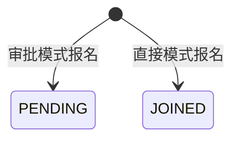

## 一句话价值

为符合条件的用户建立已加入或待审批的约球报名。

## 核心概念

- 个人档案  用户基础资料与网球资料的组合，包含 NTRP、自评状态、评分和展示视频。
- NTRP  用于描述网球水平的等级值，既用于个人展示，也用于约球和赛事准入。
- 约球  围绕一次明确时间、场地、人数和参与条件组织的网球活动，不只是两人邀约。
- 约球发布者  创建约球并负责活动信息、费用和报名审批的人，也是首位参与者。
- 约球报名  用户与约球之间的参与关系，可处于待审批、已加入、已拒绝、已撤回、已退出、已评价或已跳过。
- 组团成功  约球的有效参与人数达到人数上限，表示活动成员已经组成。

## 业务对象

### 约球报名

| 业务名称 | 描述 | 取值说明 |
|---|---|---|
| 报名编号 | 唯一标识报名人与约球的参与关系。 | — |
| 所属约球 | 本次申请加入的约球。 | — |
| 报名人 | 发起本次报名的用户。 | — |
| 报名状态 | 根据约球加入方式形成待审批或已加入状态。 | 待审批：等待发布者审批；已加入：已成为参与者；已拒绝：报名被拒绝；已撤回：申请人撤回报名；已退出：参与者退出约球；已评价：已完成赛后评价；已跳过评价：已跳过赛后评价。 |

## 状态机

| 当前状态 | 触发操作 | 新状态 | 前置条件 | 谁能触发 |
|---|---|---|---|---|
| 不存在 | 报名审批模式约球 | `PENDING` | 已登录；个人档案完整；约球可报名；未满员；本人不是发布者且没有未终止报名；性别、NTRP、信誉分符合 | 当前用户 |
| 不存在 | 报名直接模式约球 | `JOINED` | 已登录；个人档案完整；约球可报名；未满员；本人不是发布者且没有未终止报名；性别、NTRP、信誉分符合 | 当前用户 |

## 主流程

触发源：用户发起 HTTP 报名；终态：报名为 `JOINED` 或 `PENDING`。

1. 识别当前用户，确认账户存在，昵称、头像和网球档案均已完善。
2. 取得目标约球及已有报名，确认约球尚可报名且仍有空位。
3. 确认本人不是约球发布者，也没有待审批或有效参与的重复报名。
4. 按约球要求核对本人的性别、NTRP 和信誉分。
5. 建立本人和约球之间的报名关系，并保存报名人指定的自动撤回时间。
6. 若约球采用直接加入模式，将报名置为 `JOINED`，把本人计入已加入人数并加入约球群聊。
7. 若约球采用审批模式，将报名置为 `PENDING`，等待约球发布者通过另一项服务审批。
8. 按本次微信订阅消息授权登记可用额度：直接加入并达到人数上限时不登记报名成功额度。
9. 对直接加入且未满员的报名人发送报名成功通知；直接加入并满员时向全体有效参与者发送组团成功提醒；待审批时提醒约球发布者处理申请。
10. 返回报名成功标识；本次调用不返回报名编号或实际终态。

## 分支与异常

| 什么情况 | 怎么处理 | 对外提示 | 做了一半的怎么收场 |
|---|---|---|---|
| 未登录 | 拒绝报名 | 未登录，请先登录 | 不建立报名、群聊成员或通知授权。 |
| 当前身份没有对应账户 | 拒绝报名 | 登录凭证无效，请重新登录 | 不建立报名、群聊成员或通知授权。 |
| 昵称和头像均未完善，且网球档案也未完善 | 拒绝报名 | 请先完善个人信息和网球档案 | 不建立报名、群聊成员或通知授权。 |
| 昵称或头像仍为默认值 | 拒绝报名 | 请先完善用户信息, 设置头像和昵称 | 不建立报名、群聊成员或通知授权。 |
| 没有正常或核查期网球档案 | 拒绝报名 | 请先完善网球档案 | 不建立报名、群聊成员或通知授权。 |
| `meetupId` 为空或只有空白 | 拒绝报名 | 约球ID不能为空 | 不建立报名、群聊成员或通知授权。 |
| 目标约球不存在 | 拒绝报名 | 约球不存在 | 不建立报名、群聊成员或通知授权。 |
| 已加入人数达到人数上限 | 拒绝报名 | 约球已满员 | 不建立报名、群聊成员或通知授权。 |
| 约球已关闭 | 拒绝报名 | 约球已关闭 | 不建立报名、群聊成员或通知授权。 |
| 约球已结束，或开始时间已经到达 | 拒绝报名 | 约球已开始或已结束，无法操作 | 不建立报名、群聊成员或通知授权。 |
| 约球正在进行 | 拒绝报名 | 约球进行中，无法报名 | 不建立报名、群聊成员或通知授权。 |
| 本人是约球发布者 | 拒绝报名 | 不能报名自己发布的约球 | 不建立报名、群聊成员或通知授权。 |
| 本人已有 `PENDING`、`JOINED`、`REVIEWED` 或 `SKIPPED` 报名 | 拒绝重复报名 | 你已报名该约球 | 不建立新的报名、群聊成员或通知授权。 |
| 本人性别不符合仅男性或仅女性限制 | 拒绝报名 | 性别不符合该约球要求 | 不建立报名、群聊成员或通知授权。 |
| 本人 NTRP 不符合约球水平方式及边界 | 拒绝报名 | 水平不符合该约球要求 | 不建立报名、群聊成员或通知授权。 |
| 本人信誉分低于当前配置门槛 | 拒绝报名 | 信誉分过低，暂时无法报名 | 不建立报名、群聊成员或通知授权。 |
| 直接加入时本人已经是该约球群聊成员 | 拒绝报名 | 你已加入该聊天 | 本次新报名及已加入人数变更均不保留。 |
| `acceptedNoticeScenes` 含无法识别的名称 | 忽略无法识别项，继续报名 | 无 | 报名照常完成，只登记可识别场景。 |
| 微信订阅消息授权登记失败 | 保留报名结果 | 无 | 报名及直接加入的群聊成员保持成功，不登记本次授权。 |
| 没有相应微信订阅消息授权，或通知发送失败 | 保留报名结果 | 无 | 报名及直接加入的群聊成员保持成功，收件人可能收不到通知。 |
| 报名、已加入人数或群聊成员保存失败 | 报名失败 | 系统异常，请稍后重试 | 本次报名、人数和群聊成员变更均不保留。 |

## 业务边界

- 本服务从本人提交约球报名开始，到建立 `JOINED` 或 `PENDING` 报名并返回成功标识为止。
- 本服务依据约球的加入模式决定本次终态；审批模式只建立待审批报名，不在本次调用中等待或执行审批。
- `JOINED` 报名在本服务内计入已加入人数并成为群聊成员；`PENDING` 不计入人数，也不进入群聊。
- 后续审批通过或拒绝属于“约球报名审批”，待审批报名撤回属于“约球报名撤回”。
- 已加入后的主动退出属于“约球成员退出”，报名到期后的自动撤回不由本服务执行。
- 本服务不修改约球人数上限、时间、场地、参与条件、费用或活动状态。
- 本服务不检查报名人与其他约球的时间冲突，也不预留名额；待审批期间其他用户仍可报名。
- 本服务不返回报名编号或 `JOINED`、`PENDING` 终态，结果展示需通过约球查询取得。
- 微信订阅消息授权和通知结果不改变报名终态；通知失败不撤销报名。

## 遗留与待定

- `autoWithdrawAt` 没有早于当前时刻、晚于约球开始时间或仅适用于 `PENDING` 的校验，且现有代码中没有按该时间自动撤回报名的执行入口；自动撤回规则及责任服务应由产品负责人确定。
- `shareUserId` 当前未进入任何业务判断或业务对象，也不影响报名结果；分享归因的业务用途应由产品负责人确定。
- 报名成功只返回成功标识，不返回报名编号及 `JOINED`、`PENDING` 终态；调用方如何可靠识别本次结果应由产品负责人确定。
- 报名校验明确拒绝 `CLOSED`、`ONGOING`、`FINISHED`，但没有明确拒绝 `DRAFT`；草稿约球是否允许报名应由产品负责人确定。
- 本人 NTRP 为空时视为符合任意水平要求，信誉分为空时视为达到门槛；档案字段缺失时是否应放行应由产品与风控负责人确定。
- 本人性别为空时视为符合任意性别限制，但 `UNDISCLOSED` 会被仅男性或仅女性限制拒绝；缺失性别与未公开性别的准入口径应由产品负责人确定。
- 代码中存在“同一时间段已有其他约球”的错误定义，但报名流程没有执行时间冲突检查；是否允许同一用户同时参加时间重叠的约球应由产品负责人确定。
- `REJECTED`、`WITHDRAWN`、`QUIT` 后允许为同一用户和约球新建另一条报名关系；重复报名的历史保留及次数限制应由产品负责人确定。
- 待审批报名不占名额，也没有在审批前预留席位；多人等待期间名额如何分配由审批服务决定，公平性规则应由产品负责人确定。
- `acceptedNoticeScenes` 接受全部已知场景，包括与约球报名无关的赛事通知场景，且重复场景会登记多份授权；允许名单和去重规则应由产品与通知负责人确定。
- 直接加入导致组团成功时只排除本次 `JOIN_SUCCESS` 授权，其他无关场景仍会登记；组团场景的授权收集策略应由产品与通知负责人确定。
- 微信订阅消息授权登记或发送失败均不提示报名人；是否需要反馈通知未生效应由产品负责人确定。
