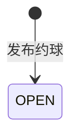

## 一句话价值

让档案完整的用户创建开放约球并成为首位参与者。

## 核心概念

- 个人档案  用户基础资料与网球资料的组合，包含 NTRP、自评状态、评分和展示视频。
- NTRP  用于描述网球水平的等级值，既用于个人展示，也用于约球和赛事准入。
- 约球  围绕一次明确时间、场地、人数和参与条件组织的网球活动，不只是两人邀约。
- 约球发布者  创建约球并负责活动信息、费用和报名审批的人，也是首位参与者。
- 约球报名  用户与约球之间的参与关系，可处于待审批、已加入、已拒绝、已撤回、已退出、已评价或已跳过。

## 业务对象

### 约球

| 业务名称 | 描述 | 取值说明 |
|---|---|---|
| 约球编号 | 唯一标识本次约球。 | — |
| 活动性质 | 区分日常约球与赛事产生的赛约。 | 普通约球：面向日常约球活动。 |
| 发布者 | 创建约球并负责活动信息、费用和报名审批的人。 | — |
| 标题 | 约球的展示名称；未填写时按活动日期、类型、性别限制和审批要求生成。 | — |
| 约球类型 | 本次活动采用的对局形式。 | 单打：以单打形式开展；双打：以双打形式开展；拉球：以拉球形式开展。 |
| 参与人数 | 包含人数上限和当前已加入人数；发布完成时当前人数为一人。 | — |
| 城市与区县 | 约球所在的已开通城市，以及根据球场资料或地址识别出的区县。 | — |
| 活动时间 | 包含开始时间、结束时间和持续时长。 | — |
| 场地 | 包含场地名称、地址和位置；引用到已有球场时以球场资料为准。 | — |
| 场地选择方式 | 确定场地资料来源的方式。 | 文字搜索：搜索并选择已有球场；地图选择：从地图选择已有球场；自由填写：不引用已有球场，直接填写场地资料。 |
| NTRP 要求 | 参与者的水平准入条件。 | 区间：水平处于最低值与最高值之间；精确值：水平等于指定值；不低于：水平不得低于最低值；不高于：水平不得高于最高值。 |
| 性别限制 | 参与者的性别准入条件。 | 不限性别：男性和女性均可报名；仅限男性：只有男性可报名；仅限女性：只有女性可报名。 |
| 加入方式 | 报名者成为参与者的方式。 | 直接加入：符合条件的报名者直接成为参与者；审批加入：报名者需等待约球发布者审批。 |
| 费用 | 本次约球的费用项目和总额；发布时没有按人时分摊方案。 | — |
| 约球状态 | 表示约球当前所处的业务阶段。 | 报名中：约球已发布并开放报名，也是本服务完成时的状态。 |

### 发布者报名

| 业务名称 | 描述 | 取值说明 |
|---|---|---|
| 报名编号 | 唯一标识发布者与本次约球的参与关系。 | — |
| 所属约球 | 指向本次新发布的约球。 | — |
| 参与者 | 固定为约球发布者。 | — |
| 报名状态 | 表示报名关系当前所处的业务阶段；本服务完成时直接为已加入，不受约球加入方式影响。 | 待审批：等待发布者审批；已加入：已成为参与者；已拒绝：报名被拒绝；已撤回：申请人撤回待审批报名；已退出：参与者退出约球；已评价：已完成赛后评价；已跳过评价：已跳过赛后评价。已评价和已跳过评价仍属于有效参与者。 |

## 交付内容

类型: 新增类

成功后形成此前不存在的业务事实，并交付主流程所述标识或结果；初始状态、后续可变更范围和可见范围，以本节下列规则、业务对象及业务边界为准。

| 当前状态 | 触发操作 | 新状态 | 前置条件 | 谁能触发 |
|---|---|---|---|---|
| 不存在 | 发布约球 | `OPEN` | 已登录；个人档案完整；未达当日发布上限；城市已开通；发布内容有效 | 当前用户 |

发布成功时，发布者的约球报名同步从不存在建立为 `JOINED`，并成为约球群聊成员。

## 主流程

触发源：档案完整的登录用户发起 HTTP 发布；终态：约球为 `OPEN`，发布者报名为 `JOINED` 并进入群聊。

1. 识别当前用户，确认其昵称、头像和网球档案已经完善。
2. 确认发布者当天仍有发布名额，所选城市已经开通。
3. 校验约球类型、人数、时间、场地、NTRP、性别、加入方式和费用等发布内容。
4. 若通过文字搜索或地图引用到已有球场，采用球场资料中的名称、地址、位置和区县；否则采用提交的场地资料。
5. 计算活动结束时间和城市、区县名称；标题空白时按活动日期、类型、性别限制和审批要求生成标题。
6. 建立报名中的普通约球，并让发布者以已加入状态成为首位参与者。
7. 让发布者成为该约球的群聊成员。
8. 对本次已经获得的微信订阅授权，按可识别通知场景登记待使用额度。
9. 确认发布成功；本次调用不交付约球编号或约球详情。

## 分支与异常

| 什么情况 | 怎么处理 | 对外提示 | 做了一半的怎么收场 |
|---|---|---|---|
| 未登录 | 拒绝发布 | 未登录，请先登录 | 不创建约球、报名或群聊成员。 |
| 当前身份不存在对应账户 | 拒绝发布 | 登录凭证无效，请重新登录 | 不创建约球、报名或群聊成员。 |
| 昵称和头像均未完善，且网球档案也未完善 | 拒绝发布 | 请先完善个人信息和网球档案 | 不创建约球、报名或群聊成员。 |
| 昵称或头像仍为默认值 | 拒绝发布 | 请先完善用户信息, 设置头像和昵称 | 不创建约球、报名或群聊成员。 |
| 没有正常或核查期网球档案 | 拒绝发布 | 请先完善网球档案 | 不创建约球、报名或群聊成员。 |
| 当天有效发布数量已达到当前配置上限 | 拒绝发布 | 今日发布已达上限 | 不创建约球、报名或群聊成员。 |
| 城市编码为空、没有开通城市配置或所选城市未开通 | 拒绝发布 | 该城市暂未开通 | 不创建约球、报名或群聊成员。 |
| 必填字段缺失，或标题、场地名称、地址超过长度限制 | 拒绝发布 | 返回首个无效字段及其校验说明 | 不创建约球、报名或群聊成员。 |
| 人数上限小于 2 或大于 16 | 拒绝发布 | `maxPlayers: 人数上限至少2人` 或 `maxPlayers: 人数上限不超过16人` | 不创建约球、报名或群聊成员。 |
| 经度不在 -180～180，或纬度不在 -90～90 | 拒绝发布 | 返回对应经纬度范围提示 | 不创建约球、报名或群聊成员。 |
| 开始时间早于受理发布时刻 | 拒绝发布 | 不能发布过去的约球 | 不创建约球、报名或群聊成员。 |
| 持续时长不在六个允许值中 | 拒绝发布 | 持续时长必须是0.5的倍数 | 不创建约球、报名或群聊成员。 |
| NTRP 数值超出 1.5～7.0 或不是 0.5 步长 | 拒绝发布 | 返回对应数值范围或步长提示 | 不创建约球、报名或群聊成员。 |
| `RANGE` 缺少任一边界，或最低值大于最高值 | 拒绝发布 | 请填写水平最小值、请填写水平最大值，或水平最小值不能大于最大值 | 不创建约球、报名或群聊成员。 |
| `EXACT` 或 `ABOVE` 缺少最低值，或 `BELOW` 缺少最高值 | 拒绝发布 | 返回对应水平值缺失提示 | 不创建约球、报名或群聊成员。 |
| `TEXT` 或 `MAP` 提交的 `courtId` 没有匹配球场 | 继续使用提交的场地名称、地址和经纬度发布 | 无 | 按提交资料完成发布。 |
| `acceptedNoticeScenes` 含无法识别的名称 | 忽略无法识别项，继续发布 | 无 | 约球正常发布，只登记可识别场景。 |
| 微信订阅通知授权登记失败 | 保留约球发布结果，不登记本次通知额度 | 无 | 约球、发布者报名和群聊成员保持成功状态。 |
| 约球、发布者报名或群聊成员保存失败 | 发布失败 | 系统异常，请稍后重试 | 撤回本次已产生的约球、报名和群聊成员变更。 |

## 业务边界

- 本服务负责校验发布者和发布内容，创建状态为 `OPEN` 的普通约球，让发布者成为首位已加入参与者并进入群聊，到确认发布成功为止。
- 本服务按本次微信授权结果登记通知额度，但不发送任何通知；额度登记失败不影响约球发布。
- 本服务不返回新约球编号或详情，发布者需通过约球查询服务取得发布结果。
- 本服务不邀请其他用户、不处理他人报名或审批，也不判断后续何时组团成功。
- 本服务不修改约球、不修改费用分摊、不关闭或结束约球。
- 本服务不创建球场；引用不到已有球场时仍可按提交的场地资料发布。
- 本服务不完成线上收款、线下订场或费用结算，只保存费用项目。
- 本服务不负责赛事比赛产生的赛约；赛事线下活动和订场约球由各自服务创建。

## 遗留与待定

| 等级 | 待定的是什么 | 要谁来定 |
|---|---|---|
| P2 | 普通发布允许的持续时长被固定为 0.5～3.0 小时的六个值，但对外错误提示只说“必须是0.5的倍数”；时长上限及提示口径应由产品确认。 | 产品与约球运营负责人 |
| P1 | `startTime` 只拒绝早于校验时刻的时间，没有定义必须至少提前多久发布；最小提前量应由产品确认。 | 产品与约球运营负责人 |
| P2 | `districtCode` 被接收但不保存，`district_name` 改为从球场资料或地址识别；区县编码是否应持久化及其与区县名称的权威关系应由产品与场地数据负责人确定。 | 产品与约球运营负责人 |
| P2 | `TEXT`、`MAP` 下引用不到 `courtId` 时不会拒绝，而是使用提交资料；是否允许失效球场引用降级为自由场地应由产品确认。 | 产品与约球运营负责人 |
| P2 | `courtSelectMode` 和 `courtId` 都可不填，`FREE` 也未禁止携带 `courtId`；场地选择方式与球场编号的组合规则应由产品确认。 | 产品与约球运营负责人 |
| P2 | `levelMode` 为 `ABOVE` 时仍可保存 `levelMax`，为 `BELOW` 时仍可保存 `levelMin`；未使用边界是否应拒绝或清空应由产品确认。 | 产品与约球运营负责人 |
| P1 | `costItems` 没有数量、名称非空、金额非负、总额上限或重复项目限制；费用资料的有效规则应由产品和财务负责人确定。 | 产品与约球运营负责人 |
| P2 | `courtIndex` 被描述为前端透传内容，缺少业务定义和格式规则；它是否表示场地号以及适用场景应由产品确认。 | 产品与约球运营负责人 |
| P1 | 当日发布数量只统计当天状态为 `OPEN` 或字面值 `full` 的约球；`full` 不在约球状态枚举中，且已结束、已关闭、进行中的约球不计入，真实防滥用口径应由产品确认。 | 产品与约球运营负责人 |
| P1 | 已开通城市编码存在于配置、但城市名录找不到对应城市时，生成城市名称会失败；城市配置与名录不一致时的处理方式应由产品与运营确定。 | 产品与约球运营负责人 |
| P2 | 标题生成规则固定使用星期和类型，并按条件追加性别及审批文字；默认标题的产品文案和本地化规则尚未说明，应由产品确认。 | 产品与约球运营负责人 |
| P2 | `acceptedNoticeScenes` 当前接受所有可识别通知场景，包括赛事通知场景，未限制为约球场景；应由产品与通知负责人确认允许名单。 | 产品与约球运营负责人 |
| P1 | 重复的通知场景会分别建立多条待使用额度；同次授权是否应去重应由产品与通知负责人确认。 | 产品与约球运营负责人 |
| P1 | 通知额度登记失败会被忽略且不告知发布者；是否需要提示授权未生效或提供补登记方式应由产品确认。 | 产品与约球运营负责人 |
| P2 | 发布成功只返回成功标识，不交付新约球编号；发布后的跳转和结果识别方式应由产品确认。 | 产品与约球运营负责人 |
