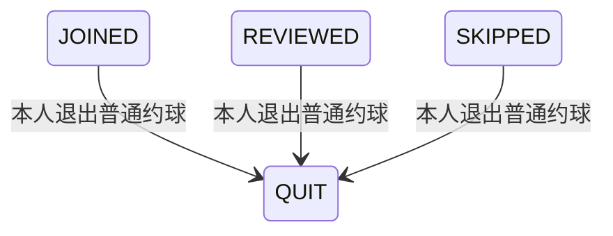

## 一句话价值

让已加入参与者退出普通约球、释放名额并离开群聊。

## 核心概念

- 约球  围绕一次明确时间、场地、人数和参与条件组织的网球活动，不只是两人邀约。
- 约球发布者  创建约球并负责活动信息、费用和报名审批的人，也是首位参与者。
- 约球报名  用户与约球之间的参与关系，可处于待审批、已加入、已拒绝、已撤回、已退出、已评价或已跳过。

## 业务对象

### 约球报名

| 业务名称 | 描述 | 取值说明 |
|---|---|---|
| 报名编号 | 唯一标识本人和约球的参与关系。 | — |
| 所属约球 | 本次退出的约球。 | — |
| 参与者 | 退出约球的当前用户。 | — |
| 报名状态 | 退出成功后变为已退出。 | 待审批：等待发布者审批；已加入：已成为参与者；已拒绝：报名被拒绝；已撤回：申请人撤回报名；已退出：参与者已退出约球；已评价：已完成赛后评价；已跳过评价：已跳过赛后评价。 |

### 约球

| 业务名称 | 描述 | 取值说明 |
|---|---|---|
| 约球编号 | 本次有成员退出的约球。 | — |
| 当前参与人数 | 退出成功后扣除退出人所占的名额。 | — |

## 状态机

| 当前状态 | 触发操作 | 新状态 | 前置条件 | 谁能触发 |
|---|---|---|---|---|
| `JOINED` | 退出约球 | `QUIT` | 已登录；目标为普通约球；报名属于本人 | 已加入参与者本人 |
| `REVIEWED` | 退出约球 | `QUIT` | 已登录；目标为普通约球；报名属于本人 | 已完成评价的参与者本人 |
| `SKIPPED` | 退出约球 | `QUIT` | 已登录；目标为普通约球；报名属于本人 | 已跳过评价的参与者本人 |

## 主流程

触发源：参与者发起 HTTP 退出；终态：本人报名为 `QUIT`、名额已释放且本人已离开群聊。

1. 识别当前登录用户和退出请求指定的约球。
2. 取得目标约球及其全部约球报名，确认目标存在且不是赛事约球。
3. 找到本人仍有效的约球报名，确认其处于 `JOINED`、`REVIEWED` 或 `SKIPPED`。
4. 将本人报名改为 `QUIT`，并按剩余有效参与者重新计算约球的 `current_players`。
5. 移除本人在该约球下的群聊成员关系，不删除已有聊天消息。
6. 取得退出人昵称，向约球发布者发起包含活动名称、开始时间、退出成员和退出时间的微信订阅消息。
7. 返回退出成功标识；不返回更新后人数、处罚判断或通知结果。

## 分支与异常

| 什么情况 | 怎么处理 | 对外提示 | 做了一半的怎么收场 |
|---|---|---|---|
| 未提供登录凭证 | 拒绝退出 | 登录已过期，请重新登录 | 报名、人数和群聊成员均不变。 |
| 登录凭证无效，或当前身份没有对应用户资料 | 拒绝退出 | 登录凭证无效，请重新登录 | 报名、人数和群聊成员均不变。 |
| `meetupId` 为空或只有空白 | 拒绝退出 | 约球ID不能为空 | 报名、人数和群聊成员均不变。 |
| 目标约球不存在 | 拒绝退出 | 约球不存在 | 报名、人数和群聊成员均不变。 |
| 目标是赛事约球 | 拒绝退出，要求回到比赛流程处理 | 这是赛事约球，无法在此退出，请返回比赛页面进行相关操作 | 报名、人数和群聊成员均不变。 |
| 本人没有 `JOINED`、`REVIEWED` 或 `SKIPPED` 报名 | 拒绝退出 | 你未报名该约球 | 待审批、已拒绝、已撤回或已退出的报名均保持原状态。 |
| 本人的报名为 `PENDING` | 拒绝退出，应改走报名撤回 | 你未报名该约球 | 待审批报名保持 `PENDING`。 |
| 本人的群聊成员关系已经不存在 | 继续完成退出 | 退出成功 | 报名保持 `QUIT`，人数照常释放。 |
| 报名、人数或群聊成员变更失败 | 退出失败 | 系统异常，请稍后重试 | 本次报名、人数和群聊成员变更均不保留。 |
| 发布者没有可用的 `MEMBER_QUIT` 通知额度 | 跳过成员退出通知 | 退出成功 | 退出结果保留；通知额度不变。 |
| 通知触发过程发生异常 | 不影响退出结果 | 退出成功 | 退出结果保留；发布者可能收不到通知。 |
| 发布者没有微信小程序接收身份，无法取得微信授权，或微信拒绝消息 | 记录通知失败 | 退出成功 | 退出结果保留；已占用通知额度记为 `FAILED`。 |

## 业务边界

- 本服务从参与者提交指定约球的退出请求开始，到本人报名变为 `QUIT`、有效人数重新计算、本人群聊成员关系移除并返回成功标识为止。
- 本服务只处理普通约球；赛事约球的退出由赛事比赛流程负责。
- 本服务保留约球报名历史和已有聊天消息，不删除约球、报名记录或聊天消息。
- 本服务不改变约球状态、时间、场地、人数上限、费用或其他参与者的报名和群聊关系。
- 本服务会判断是否落入临近开始的处罚窗口，但目前不扣减信誉分，也不向退出人返回处罚判断。
- 本服务只向约球发布者发起成员退出通知，不等待或保证微信订阅消息送达；通知失败不撤销退出。
- 本服务只返回成功标识，不交付退出后的约球详情、剩余人数或群聊历史。

## 遗留与待定

- 临近开始退出会按 `meetup.quit.penalty_threshold_hours` 判定为应处罚，但实际信誉分扣减尚未实现，`meetup.quit.penalty_under_6h` 也未被读取；处罚是否启用、扣多少、落在哪个业务对象及何时生效需由产品与风控负责人确定。
- 当前没有按约球状态或开始、结束时间限制退出，`ONGOING`、`CLOSED`、`FINISHED` 下仍可退出；活动生命周期内各状态是否允许退出需由产品负责人确定。
- `REVIEWED` 和 `SKIPPED` 报名在赛后仍可改为 `QUIT`，从而不再计入有效人数；赛后参与事实是否应被退出覆盖需由产品负责人确定。
- 约球发布者也有一条有效参与关系，当前没有禁止发布者从本服务退出；退出后 `creator_id` 仍指向本人、人数可能降为零，且本人会成为成员退出通知的接收人，发布者应关闭约球还是允许退出需由产品负责人确定。
- 退出将报名改为 `QUIT`，但不更新 `opt_time`；该字段是否应统一记录最近一次状态操作时间需由产品与数据负责人确定。
- 多名参与者同时退出时，报名终态与 `current_players` 缺少明确的冲突判定和一致性规则，需由产品与数据负责人确定。
- 成员退出场景的定义写有“创建人/全体已加入参与人”，当前只通知约球发布者；最终接收人范围需由产品负责人确定。
- 通知额度筛选只看 `UNUSED`，没有按 `expire_time` 排除已经过期但状态未更新的额度；过期额度是否可被尝试消费需由通知负责人确定。
