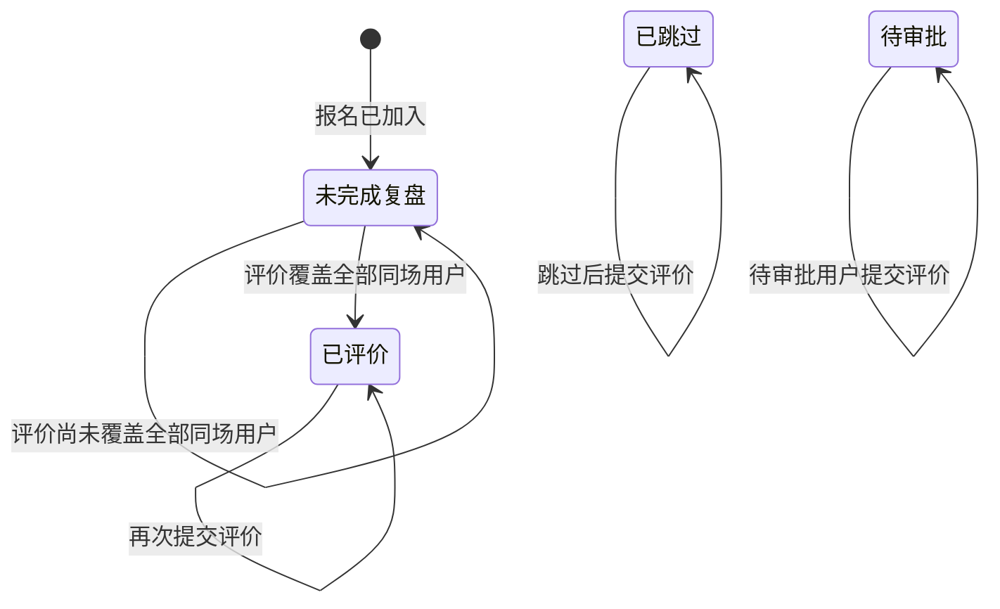

## 一句话价值

让约球参与者评价同场用户并完成本人复盘。

## 核心概念

- 约球  围绕一次明确时间、场地、人数和参与条件组织的网球活动，不只是两人邀约。
- 约球报名  用户与约球之间的参与关系，可处于待审批、已加入、已拒绝、已撤回、已退出、已评价或已跳过。
- 赛后复盘  约球结束后记录比分、评价同场用户或明确跳过评价的阶段。
- 评价维度  对一位被评价人的一类判断，分为水平投票、出勤投票和个性化标签。
- 评价覆盖  本人已对约球中每一位其他有效参与者至少留下一个评价维度。

## 业务对象

### 同场评价

| 业务名称 | 描述 | 取值说明 |
|---|---|---|
| 所属约球 | 本次评价对应的约球。 | — |
| 评价人 | 提交评价的当前参与者。 | — |
| 被评价人 | 接受本条评价的同场参与者。 | — |
| 评价维度 | 表示本条评价针对的方面。 | 水平投票：判断对方 NTRP 偏高、相近或偏低；出勤投票：判断对方准时、迟到或爽约；个性化标签：为对方添加文字标签。 |
| 评价内容 | 评价人在相应维度给出的选择或标签。 | 水平投票：偏高、差不多、偏低；出勤投票：准时、迟到、爽约；个性化标签：文字标签。 |

### 本人约球报名

| 业务名称 | 描述 | 取值说明 |
|---|---|---|
| 所属约球 | 本次完成赛后复盘的约球。 | — |
| 参与者 | 提交评价的当前用户。 | — |
| 报名状态 | 对全部其他有效参与者完成评价覆盖后变为已评价。 | 已加入：尚未完成复盘；已评价：已完成赛后评价。 |

## 状态机

| 当前状态 | 触发操作 | 新状态 | 前置条件 | 谁能触发 |
|---|---|---|---|---|
| `JOINED` 未完成复盘 | 评价一位用户，但尚未覆盖全部同场用户 | `JOINED` 未完成复盘 | 约球可评价且未超过截止时间 | 本场已加入用户 |
| `JOINED` 未完成复盘 | 评价后覆盖全部同场用户，或没有其他有效参与者 | `REVIEWED` 已评价 | 约球可评价且未超过截止时间 | 本场已加入用户 |
| `REVIEWED` 已评价 | 再次提交评价 | `REVIEWED` 已评价 | 约球仍可评价且未超过截止时间 | 本场已评价用户 |
| `SKIPPED` 已跳过 | 提交评价 | `SKIPPED` 已跳过 | 约球仍可评价且未超过截止时间 | 本场已跳过用户 |
| `PENDING` 待审批 | 提交评价 | `PENDING` 待审批 | 约球可评价且未超过截止时间 | 本场待审批用户 |

## 主流程

触发源：约球参与者发起 HTTP 评价；终态：目标用户的评价已保存，本人按评价覆盖情况保持未完成复盘或转为已评价。

1. 识别当前用户，并取得指定约球、时间状态及全部报名关系。
2. 确认当前用户属于该约球，约球已进行中或已结束，且尚未超过结束后的评价期限。
3. 确认每个水平投票和出勤投票均为约定取值，标签值不为 `null`。
4. 针对本次被评价人，分别保存水平投票、出勤投票或个性化标签；已有的同维度评价由本次值替换。
5. 汇总本人在该约球已经评价过的用户，并与全部其他有效参与者比较。
6. 若评价已覆盖全部其他有效参与者，或本场没有其他有效参与者，将本人的报名状态从 `JOINED` 转为 `REVIEWED`；否则保持 `JOINED`。
7. 返回评价提交成功，不交付评价内容或新的复盘详情。

## 分支与异常

| 什么情况 | 怎么处理 | 对外提示 | 做了一半的怎么收场 |
|---|---|---|---|
| 未登录、登录过期或登录凭证无效 | 拒绝评价 | 对应的登录提示 | 不保存评价，不改变复盘状态。 |
| `meetupId` 为空白 | 拒绝评价 | 约球ID不能为空 | 不保存评价，不改变复盘状态。 |
| `toUserId` 为空白 | 拒绝评价 | 被评价人不能为空 | 不保存评价，不改变复盘状态。 |
| 指定约球不存在 | 拒绝评价 | 约球不存在 | 不保存评价，不改变复盘状态。 |
| 当前用户既非发布者，也没有待审批或有效参与报名 | 拒绝评价 | 你未报名该约球 | 不保存评价，不改变复盘状态。 |
| 约球尚未开始、仍为草稿或已经关闭 | 拒绝评价 | 约球不可评价 | 不保存评价，不改变复盘状态。 |
| 当前时间晚于 `end_time` 加评价期限 | 拒绝评价 | 评价已超期 | 不保存评价，不改变复盘状态。 |
| 评价维度为空或无法识别 | 拒绝评价 | 评价类型不能为空或参数错误 | 不保存评价，不改变复盘状态。 |
| 水平投票不是 `HIGHER`、`SAME`、`LOWER` | 拒绝评价 | 评价值不合法 | 不保存评价，不改变复盘状态。 |
| 出勤投票不是 `ON_TIME`、`LATE`、`NO_SHOW` | 拒绝评价 | 评价值不合法 | 不保存评价，不改变复盘状态。 |
| 标签值为 `null` | 拒绝评价 | 评价值不合法 | 不保存评价，不改变复盘状态。 |
| 标签为空字符串或不在默认标签中 | 当前仍接受并保存原值 | 成功 | 复盘状态继续按被评价人覆盖情况推进。 |
| `reviews` 为空列表 | 当前不新增或修改评价，仍按既有评价覆盖情况判断复盘是否完成 | 成功 | 既有评价保留；可能保持原状态，也可能转为 `REVIEWED`。 |
| `reviews` 缺失或为 `null` | 当前无法正常处理 | 系统异常 | 不保存评价，不改变复盘状态。 |
| 同一维度在一次提交中出现多次 | 逐项接受，后提交的值覆盖先提交的值 | 成功 | 该维度最终只保留一条评价。 |
| 被评价人是本人或不是本场有效参与者 | 当前仍保存评价 | 成功 | 该对象不属于正常评价覆盖范围，通常不能单独推进复盘完成。 |
| 本人已经 `REVIEWED` 或 `SKIPPED` | 仍保存或替换评价，报名状态不再改变 | 成功 | 保持原复盘状态。 |
| 评价保存或复盘状态更新失败 | 本次评价失败 | 系统异常，请稍后重试 | 本次评价与复盘状态均不生效，可重新提交。 |

## 业务边界

- 本服务从用户提交一位目标用户的评价开始，到各评价维度保存并按覆盖情况更新本人复盘状态为止。
- 本服务一次只评价一位用户，但可同时提交水平、出勤和标签多个维度。
- 评价人只能取当前登录身份，请求不能另行指定评价人；不支持任何人代评。
- 本服务不提供约球详情、可评价用户、默认标签或既有评价；这些信息由约球详情查询交付。
- 本服务不要求一次提交齐全三个评价维度；复盘完成只看是否覆盖每位其他有效参与者。
- 本服务不新增、修改或删除比分，也不处理明确跳过复盘；这些分别属于比分服务和“赛后评价跳过”。
- 本服务只沉淀评价事实，不在本次调用中重新计算 NTRP、信誉分、可信度或综合评级。
- 本服务不通知被评价人，也不直接交付其获评汇总；获评汇总属于个人档案查阅。

## 遗留与待定

- 待产品负责人确定：评价人的正式资格是否仅限 `JOINED`；当前发布者、`PENDING`、`REVIEWED`、`SKIPPED` 用户也可能提交。
- 待产品负责人确定：被评价人必须是本场其他有效参与者及禁止自评的规则；当前虽已有相应错误定义，但提交时未执行校验。
- 待产品负责人确定：一次评价必须包含哪些维度；当前可只提交任意一个维度，也可提交空列表。
- 待产品负责人确定：个性化标签是否只能来自默认标签、是否允许自定义、空标签和重复标签，以及数量与长度上限；当前仅要求值不为 `null`。
- 待产品负责人确定：同一请求重复提交同一维度时应拒绝还是采用最后一个值；当前采用最后一个值。
- 待产品负责人确定：`REVIEWED` 或 `SKIPPED` 后是否允许再次提交评价，以及再次提交后是否应改变复盘状态；当前允许保存但保持原状态。
- 待产品负责人确定：进行中的约球是否应允许提前评价；当前约球到达开始时间即开放评价。
- 待产品负责人确认：默认评价期限为约球结束后 `30` 天，且可由 `review.deadline_days` 调整，具体业务依据尚无说明。
- 待产品负责人确定：没有其他有效参与者时是否应允许通过一次任意目标评价将复盘标记为已评价；当前会如此处理。
