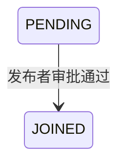

## 一句话价值

将待审批申请变为已加入并接入活动群聊。

## 核心概念

- 约球  围绕一次明确时间、场地、人数和参与条件组织的网球活动，不只是两人邀约。
- 约球发布者  创建约球并负责活动信息、费用和报名审批的人，也是首位参与者。
- 约球报名  用户与约球之间的参与关系，可处于待审批、已加入、已拒绝、已撤回、已退出、已评价或已跳过。
- 组团成功  约球的有效参与人数达到人数上限，表示活动成员已经组成。

## 业务对象

### 约球报名

| 业务名称 | 描述 | 取值说明 |
|---|---|---|
| 报名编号 | 唯一标识本次被审批的参与申请。 | — |
| 所属约球 | 报名申请加入的约球。 | — |
| 申请人 | 提交报名申请的用户。 | — |
| 报名状态 | 审批通过后由待审批变为已加入。 | 待审批：等待发布者审批；已加入：已成为参与者。 |

### 约球群聊成员

| 业务名称 | 描述 | 取值说明 |
|---|---|---|
| 所属约球 | 申请人获准加入的约球群聊。 | — |
| 群聊成员 | 审批通过后加入群聊的申请人。 | — |
| 已读位置 | 加入群聊时从当时最新消息之后开始计算未读。 | — |

## 交付内容

类型: 变更类

成功后按主流程改写或撤销既有业务事实；允许变更的内容、前置状态、对外可见结果与原值留痕，以本节下列规则、业务对象及分支与异常为准。

| 当前状态 | 触发操作 | 新状态 | 前置条件 | 谁能触发 |
|---|---|---|---|---|
| `PENDING` | 审批通过 | `JOINED` | 报名属于目标约球；目标约球未关闭或结束；申请人尚未成为该约球群聊成员 | 约球发布者 |

## 主流程

触发源：约球发布者在报名等待后发起 HTTP 审批；终态：报名为 `JOINED`，申请人成为约球群聊成员。

1. 识别当前登录用户，取得目标约球及其全部约球报名。
2. 找到指定报名，确认当前用户是约球发布者、报名仍为 `PENDING`，且约球未关闭或结束。
3. 将申请人的报名变为 `JOINED`，并按全部有效参与者重新计算已加入人数。
4. 为申请人建立约球群聊成员关系，初始未读数为零。
5. 若审批后已加入人数达到或超过人数上限，向全体有效参与者发起微信组团成功提醒；否则向申请人发起微信报名成功通知。
6. 按发布者本次取得的微信订阅消息授权场景登记后续可用通知额度。
7. 向发布者返回审批成功；本次调用不返回报名、人数或通知结果。

## 分支与异常

| 什么情况 | 怎么处理 | 对外提示 | 做了一半的怎么收场 |
|---|---|---|---|
| 未提供登录凭证 | 拒绝审批 | 登录已过期，请重新登录 | 报名、已加入人数和群聊成员均不变。 |
| 登录凭证无效 | 拒绝审批 | 登录凭证无效，请重新登录 | 报名、已加入人数和群聊成员均不变。 |
| `meetupId` 为空或只有空白 | 拒绝审批 | 活动id不能为空 | 报名、已加入人数和群聊成员均不变。 |
| `registrationId` 为空或只有空白 | 拒绝审批 | 报名ID不能为空 | 报名、已加入人数和群聊成员均不变。 |
| 目标约球不存在 | 拒绝审批 | 约球不存在 | 报名、已加入人数和群聊成员均不变。 |
| 指定报名不存在，或不属于目标约球 | 拒绝审批 | 报名记录不存在 | 报名、已加入人数和群聊成员均不变。 |
| 当前用户不是约球发布者 | 拒绝审批 | 仅发布者可操作 | 报名、已加入人数和群聊成员均不变。 |
| 报名不再是 `PENDING` | 拒绝审批 | 该报名当前状态不可撤回 | 报名、已加入人数和群聊成员均不变。 |
| 约球已关闭或已结束 | 拒绝审批 | 约球状态不允许该操作 | 报名、已加入人数和群聊成员均不变。 |
| 申请人已经是该约球群聊成员 | 拒绝审批 | 你已加入该聊天 | 报名仍为 `PENDING`，已加入人数不变，不重复建立群聊成员。 |
| 报名、已加入人数或群聊成员保存失败 | 审批失败 | 系统异常，请稍后重试 | 本次报名、人数和群聊成员变更均不保留。 |
| `acceptedNoticeScenes` 含无法识别的名称 | 忽略无法识别项，继续审批 | 无 | 审批照常完成，只登记可识别场景。 |
| 发布者的微信订阅消息授权登记失败 | 保留审批结果 | 无 | 报名和群聊成员保持成功，不登记本次授权。 |
| 收件人没有相应微信订阅消息授权，授权已使用或已过期 | 跳过该收件人的通知 | 审批成功 | 报名和群聊成员保持成功，授权状态不变。 |
| 通知发送前收件人已退出约球 | 跳过该收件人的通知 | 审批成功 | 报名和群聊成员保持成功，该用户授权不消费。 |
| 收件人没有微信小程序接收身份，或微信发送失败 | 记录通知失败，不影响审批 | 审批成功 | 报名和群聊成员保持成功，已占用授权记为 `FAILED`。 |

## 业务边界

- 本服务从约球发布者处理已经存在的 `PENDING` 报名开始，到报名成为 `JOINED` 且申请人成为群聊成员为止。
- 产生 `PENDING` 报名的约球报名是等待前的独立服务，不并入本服务；报名审批拒绝和申请人撤回也分别由其他服务负责。
- 本服务只修改目标报名和约球的 `current_players`，不修改约球状态、人数上限、时间、场地、参加条件或费用。
- 本服务不重新核对申请人的档案完整度、性别、NTRP、信誉分或其他约球时间冲突，也不检查报名的 `expires_at`。
- 本服务当前不以 `join_mode` 限制审批，也不检查审批前是否已经满员。
- 通知是否实际送达不改变 `JOINED` 终态；审批结果不等待微信通知结果，也不保证收件人一定收到消息。
- `acceptedNoticeScenes` 只登记发布者本次授权的后续通知额度，不是申请人获批的前置条件。
- 本服务只返回审批成功标识，不交付更新后的报名、约球人数或群聊资料。

## 遗留与待定

| 等级 | 待定的是什么 | 要谁来定 |
|---|---|---|
| P1 | 审批没有检查剩余名额，也没有并发版本条件；多个待审批申请可能使 `current_players` 超过 `max_players`，名额分配和并发审批规则需由产品负责人确定。 | 产品与约球运营负责人 |
| P2 | 审批不要求约球采用 `APPROVAL`，并允许 `DRAFT` 和尚未结束的 `ONGOING` 约球继续审批；适用加入方式和活动阶段需由产品负责人确定。 | 产品与约球运营负责人 |
| P1 | 申请提交后到审批前，不重新核对档案完整度、性别、NTRP、信誉分等准入条件，也不判断 `expires_at` 是否已过；审批时是否需要复核及到期报名如何处理需由产品与风控负责人确定。 | 产品与约球运营负责人 |
| P2 | `rally_meetup_registration.opt_time` 定义为管理人审批操作时间，但审批通过没有写入；该字段的记录时机需由产品与数据负责人确定。 | 产品与约球运营负责人 |
| P1 | 非 `PENDING` 报名在审批时提示“该报名当前状态不可撤回”，没有表达审批失败原因；提示文案需由产品负责人确定。 | 产品与约球运营负责人 |
| P1 | 只要审批后人数达到或超过上限就触发组团成功提醒，不判断本次是否首次达到上限；重复提醒和超员场景的通知规则需由产品负责人确定。 | 产品与约球运营负责人 |
| P1 | `acceptedNoticeScenes` 接受全部已知约球和赛事通知场景，且重复场景会登记多份授权；审批场景允许名单和去重规则需由产品与通知负责人确定。 | 产品与约球运营负责人 |
| P1 | 申请人若已存在群聊成员关系，整个审批被拒绝且报名保持 `PENDING`；报名状态与群聊关系不一致时的修复规则需由产品负责人确定。 | 产品与约球运营负责人 |
| P1 | 审批成功只返回成功标识，不返回申请人、最新报名状态或已加入人数；调用方如何确认审批结果需由产品负责人确定。 | 产品与约球运营负责人 |
| P1 | 微信订阅消息授权登记或发送失败均不向发布者反馈；是否需要展示通知未生效需由产品负责人确定。 | 产品与约球运营负责人 |
