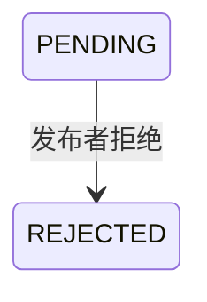

## 一句话价值

让约球发布者拒绝一份待审批报名。

## 核心概念

- 约球  围绕一次明确时间、场地、人数和参与条件组织的网球活动，不只是两人邀约。
- 约球发布者  创建约球并负责活动信息、费用和报名审批的人，也是首位参与者。
- 约球报名  用户与约球之间的参与关系，可处于待审批、已加入、已拒绝、已撤回、已退出、已评价或已跳过。

## 业务对象

### 约球报名

| 业务名称 | 描述 | 取值说明 |
|---|---|---|
| 报名编号 | 唯一标识本次被审批的参与申请。 | — |
| 所属约球 | 报名申请加入的约球。 | — |
| 申请人 | 提交报名申请的用户。 | — |
| 报名状态 | 审批拒绝后由待审批变为已拒绝。 | 待审批：等待发布者审批；已拒绝：报名申请未通过。 |

## 交付内容

类型: 变更类

成功后按主流程改写或撤销既有业务事实；允许变更的内容、前置状态、对外可见结果与原值留痕，以本节下列规则、业务对象及分支与异常为准。

| 当前状态 | 触发操作 | 新状态 | 前置条件 | 谁能触发 |
|---|---|---|---|---|
| `PENDING` | 拒绝报名 | `REJECTED` | 已登录；目标约球和报名存在；报名属于该约球且仍待审批 | 约球发布者 |

## 主流程

触发源：约球发布者发起 HTTP 审批拒绝；终态：目标报名为 `REJECTED`。

1. 识别当前登录用户和拒绝内容指定的约球、报名。
2. 确认目标约球存在，且当前用户是约球发布者。
3. 确认指定报名属于该约球并仍处于 `PENDING`。
4. 将报名状态改为 `REJECTED`，保留报名历史并更新最近更新时间。
5. 按发布者本次取得的微信订阅消息授权，登记后续约球通知的可用额度。
6. 返回拒绝成功标识。

## 分支与异常

| 什么情况 | 怎么处理 | 对外提示 | 做了一半的怎么收场 |
|---|---|---|---|
| 未登录 | 拒绝操作 | 未登录，请先登录 | 报名保持原状态，不登记通知授权。 |
| 登录凭证失效或无效 | 拒绝操作 | 登录已过期，请重新登录，或登录凭证无效，请重新登录 | 报名保持原状态，不登记通知授权。 |
| `meetupId` 为空或只有空白 | 拒绝操作 | 活动id不能为空 | 报名保持原状态，不登记通知授权。 |
| `registrationId` 为空或只有空白 | 拒绝操作 | 报名ID不能为空 | 报名保持原状态，不登记通知授权。 |
| 目标约球不存在 | 拒绝操作 | 约球不存在 | 报名保持原状态，不登记通知授权。 |
| 指定报名不存在，或不属于目标约球 | 拒绝操作 | 报名记录不存在 | 该约球下全部报名保持原状态，不登记通知授权。 |
| 当前用户不是约球发布者 | 拒绝操作 | 仅发布者可操作 | 报名保持原状态，不登记通知授权。 |
| 报名已经不是 `PENDING` | 拒绝操作 | 该报名当前状态不可撤回 | 报名保持原状态，不登记通知授权。 |
| `acceptedNoticeScenes` 含无法识别的名称 | 忽略无法识别项，继续拒绝 | 无 | 报名照常变为 `REJECTED`，只登记可识别场景。 |
| 微信订阅消息授权登记失败 | 保留拒绝结果 | 无 | 报名保持 `REJECTED`，本次授权不登记。 |
| 报名状态保存失败 | 拒绝失败 | 系统异常，请稍后重试 | 报名状态不变，也不登记通知授权。 |

## 业务边界

- 本服务从约球发布者处理一份待审批报名开始，到该报名变为 `REJECTED` 并返回成功标识为止。
- 本服务是报名等待后的独立审批触发，不包含用户发起报名或申请人撤回报名。
- 本服务只处理指定约球下的指定报名，只有约球发布者可以操作，且只接受 `PENDING`。
- 本服务不要求约球仍为 `OPEN`；只要报名仍为 `PENDING`，草稿、进行中、关闭或结束状态均未被明确禁止。
- 被拒绝报名不计入有效参与人数；本服务保留报名历史，不删除报名，也不改变约球人数上限、活动状态、费用或其他报名。
- 本服务不把申请人加入或移出群聊，也不向申请人发送被拒绝通知。
- 本服务不写审批操作时间，不接收或保存拒绝理由，也不返回拒绝后的报名详情。
- 微信订阅消息授权只为发布者后续接收提醒保留额度，其登记结果不改变报名终态。

## 遗留与待定

| 等级 | 待定的是什么 | 要谁来定 |
|---|---|---|
| P1 | 审批拒绝不校验约球状态，关闭、进行中或结束的约球仍可拒绝遗留的 `PENDING` 报名；允许范围需由产品负责人确定。 | 产品与约球运营负责人 |
| P2 | 审批拒绝没有填写 `opt_time`，与该字段“管理人审批操作时间”的表定义不一致；拒绝时间是否需要记录需由产品与数据负责人确定。 | 产品与约球运营负责人 |
| P1 | `WAITLIST_NOT_PENDING` 在审批拒绝场景仍提示“该报名当前状态不可撤回”；审批失败的对外文案需由产品负责人确定。 | 产品与约球运营负责人 |
| P2 | 本服务不记录拒绝理由，也不通知申请人；是否需要理由、结果通知及展示口径需由产品负责人确定。 | 产品与约球运营负责人 |
| P1 | 审批通过、审批拒绝和申请人撤回同时发生时没有版本校验或业务优先级，后保存的状态可能覆盖先保存的状态；冲突判定需由产品负责人确定。 | 产品与约球运营负责人 |
| P1 | `acceptedNoticeScenes` 接受全部已知通知场景，包括与约球审批无关的赛事通知场景，且重复场景会登记多份授权；允许名单和去重规则需由产品与通知负责人确定。 | 产品与约球运营负责人 |
| P1 | 微信订阅消息授权登记失败不会提示发布者；是否反馈授权未生效需由产品负责人确定。 | 产品与约球运营负责人 |
