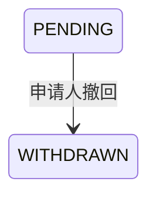

## 一句话价值

让申请人在审批前撤回本人的约球报名。

## 核心概念

- 约球  围绕一次明确时间、场地、人数和参与条件组织的网球活动，不只是两人邀约。
- 约球报名  用户与约球之间的参与关系，可处于待审批、已加入、已拒绝、已撤回、已退出、已评价或已跳过。

## 业务对象

### 约球报名

| 业务名称 | 描述 | 取值说明 |
|---|---|---|
| 报名编号 | 唯一标识本人和约球的参与申请。 | — |
| 所属约球 | 本次撤回申请加入的约球。 | — |
| 申请人 | 撤回报名的当前用户。 | — |
| 报名状态 | 撤回成功后由待审批变为已撤回。 | 待审批：等待发布者审批；已撤回：申请人已主动撤回。 |

## 交付内容

类型: 变更类

成功后按主流程改写或撤销既有业务事实；允许变更的内容、前置状态、对外可见结果与原值留痕，以本节下列规则、业务对象及分支与异常为准。

| 当前状态 | 触发操作 | 新状态 | 前置条件 | 谁能触发 |
|---|---|---|---|---|
| `PENDING` | 撤回报名 | `WITHDRAWN` | 已登录；指定约球下存在本人的待审批报名 | 报名申请人本人 |

## 主流程

触发源：申请人发起 HTTP 撤回；终态：本人的约球报名为 `WITHDRAWN`。

1. 识别当前登录用户和撤回请求指定的约球。
2. 找到该用户在指定约球下仍处于 `PENDING` 或 `JOINED` 的本人报名。
3. 确认报名仍处于 `PENDING`，尚未被审批。
4. 将报名状态改为 `WITHDRAWN`，并记录本次撤回时间。
5. 返回撤回成功标识。

## 分支与异常

| 什么情况 | 怎么处理 | 对外提示 | 做了一半的怎么收场 |
|---|---|---|---|
| 未提供登录凭证 | 拒绝撤回 | 登录已过期，请重新登录 | 报名保持原状态。 |
| 登录凭证无效 | 拒绝撤回 | 登录凭证无效，请重新登录 | 报名保持原状态。 |
| `meetupId` 为空或只有空白 | 拒绝撤回 | meetupId: 约球ID不能为空 | 报名保持原状态。 |
| 指定约球下不存在本人处于 `PENDING` 或 `JOINED` 的报名 | 拒绝撤回 | 你未报名该约球 | 已拒绝、已撤回、已退出、已评价或已跳过的历史报名均保持原状态。 |
| 本人报名已经是 `JOINED` | 拒绝撤回 | 该报名当前状态不可撤回 | 已加入关系保持不变。 |
| 同一用户在同一约球下存在多条 `PENDING` 或 `JOINED` 报名 | 无法确定唯一报名，撤回失败 | 系统异常，请稍后重试 | 所有报名保持原状态。 |
| 报名状态或操作时间保存失败 | 撤回失败 | 系统异常，请稍后重试 | 本次状态和操作时间变更均不保留。 |

## 业务边界

- 本服务从申请人提交指定约球的撤回请求开始，到本人待审批报名变为 `WITHDRAWN` 并返回成功标识为止。
- 本服务只允许报名申请人撤回本人的 `PENDING` 报名，不允许代他人撤回。
- 本服务不处理 `JOINED` 报名；已加入参与者离开约球属于“约球退出”。
- 本服务保留报名历史，不删除报名，也不改变约球人数、状态、费用或其他参与者关系。
- 本服务不通知约球发布者，不修改群聊成员，也不返回撤回后的报名详情。
- 按 `expires_at` 自动撤回报名不由本服务执行。

## 遗留与待定

| 等级 | 待定的是什么 | 要谁来定 |
|---|---|---|
| P1 | 撤回与审批通过或拒绝同时发生时，状态更新没有明确的业务优先级或冲突判定；最终状态口径需由产品负责人确定。 | 产品与约球运营负责人 |
| P1 | `rally_meetup_registration` 没有限制同一用户在同一约球下只能有一条未终止报名；出现多条 `PENDING` 或 `JOINED` 时撤回会失败，数据唯一性规则需由产品与数据负责人确定。 | 产品与约球运营负责人 |
| P1 | `opt_time` 的表定义称其为管理人审批操作时间，但申请人撤回也会写入该字段；该字段是否统一表示最近一次状态操作时间需由产品与数据负责人确定。 | 产品与约球运营负责人 |
| P2 | `status` 的表缺省值是小写 `pending`，而业务判断使用大写 `PENDING`；线上存储约定及历史数据兼容方式需由数据负责人确定。 | 产品与约球运营负责人 |
| P1 | `WITHDRAWN` 后再次撤回会提示“你未报名该约球”，而不是“报名已撤回”；重复撤回的对外反馈口径需由产品负责人确定。 | 产品与约球运营负责人 |
