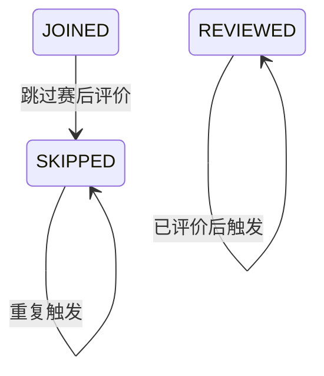

## 一句话价值

让参与者明确跳过一场约球的赛后评价。

## 核心概念

- 约球  围绕一次明确时间、场地、人数和参与条件组织的网球活动，不只是两人邀约。
- 约球报名  用户与约球之间的参与关系，可处于待审批、已加入、已拒绝、已撤回、已退出、已评价或已跳过。
- 赛后复盘  约球结束后记录比分、评价同场用户或明确跳过评价的阶段。
- 跳过评价  参与者明确不提交该场评价，并以已跳过结束本人该场复盘。

## 业务对象

### 本人约球报名

| 业务名称 | 描述 | 取值说明 |
|---|---|---|
| 所属约球 | 本次跳过赛后评价的约球。 | — |
| 参与者 | 明确跳过评价的当前用户。 | — |
| 报名状态 | 跳过成功后由已加入变为已跳过评价。 | 已加入：尚未完成赛后复盘；已跳过评价：明确不提交该场评价并结束本人复盘。 |

## 交付内容

类型: 变更类

成功后按主流程改写或撤销既有业务事实；允许变更的内容、前置状态、对外可见结果与原值留痕，以本节下列规则、业务对象及分支与异常为准。

| 当前状态 | 触发操作 | 新状态 | 前置条件 | 谁能触发 |
|---|---|---|---|---|
| `JOINED` | 跳过赛后评价 | `SKIPPED` | 目标约球实际处于进行中或已结束 | 当前登录参与者 |
| `SKIPPED` | 重复跳过 | `SKIPPED` | 目标约球实际处于进行中或已结束 | 当前登录用户；返回成功但不产生新变更 |
| `REVIEWED` | 跳过赛后评价 | `REVIEWED` | 目标约球实际处于进行中或已结束 | 当前登录用户；返回成功但不产生新变更 |

`PENDING`、`REJECTED`、`WITHDRAWN`、`QUIT` 或没有本人报名记录时，请求也会返回成功，但不会形成报名状态流转。

## 主流程

触发源：参与者发起 HTTP 请求；终态：本人该场约球报名为 `SKIPPED`，并返回成功。

1. 识别当前登录用户，并取得请求指定的约球及其报名记录。
2. 确认约球当前实际处于进行中或已结束。
3. 将本人在该约球中处于 `JOINED` 的报名标记为 `SKIPPED`，同时记录操作时间。
4. 返回跳过成功。

## 分支与异常

| 什么情况 | 怎么处理 | 对外提示 | 做了一半的怎么收场 |
|---|---|---|---|
| 未提供登录凭证 | 拒绝请求 | 未登录，请先登录 | 报名状态保持不变。 |
| 登录凭证过期或无效 | 拒绝请求 | 登录已过期，请重新登录，或登录凭证无效，请重新登录 | 报名状态保持不变。 |
| `meetupId` 为空或只有空白 | 拒绝请求 | meetupId 不能为空 | 报名状态保持不变。 |
| 指定约球不存在 | 拒绝请求 | 约球不存在 | 报名状态保持不变。 |
| 约球实际状态不是进行中或已结束 | 拒绝请求 | 约球不可评价 | 报名状态保持不变。 |
| 本人报名为 `JOINED` | 改为 `SKIPPED` 并记录操作时间 | 成功 | 状态变更与操作时间共同完成。 |
| 本人没有报名记录，或报名不是 `JOINED` | 不改变报名，仍返回成功 | 成功 | 原状态保持不变。 |
| 本人已经是 `SKIPPED` | 不重复变更，仍返回成功 | 成功 | 已跳过状态和原操作时间保持不变。 |
| 本人已经是 `REVIEWED` | 不回退为已跳过，仍返回成功 | 成功 | 已评价状态保持不变。 |
| 本人已保存部分评价但报名仍为 `JOINED` | 将报名改为 `SKIPPED`，保留已保存评价 | 成功 | 报名进入已跳过，既有评价不撤销。 |
| 状态变更发生未归类异常 | 请求失败 | 系统异常，请稍后重试 | 本次报名状态与操作时间变更整体撤销。 |

## 业务边界

- 本服务从当前用户指定一场约球并选择跳过评价开始，到本人 `JOINED` 报名变为 `SKIPPED` 并返回成功为止。
- 本服务以 `SKIPPED` 作为本人该场赛后复盘的完成态；已跳过报名仍被视为该约球的有效参与关系。
- 本服务只变更当前用户在目标约球下处于 `JOINED` 的报名，不变更其他参与者的报名。
- 本服务不检查本人是否存在报名后再决定是否返回成功；没有可变更记录时同样返回成功。
- 本服务不受评价期限约束，也不读取复盘期限配置。
- 本服务不创建、修改或删除评价内容，不补记比分，也不改变约球状态和个人档案。
- 本服务不阻止已经保存部分评价的用户选择跳过；既有评价仍然保留并可参与其他汇总或计算。

## 遗留与待定

| 等级 | 待定的是什么 | 要谁来定 |
|---|---|---|
| P1 | 待产品负责人确认：跳过评价是否必须校验当前用户为该场有效参与者；当前没有报名记录也返回成功。 | 产品与约球运营负责人 |
| P2 | 待产品负责人确认：跳过评价是否应与提交评价共用复盘期限；当前进行中或已结束的约球均可跳过，没有截止日期。 | 产品与约球运营负责人 |
| P2 | 待产品负责人确认：是否应在约球结束后才允许跳过；当前约球进行中即可操作。 | 产品与约球运营负责人 |
| P1 | 待产品负责人确定：已评价或已跳过时重复触发，是继续返回成功还是提示复盘已经完成；当前返回成功且状态不变。 | 产品与约球运营负责人 |
| P1 | 待产品负责人确定：本人已保存部分评价后再跳过，既有评价应保留、撤回还是作废；当前保留评价但报名终态为 `SKIPPED`。 | 产品与约球运营负责人 |
| P1 | 待产品与数据负责人确认：同一用户在同一约球存在多条 `JOINED` 报名时是否全部改为 `SKIPPED`；当前数据约束没有禁止这种重复关系。 | 产品与约球运营负责人 |
| P2 | 待产品负责人确认：`opt_time` 同时用于报名审批和跳过评价操作时间，字段业务含义是否需要统一或拆分。 | 产品与约球运营负责人 |
