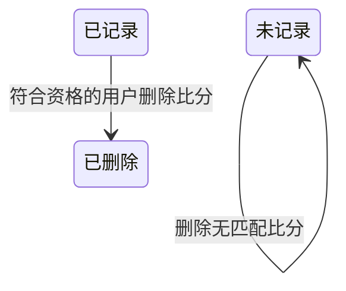

## 一句话价值

让可复盘约球的参与者移除指定的一盘比分。

## 核心概念

- 约球  围绕一次明确时间、场地、人数和参与条件组织的网球活动，不只是两人邀约。
- 约球报名  用户与约球之间的参与关系，可处于待审批、已加入、已拒绝、已撤回、已退出、已评价或已跳过。
- 赛后复盘  约球结束后记录比分、评价同场用户或明确跳过评价的阶段。
- 可复盘约球  实际状态为进行中或已结束，且尚未超过结束时间加评价期限的约球。
- 比分记录  归属于一个约球的一盘比赛结果，包含双方球员、赛制、比分和获胜侧。

## 业务对象

### 比分记录

| 业务名称 | 描述 | 取值说明 |
|---|---|---|
| 比分编号 | 唯一标识本次删除的一盘比分。 | — |
| 所属约球 | 本盘比分原本归属的约球。 | — |
| 盘号 | 本盘在该约球全部比分中的顺序。 | — |
| 比赛类型 | 表示本盘采用单打或双打阵容。 | 单打：每侧一名球员；双打：每侧两名球员。 |
| 盘制 | 表示本盘采用的计分方式。 | 常规局：按局数记录得分；抢分局：按抢分分数记录得分。 |
| 双方阵容 | 记录两侧参与本盘比赛的球员。 | — |
| 双方得分 | 记录两侧在本盘取得的分数。 | — |
| 删除结果 | 删除成功后该盘不再属于约球的比分记录。 | — |

## 状态机

| 当前状态 | 触发操作 | 新状态 | 前置条件 | 谁能触发 |
|---|---|---|---|---|
| 已记录 | 删除比分 | 已删除 | 约球可复盘，且比分编号与约球归属同时匹配 | 约球发布者，或具有 `PENDING`、`JOINED`、`REVIEWED`、`SKIPPED` 报名的用户 |
| 未记录 | 删除比分 | 未记录 | 约球可复盘，但指定编号在该约球下没有匹配比分 | 约球发布者，或具有 `PENDING`、`JOINED`、`REVIEWED`、`SKIPPED` 报名的用户 |

## 主流程

触发源：用户发起 HTTP 删除；终态：指定约球下目标比分记录不存在，并返回成功标识。

1. 识别当前登录用户，并取得请求指定的约球及全部约球报名。
2. 确认当前用户是约球发布者，或在该约球下具有当前允许操作的报名关系。
3. 确认约球实际处于进行中或已结束，且当前时间没有超过结束时间加评价期限。
4. 删除同时匹配约球编号和比分编号的整条比分记录。
5. 返回删除成功标识。

## 分支与异常

| 什么情况 | 怎么处理 | 对外提示 | 做了一半的怎么收场 |
|---|---|---|---|
| 未提供登录凭证 | 拒绝删除 | 未登录，请先登录 | 比分记录保持不变。 |
| 登录凭证过期或无效 | 拒绝删除 | 登录已过期，请重新登录，或登录凭证无效，请重新登录 | 比分记录保持不变。 |
| `meetupId` 为空或只有空白 | 拒绝删除 | 约球ID不能为空 | 比分记录保持不变。 |
| `bizId` 为空或只有空白 | 拒绝删除 | 比分记录ID不能为空 | 比分记录保持不变。 |
| 指定约球不存在 | 拒绝删除 | 约球不存在 | 比分记录保持不变。 |
| 当前用户不是发布者，也没有 `PENDING`、`JOINED`、`REVIEWED`、`SKIPPED` 报名 | 拒绝删除 | 你未报名该约球 | 比分记录保持不变。 |
| 约球实际状态不是进行中或已结束 | 拒绝删除 | 约球不可评价 | 比分记录保持不变。 |
| 当前时间已超过约球结束时间加评价期限 | 拒绝删除 | 评价已超期 | 比分记录保持不变。 |
| 指定比分不存在，或该比分不属于请求指定的约球 | 不删除任何记录，仍返回成功 | 删除成功 | 原有比分记录保持不变。 |
| 比分删除失败或发生其他未归类异常 | 删除失败 | 系统异常，请稍后重试 | 当前没有明确的业务补偿规则，用户需重新查询确认比分是否仍存在。 |

## 业务边界

- 本服务从符合资格的用户提交一个约球编号和比分编号开始，到该约球下目标比分不存在并返回成功标识为止。
- 比分归属于 `rally_meetup_id` 指定的约球；删除时必须同时匹配约球编号和比分编号，不会删除同编号之外的比分。
- 当前删除权限属于约球层面，不属于比分记录人；满足约球操作资格的用户可以删除该约球下任意参与者记录的比分。
- 本服务不要求当前用户出现在目标比分的 A、B 两侧，也不要求 `recorded_by` 等于当前用户。
- 本服务不核对比分版本，比分在用户查看后被修改也不阻止删除。
- 本服务只删除一盘比分，不修改其他盘、约球状态、报名状态、评价记录或个人档案。
- 本服务不重新计算胜负统计、胜率、连胜负或个人评分；这些查询会基于删除后的剩余比分重新汇总，评分重算尚未实现。
- 删除为直接移除记录，不保留可供本服务恢复的已删除状态或删除原因。

## 遗留与待定

- 待产品负责人确认：`PENDING` 报名尚未获批却可以删除约球比分，是否应只允许实际参赛者操作。
- 待产品负责人确定：比分删除应限于原记录人、比分中的球员、约球发布者还是全部有效参与者；当前未校验目标比分与操作者的关系。
- 待产品负责人确定：目标比分不存在或属于其他约球时是否应提示“比分记录不存在”；当前仍返回删除成功。
- 待产品负责人确定：删除是否需要比分版本条件；当前无法识别用户是否在删除已被他人修改的比分。
- 待产品与数据负责人确定：比分删除是否需要保留删除人、删除时间、删除原因和恢复能力；当前为直接移除记录。
- 待产品负责人确定：删除比分后个人评分是否需要立即重算；当前仅预留该事项，没有实际规则。
- 待产品负责人确认：复盘期限继续沿用名为“评价期限”的 `review.deadline_days`，且配置无法解析时直接按 `0` 天处理，是否符合比分管理规则。
- 待产品负责人确定：比赛进行中即可删除比分、已关闭约球不可删除比分的业务依据；当前规则只接受实际状态为进行中或已结束。
