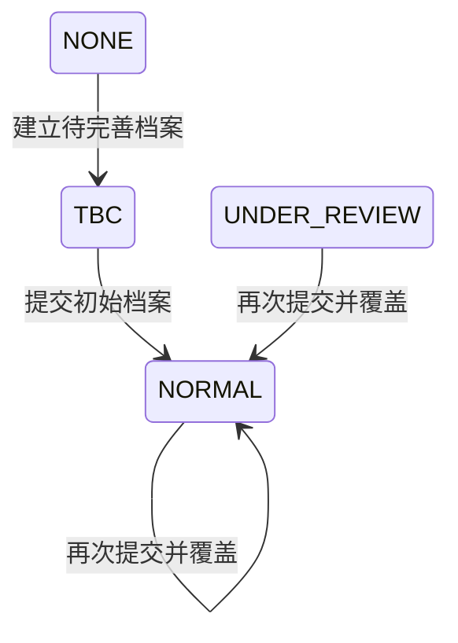

## 一句话价值

让用户补齐初始网球档案并获得正常可用的个人档案。

## 核心概念

- 个人档案  用户基础资料与网球资料的组合，包含 NTRP、自评状态、评分和展示视频。
- NTRP  用于描述网球水平的等级值，既用于个人展示，也用于约球和赛事准入。
- 核查期  用户修改自评等级后，需要用后续比赛与评价验证新等级的阶段。

## 业务对象

### 网球档案

| 业务名称 | 描述 | 取值说明 |
|---|---|---|
| 档案编号 | 唯一标识本人的网球档案；首次提交时生成。 | — |
| 所属用户 | 标识网球档案归属的用户。 | — |
| NTRP 自评 | 用户本次提交的网球水平自评。 | — |
| 展示视频 | 用户本次提交的视频列表，包含视频资源标识和标题，至少一项。 | — |
| 档案状态 | 提交成功后档案进入正常可用状态。 | 待完善：网球档案尚待补全；正常：档案正常可用，也是本服务完成时的状态；核查期：档案正在核查，当前也允许重新提交并转为正常。 |
| 信誉分 | 提交成功后重置为注册初始信誉分。 | — |
| 可信度 | 提交成功后重置为注册初始可信度。 | — |
| 校准度 | 提交成功后重置为注册初始校准度。 | — |

## 交付内容

类型: 变更类

成功后按主流程改写或撤销既有业务事实；允许变更的内容、前置状态、对外可见结果与原值留痕，以本节下列规则、业务对象及分支与异常为准。

| 当前状态 | 触发操作 | 新状态 | 前置条件 | 谁能触发 |
|---|---|---|---|---|
| `NONE` | 提交初始档案 | `NORMAL` | 登录账户存在；NTRP 有值；视频列表非空 | 档案本人 |
| `TBC` | 提交初始档案 | `NORMAL` | 登录账户存在；NTRP 有值；视频列表非空 | 档案本人 |
| `NORMAL` | 再次提交初始档案 | `NORMAL` | 登录账户存在；NTRP 有值；视频列表非空 | 档案本人 |
| `UNDER_REVIEW` | 再次提交初始档案 | `NORMAL` | 登录账户存在；NTRP 有值；视频列表非空 | 档案本人 |

## 主流程

触发源：已登录用户通过接口提交初始档案；终态：个人档案为正常状态，并向本人交付更新后的完整个人档案。

1. 用户提交 NTRP 自评和至少一项展示视频。
2. 确认当前登录账户存在对应的用户基础资料，并取得其已有网球档案。
3. 若尚无网球档案，先为该用户建立待完善档案。
4. 用本次 NTRP 自评与完整视频列表覆盖网球档案，将档案状态设为正常，并按当前全局配置设置初始信誉分、可信度和校准度。
5. 保存正常状态的网球档案。
6. 汇总用户基础资料、关注与粉丝数量、已完成约球数量、NTRP、综合评级和视频资料。
7. 为头像、视频及视频封面生成七牛云临时访问地址，向用户交付更新后的个人档案。

## 分支与异常

| 什么情况 | 怎么处理 | 对外提示 | 做了一半的怎么收场 |
|---|---|---|---|
| 未携带登录凭据或凭据格式不符合要求 | 不受理提交 | 登录已过期，请重新登录 | 不建立或修改个人档案 |
| 登录凭据已过期、签名错误或内容无法验证 | 不受理提交 | 登录凭证无效，请重新登录 | 不建立或修改个人档案 |
| 登录身份找不到对应的 `user` 记录 | 终止提交 | 登录凭证无效，请重新登录 | 不建立或修改个人档案 |
| `ntrpScore` 未提交或为 `null` | 拒绝提交 | `ntrpScore: NTRP 自评分不能为空` | 不建立或修改个人档案 |
| `videos` 未提交、为 `null` 或为空数组 | 拒绝提交 | `videos: 视频列表不能为空` | 不建立或修改个人档案 |
| 请求内容无法解析，例如生日格式不符合日期格式 | 终止提交 | 系统异常，请稍后重试 | 不建立或修改个人档案 |
| 视频列表中含 `null` 项 | 终止提交 | 系统异常，请稍后重试 | 个人档案保持提交前状态 |
| 非空视频存储标识无法生成七牛云访问地址 | 终止提交 | 系统异常，请稍后重试 | 个人档案保持提交前状态 |
| 非空视频存储标识不含文件扩展名，无法生成封面地址 | 终止档案交付 | 系统异常，请稍后重试 | 个人档案保持提交前状态 |
| NTRP 数值超出 `DECIMAL(3,1)` 可保存范围，或档案保存失败 | 终止提交 | 系统异常，请稍后重试 | 个人档案保持提交前状态 |
| 完成后汇总统计或生成返回档案失败 | 不确认档案提交成功 | 系统异常，请稍后重试 | 个人档案保持提交前状态 |

## 业务边界

- 本服务负责把当前登录用户的 NTRP 自评与展示视频保存为正常可用的个人档案，并立即返回完成后的本人档案。
- 本服务允许从无档案、待完善、正常或核查期状态发起；当前没有“只能初次提交”的状态限制。
- 本服务不创建账户或用户基础资料，也不绑定手机号。
- 本服务不修改昵称、头像、性别、生日、城市或个人简介；提交内容中的性别和生日当前不会保存。
- 本服务不上传、转码或删除视频，只保存提交方提供的七牛云存储标识并生成访问地址。
- 本服务不核实视频归属、文件存在性、数量上限、大小或时长。
- 本服务不启动 NTRP 修改冷却期，也不按 NTRP 变化触发核查期。
- 本服务只随完成结果返回关注、粉丝和已完成约球的汇总数量，不负责维护这些关系和记录。

## 遗留与待定

| 等级 | 待定的是什么 | 要谁来定 |
|---|---|---|
| P2 | `gender` 和 `birthday` 出现在提交内容中却完全未保存；需产品确认是删除这两个提交字段，还是将其纳入初始档案完成条件。 | 产品与用户运营负责人 |
| P1 | NTRP 的代码注释声称应为 1.5～7.0、步长 0.5，但当前只校验非空；需产品确认有效取值、精度和错误提示。 | 产品与用户运营负责人 |
| P1 | 展示视频只校验列表非空，未限制数量、单个大小或时长；返回结果虽展示缺省上限 3 个、20 MB、60 秒，但提交不执行这些限制，需产品确定最终规则。 | 产品与用户运营负责人 |
| P1 | 视频存储标识允许为空，也未核实文件存在或是否属于当前用户，可能在档案正常后仍无法播放；需产品确定有效性与归属校验规则。 | 产品与用户运营负责人 |
| P1 | 视频存储标识写死按“包含文件扩展名”生成封面；无扩展名会使整个提交失败，需产品确定存储标识格式及封面生成规则。 | 产品与用户运营负责人 |
| P1 | 已处于 `NORMAL` 或 `UNDER_REVIEW` 的档案仍可重复提交，并会覆盖 NTRP、视频、信誉分、可信度和校准度；需产品确定初始提交是否只能执行一次。 | 产品与用户运营负责人 |
| P2 | 从 `UNDER_REVIEW` 再次提交时，`status` 会改为 `NORMAL`，但 `is_under_review` 和 `review_remaining_matches` 不会清理，形成相互冲突的核查期信息；需产品确定应禁止提交还是同步退出核查期。 | 产品与用户运营负责人 |
| P1 | 初次提交和重复提交都不刷新 `ntrp_updated_at`，因此不会开始 NTRP 修改冷却期；需产品确定初始自评是否应成为冷却期起点。 | 产品与用户运营负责人 |
| P2 | `user_tennis_profile.status` 的建表说明和默认值使用小写 `tbc/normal/under_review`，运行时实际写入的枚举为大写 `TBC/NORMAL/UNDER_REVIEW`；需技术负责人统一存储口径并确认历史数据兼容方式。 | 产品与用户运营负责人 |
| P2 | 完成后的等级提示固定声称“根据近 20 场对战数据”评估为 4.5，即使用户刚建立档案也会返回；需产品确定真实计算依据或新用户提示。 | 产品与用户运营负责人 |
| P1 | 七牛云头像、视频与封面访问地址的有效期写死为 3600 秒；需产品确定对外承诺的访问时长。 | 产品与用户运营负责人 |
| P1 | 初始三项评分来自可变全局配置，配置缺失时使用 1000、1000、800，配置内容无法解析时会静默变为 0；需产品确定初始值、变更生效范围及异常配置的处理方式。 | 产品与用户运营负责人 |
