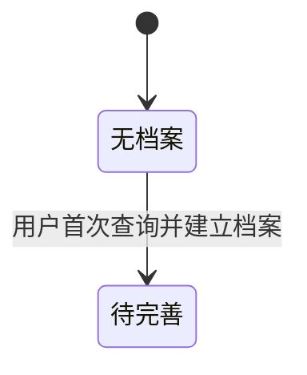

## 一句话价值

告知用户档案引导进度并建立待完善档案。

## 核心概念

- 账户  用户获得访问身份的载体，可关联登录凭据、手机号和个人资料。
- 个人档案  用户基础资料与网球资料的组合，包含 NTRP、自评状态、评分和展示视频。

## 业务对象

### 个人档案引导状态

| 业务名称 | 描述 | 取值说明 |
|---|---|---|
| 所属用户 | 标识个人档案归属的当前用户。 | — |
| 档案状态 | 表示查询开始时个人档案所处的业务阶段；尚无档案时，本次查询会建立一份待完善档案，但仍返回未建立。 | 未建立：查询开始时尚无个人档案；待完善：已有待完善档案；正常：档案正常可用；核查期：档案正在核查。 |

## 状态机

| 当前状态 | 触发操作 | 新状态 | 前置条件 | 谁能触发 |
|---|---|---|---|---|
| 无档案 | 查询引导状态 | 待完善 | 用户已登录、账户资料存在且尚无个人档案 | 用户本人 |

已有档案处于待完善、正常或核查期时，本服务只返回其状态，不改变状态。

## 主流程

触发源：接口（用户）；终态：交付查询开始时的引导状态，原无档案者同时形成待完善档案。

1. 依据当前登录身份确定用户本人。
2. 查找本人的账户资料与个人档案，并确认账户资料存在。
3. 若个人档案已存在，交付其待完善、正常或核查期状态，档案保持不变。
4. 若个人档案不存在，将本次引导状态识别为无档案，并为本人建立视频列表为空、状态为待完善的个人档案。
5. 首次建档完成后，仍向用户交付本次查询开始时识别到的无档案状态。

## 分支与异常

| 什么情况 | 怎么处理 | 对外提示 | 做了一半的怎么收场 |
|---|---|---|---|
| 未携带登录凭据或凭据格式不符合要求 | 不查询或建立个人档案 | 登录已过期，请重新登录 | 账户资料与个人档案保持不变。 |
| 登录凭据已过期、签名错误或内容无法验证 | 不查询或建立个人档案 | 登录凭证无效，请重新登录 | 账户资料与个人档案保持不变。 |
| 登录身份对应的账户资料不存在 | 终止查询，不建立个人档案 | 登录凭证无效，请重新登录 | 不创建账户资料或个人档案。 |
| 账户资料或个人档案读取失败，或已有档案内容无法识别 | 终止查询 | 系统异常，请稍后重试 | 不改变已有业务资料。 |
| 首次个人档案建立失败，或同一用户的首次查询发生重复建档冲突 | 不交付成功结果 | 系统异常，请稍后重试 | 本次不确认建档成功；其他同时请求已经建立的档案可能保留。 |

## 业务边界

- 本服务负责识别并交付当前用户的个人档案引导状态；仅在尚无个人档案时建立一份待完善档案。
- 本服务只交付状态，不交付账户资料、NTRP、评分、视频内容或其他个人档案详情。
- 本服务不修改已经存在的个人档案，也不把待完善档案转为正常或核查期。
- 本服务不负责提交初始网球资料、维护账户资料、修改 NTRP 或管理展示视频。
- 本服务不创建账户或登录身份；登录身份无法对应账户资料时不补建账户。

## 遗留与待定

- 首次查询已将个人档案建立为 `TBC`，但本次仍返回 `NONE`，返回状态与服务终态不一致；应由产品确认首次查询应返回 `NONE` 还是 `TBC`。
- 查询动作当前会在无档案时直接建立个人档案；查询是否应承担建档职责，还是只报告状态，应由产品确认。
- `user_tennis_profile.status` 的建表定义和注释使用小写值，实际读写使用大写枚举值且按大小写精确识别；应由产品与数据负责人统一存量数据和取值口径。
- 同一用户首次重复发起查询时，重复建档冲突没有专门的业务提示，也不会改为返回已存在档案的状态；应由产品确定对外结果。
