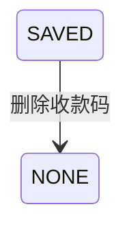

## 一句话价值

让用户移除本人收款码资料及七牛云中的对应图片。

## 核心概念

- 收款码  约球发布者提供的线下费用收取图片，不代表平台已完成收款或记账。

## 业务对象

### 收款码

| 业务名称 | 描述 | 取值说明 |
|---|---|---|
| 所属用户 | 标识待删除收款码的当前用户。 | — |
| 收款码图片 | 当前保存的收款码图片；删除资料时一并删除对应图片。 | — |
| 收款码状态 | 删除完成后用户不再保有收款码资料。 | 已保存：用户当前有收款码资料；未保存：用户没有收款码资料，也是本服务完成时的状态。 |

## 状态机

| 当前状态 | 触发操作 | 新状态 | 前置条件 | 谁能触发 |
|---|---|---|---|---|
| 已保存收款码 | 删除收款码 | 无收款码资料 | 用户已登录；本人存在收款码资料 | 收款码本人 |

## 主流程

触发源：接口（用户）；终态：本人的收款码资料已删除，资料引用的七牛云图片已不存在。

1. 依据当前登录身份确定要删除的收款码归属。
2. 查找本人当前唯一的收款码资料及其中保存的图片资源标识。
3. 资料包含图片资源标识时，删除七牛云中的对应图片；图片已经不存在时视为删除目标已达成。
4. 删除本人的收款码资料，使其不再作为约球费用分摊的收款码展示。
5. 删除完成后向用户确认本次操作成功。

## 分支与异常

| 什么情况 | 怎么处理 | 对外提示 | 做了一半的怎么收场 |
|---|---|---|---|
| 未携带登录凭据，或登录凭据未使用约定格式 | 不受理删除 | 登录已过期，请重新登录 | 不删除图片和收款码资料 |
| 登录凭据已过期、签名错误或内容无法验证 | 不受理删除 | 登录凭证无效，请重新登录 | 不删除图片和收款码资料 |
| 本人不存在收款码资料 | 拒绝删除 | 用户扩展信息不存在 | 不删除任何图片或资料；该操作不按重复成功处理 |
| 收款码资料存在，但 `ext_value` 为空 | 跳过图片删除，只删除收款码资料 | 删除成功 | 收款码资料被删除；无法据此识别或处理可能存在的图片 |
| 七牛云返回图片不存在 | 将图片视为已经删除，继续删除收款码资料 | 删除成功 | 收款码资料被删除，不再引用该图片 |
| 七牛云删除图片发生除“不存在”以外的失败 | 终止删除 | 系统异常，请稍后重试 | 保留收款码资料，图片状态以七牛云实际结果为准 |
| 读取收款码资料失败 | 终止删除 | 系统异常，请稍后重试 | 不发起图片删除，不删除收款码资料 |
| 七牛云图片已删除，但删除 `user_ext` 资料失败 | 终止删除 | 系统异常，请稍后重试 | 收款码资料仍然保留，但其引用的图片可能已经无法访问；不自动恢复图片 |
| 删除期间同一用户并发保存或删除收款码 | 按各次操作实际先后继续处理，当前未做冲突校验 | 可能删除成功、用户扩展信息不存在或系统异常 | 可能删除并发保存的新资料，或遗留未被资料引用的七牛云图片；不自动校正 |

## 业务边界

- 本服务负责删除当前登录用户现有的收款码资料，并在资料含图片资源标识时删除七牛云中的对应图片。
- 本服务只允许用户删除本人资料，不接收其他用户标识作为删除目标。
- 本服务不把“资料不存在”视为删除成功；重复删除属于失败。
- 本服务不保存、替换或返回收款码；这些承诺分别属于收款码保存和收款码查询。
- 本服务不上传图片，也不签发上传凭证。
- 本服务不核验资料所引用的七牛云图片是否确属本人、是否确为收款码；删除目标完全取自本人当前收款码资料。
- 本服务不变更约球、费用分摊方案或任何平台收付款记录；删除后仅使后续展示无法再取得这份收款码资料。
- 本服务不恢复已删除图片，也不自动修复因外部图片删除成功、资料删除失败形成的不一致。

## 遗留与待定

- `user_ext.ext_key` 写死为历史值 `wechat_payment_code`，但当前业务定义并未限定微信收款码；需产品确认允许的收款码渠道范围，技术负责人确认历史数据兼容口径。
- `user_ext.ext_value` 的建表说明允许保存付款码 URL 或 base64，当前删除流程却将其直接作为七牛云资源标识；需产品和技术负责人统一数据格式，并确认历史数据是否都能安全删除。
- 七牛云返回码 `612` 被写死为“图片不存在”并继续成功；需技术负责人确认该返回码语义及外部接口变化后的维护机制。
- 删除七牛云图片早于删除 `user_ext` 资料，后一步失败时无法恢复图片；需产品确定对外结果及补偿责任，技术负责人确定一致性方案。
- 删除期间没有并发冲突校验；并发保存可能导致新资料被删除或新图片遗留，并发删除也可能返回失败；需产品确定并发语义，技术负责人确定控制方案。
- 保存服务未核验图片归属，而本服务会直接删除资料引用的七牛云资源；需产品和安全负责人确定资源归属校验及误删责任。
- 资料不存在时当前返回“用户扩展信息不存在”，而不是将目标视为已达成；需产品确认删除是否应具备重复执行仍成功的业务语义。
