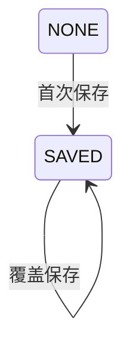

## 一句话价值

让用户保存本人用于约球费用分摊的收款码图片。

## 核心概念

- 收款码  约球发布者提供的线下费用收取图片，不代表平台已完成收款或记账。

## 业务对象

### 收款码

| 业务名称 | 描述 | 取值说明 |
|---|---|---|
| 收款码编号 | 唯一标识本次保存后的收款码资料；每次保存都会重新生成。 | — |
| 所属用户 | 标识收款码归属的当前用户。 | — |
| 图片资源标识 | 标识本次保存的收款码图片，不得为空白。 | — |

## 交付内容

类型: 变更类

成功后按主流程改写或撤销既有业务事实；允许变更的内容、前置状态、对外可见结果与原值留痕，以本节下列规则、业务对象及分支与异常为准。

| 当前状态 | 触发操作 | 新状态 | 前置条件 | 谁能触发 |
|---|---|---|---|---|
| 无收款码资料 | 保存收款码 | 已保存 | 用户已登录；`key` 非空白 | 收款码本人 |
| 已保存 | 覆盖保存 | 已保存 | 用户已登录；`key` 非空白 | 收款码本人 |

## 主流程

触发源：接口（用户）；终态：本人唯一的收款码资料已保存，当前图片资源标识为本次提交值。

1. 用户提交本人收款码图片的资源标识。
2. 依据当前登录身份确定收款码归属，并将资料类型固定为用户收款码。
3. 若本人尚无收款码资料，则建立一份新资料；若已有，则用本次资源标识覆盖原资料。
4. 保存成功后向用户确认本次操作完成。

## 分支与异常

| 什么情况 | 怎么处理 | 对外提示 | 做了一半的怎么收场 |
|---|---|---|---|
| 未携带登录凭据，或登录凭据未使用约定格式 | 不受理保存 | 登录已过期，请重新登录 | 不建立或修改收款码资料 |
| 登录凭据已过期、签名错误或内容无法验证 | 不受理保存 | 登录凭证无效，请重新登录 | 不建立或修改收款码资料 |
| `key` 未提交、为 `null`、空字符串或仅含空白字符 | 拒绝保存 | `key: 付款码 key 不能为空` | 不建立或修改收款码资料 |
| 请求内容无法解析 | 终止保存 | 系统异常，请稍后重试 | 不建立或修改收款码资料 |
| 提交的 `key` 并非有效的七牛云图片资源标识，或资源不存在、不属于本人 | 当前不核验，仍按原值保存 | 保存成功 | 收款码资料可能无法展示或展示非本人图片，不做自动恢复 |
| 收款码资料保存失败，包含首次并发保存触发唯一性冲突 | 终止保存 | 系统异常，请稍后重试 | 本次资料变更不生效，保留保存前记录 |

## 业务边界

- 本服务负责将当前登录用户提交的资源标识保存为本人唯一的当前收款码资料；已有资料时直接覆盖。
- 本服务不上传图片，也不签发上传凭证；图片资源需由其他服务预先取得。
- 本服务不读取或返回收款码图片，收款码查询属于独立业务服务。
- 本服务不删除收款码资料或对应图片，收款码删除属于独立业务服务。
- 本服务不核验图片是否存在于七牛云、是否属于本人，也不校验文件类型、大小、内容或是否确为收款码。
- 本服务以登录凭据中的用户标识确定归属，不另行确认对应账户或个人档案仍然存在。
- 本服务不向约球参与者付款、不确认费用到账，也不形成平台收付款记录。

## 遗留与待定

| 等级 | 待定的是什么 | 要谁来定 |
|---|---|---|
| P1 | 提交字段和校验提示使用“付款码”，盘点与业务概念使用“收款码”；需产品统一对外术语。 | 产品与用户运营负责人 |
| P2 | `user_ext.ext_key` 写死为历史值 `wechat_payment_code`，但当前业务定义并未限定微信收款码；需产品确认允许的收款码渠道范围，技术负责人确认历史数据兼容口径。 | 产品与用户运营负责人 |
| P1 | `user_ext.ext_value` 的建表说明允许保存付款码 URL 或 base64，当前后续流程却将其作为七牛云资源标识使用；需产品和技术负责人统一数据格式。 | 产品与用户运营负责人 |
| P1 | 当前只校验 `key` 非空白，未核验七牛云资源存在性、图片归属、格式、大小及内容；需产品确定收款码图片准入规则。 | 产品与用户运营负责人 |
| P1 | 覆盖已有收款码时会重新生成 `user_ext.biz_id`，使同一份业务资料的唯一编号随修改变化；需产品和技术负责人确认该编号应保持稳定还是允许重建。 | 产品与用户运营负责人 |
| P2 | 覆盖已有收款码时不会删除此前图片，可能遗留不再引用的七牛云资源；需产品确定旧图片保留期限与清理责任。 | 产品与用户运营负责人 |
| P2 | 有效登录凭据中的用户标识即使已找不到对应账户或个人档案，当前仍可保存收款码资料；需产品确定是否允许形成脱离账户的收款资料。 | 产品与用户运营负责人 |
