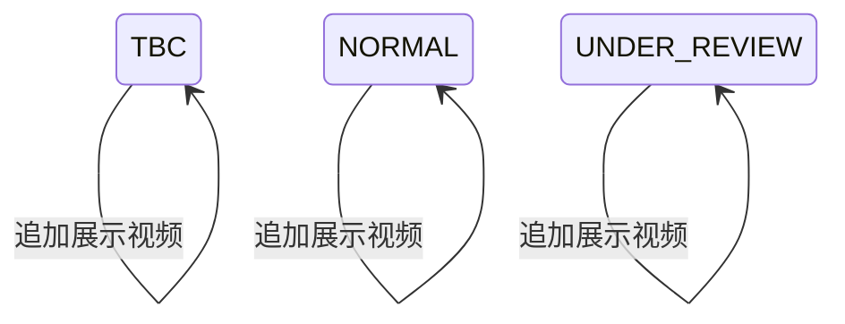

## 一句话价值

将已上传视频加入本人档案并交付更新后的个人档案。

## 核心概念

- 个人档案  用户基础资料与网球资料的组合，包含 NTRP、自评状态、评分和展示视频。
- NTRP  用于描述网球水平的等级值，既用于个人展示，也用于约球和赛事准入。
- 核查期  用户修改自评等级后，需要用后续比赛与评价验证新等级的阶段。

## 业务对象

### 展示视频

| 业务名称 | 描述 | 取值说明 |
|---|---|---|
| 视频资源标识 | 标识本次加入本人档案的已上传视频，不得为空白。 | — |
| 视频标题 | 本次加入的视频标题；空白标题在档案中展示为“未命名”。 | — |
| 展示视频列表 | 本次视频追加后的本人展示视频列表。 | — |
| 档案状态 | 新增视频不改变个人档案原有状态。 | 待完善：网球档案尚待完善；正常：档案正常可用；核查期：档案正在核查。 |

## 状态机

| 当前状态 | 触发操作 | 新状态 | 前置条件 | 谁能触发 |
|---|---|---|---|---|
| `TBC` | 新增档案视频 | `TBC` | 登录账户及待完善档案存在；视频存储标识非空 | 档案本人 |
| `NORMAL` | 新增档案视频 | `NORMAL` | 登录账户及正常档案存在；视频存储标识非空 | 档案本人 |
| `UNDER_REVIEW` | 新增档案视频 | `UNDER_REVIEW` | 登录账户及核查期档案存在；视频存储标识非空 | 档案本人 |

## 主流程

触发源：已登录用户在视频上传完成后通过接口新增档案视频；终态：视频已追加到本人原有展示视频列表，档案状态保持不变，并交付更新后的个人档案。

1. 用户提交已上传视频的七牛云存储标识，并可同时提交标题。
2. 确认当前登录身份存在对应账户和网球档案，取得该档案原有的展示视频列表。
3. 确认提交的非空存储标识能够形成七牛云访问地址。
4. 将本次视频存储标识和标题追加到本人展示视频列表末尾，并保持个人档案原有状态、NTRP、评分和核查期信息不变。
5. 保存新增后的完整展示视频列表。
6. 若档案正常或处于核查期，汇总本人的基础资料、关注与粉丝数量、已完成约球数量、NTRP、综合评级和新增后的视频列表；若档案待完善，仅汇总档案状态与基础资料。
7. 为头像、视频和视频封面形成七牛云限时访问地址，交付更新后的个人档案。

## 分支与异常

| 什么情况 | 怎么处理 | 对外提示 | 做了一半的怎么收场 |
|---|---|---|---|
| 未携带登录凭据，或登录凭据没有使用约定格式 | 不受理新增 | 登录已过期，请重新登录 | 展示视频列表保持原样。 |
| 登录凭据无法验证 | 不受理新增 | 登录凭证无效，请重新登录 | 展示视频列表保持原样。 |
| `key` 未提交、为空字符串或仅含空白 | 拒绝新增 | `key: 视频 key 不能为空` | 展示视频列表保持原样。 |
| 请求内容无法解析 | 终止新增 | 系统异常，请稍后重试 | 展示视频列表保持原样。 |
| 登录身份找不到对应的 `user` 记录 | 终止新增 | 登录凭证无效，请重新登录 | 不建立账户或个人档案，展示视频列表不变。 |
| 存在 `user` 记录但没有对应的 `user_tennis_profile` 记录 | 无法取得可追加的视频列表，终止新增 | 系统异常，请稍后重试 | 不建立个人档案。 |
| `user_tennis_profile.videos` 为空 | 建立空的视频列表并追加本次视频 | 新增成功 | 保存只包含本次视频的新列表。 |
| 提交的 `key` 与已有视频重复 | 仍把本次视频作为新的一项追加 | 新增成功 | 同一存储标识可在列表中出现多次。 |
| 提交的视频已超过返回结果所示的数量、大小或时长限制 | 当前不执行这些限制，仍继续追加 | 新增成功 | 保存追加后的视频列表。 |
| 提交的 `key` 不属于当前用户，或七牛云中不存在对应文件 | 当前不核实归属和文件存在性，仍继续追加 | 新增成功；后续能否播放不确定 | 保存追加后的视频列表。 |
| `title` 为空或仅含空白 | 按原值保存，并在返回档案中展示为“未命名” | 新增成功 | 保存的标题仍为空白。 |
| 提交的非空 `key` 无法形成七牛云访问地址 | 终止新增 | 系统异常，请稍后重试 | 展示视频列表保持原样。 |
| 档案状态为 `TBC` | 追加视频并保持 `TBC`；返回状态和基础资料，不返回视频内容 | 新增成功 | 新视频已保存，可在档案完善后展示。 |
| `user_tennis_profile.status` 不是可识别的大写档案状态，或已有 `videos` 不是可识别的视频列表 | 无法读取个人档案，终止新增 | 系统异常，请稍后重试 | 展示视频列表保持原样。 |
| 档案为 `NORMAL` 或 `UNDER_REVIEW`，且新增后的任一非空视频存储标识没有文件扩展名 | 无法形成封面标识，终止个人档案交付，不确认新增成功 | 系统异常，请稍后重试 | 本次视频不加入展示视频列表，保留原列表。 |
| 正常或核查期档案缺少 NTRP、三项评分等返回结果所需数据 | 无法形成更新后的个人档案，不确认新增成功 | 系统异常，请稍后重试 | 本次视频不加入展示视频列表，保留原列表。 |
| 城市编码非空但城市名录没有对应城市，或七牛云无法签发头像、视频或封面访问地址 | 无法形成更新后的个人档案，不确认新增成功 | 系统异常，请稍后重试 | 本次视频不加入展示视频列表，保留原列表。 |
| 数字配置内容无法识别 | 对相应整数或小数配置按 `0` 使用，继续形成个人档案 | 新增成功 | 视频已追加，但返回的限制、冻结期或评分可能为零值口径。 |
| 个人档案保存、统计汇总或其他返回资料读取失败 | 终止新增，不确认成功 | 系统异常，请稍后重试 | 本次视频不加入展示视频列表，保留原列表。 |

## 业务边界

- 本服务从用户在视频上传完成后提交视频存储标识开始，到把该视频追加进本人档案并交付更新后的个人档案为止。
- 本服务只新增视频资料，不负责取得上传授权，也不负责把视频文件上传到七牛云；视频上传授权是独立业务服务。
- 本服务只追加一项视频，不替换完整列表，不修改已有视频标题，也不删除视频。
- 本服务不改变档案状态、NTRP、评分或核查期信息；待完善、正常和核查期档案当前都可新增。
- 本服务不核实七牛云文件是否存在、是否上传完成、是否为视频，也不核实存储标识是否属于当前用户。
- 本服务不执行视频数量、文件大小或时长限制，只在新增后的个人档案中交付当前配置值。
- 本服务不去重；相同的七牛云存储标识可以被重复追加。
- 本服务随结果汇总关注、粉丝和已完成约球数量，但不维护社交关系、约球或赛后复盘记录。
- 本服务交付七牛云限时资源地址，不保证地址到期后仍可访问。

## 遗留与待定

- 新增入口没有执行 `user.video.max_count`，而上传授权按该配置限制数量、`user_tennis_profile.videos` 的建表说明又称存储最多 5 项；需产品负责人统一档案视频数量上限及最终校验位置。
- 新增入口不校验 `key` 是否属于当前用户、文件是否存在、上传是否完成或是否为视频；需产品与安全负责人确定存储标识的归属和有效性规则。
- 相同 `key` 可以重复加入视频列表；需产品负责人确定同一视频能否重复展示，以及重复时应拒绝、覆盖标题还是保持多项。
- `title` 没有长度、字符或内容限制，空白标题保存后固定展示为“未命名”；需产品负责人确定标题规则和默认文案。
- `TBC` 档案可以新增视频，但成功结果不展示刚新增的视频；需产品负责人确定待完善阶段是否允许使用本服务及成功后的交付内容。
- 视频封面固定通过把 `key` 最后一个文件扩展名替换为 `.jpg` 得到；无扩展名会使新增结果无法交付，需产品负责人确定允许的存储标识格式和无封面时的处理方式。
- 返回的 `video.maxCount`、`video.maxSizeMb`、`video.maxSecond` 只是展示值，新增时均不校验；需产品负责人确定这些限制是否构成档案登记的准入条件。
- 七牛云头像、视频和封面访问地址的有效期固定为 3600 秒；需产品负责人确定对外承诺的访问时长。
- 返回档案中的“系统建议”固定声称依据近 20 场对战数据评估为 4.5，当前没有读取或计算相应数据；需产品负责人确定真实计算依据和展示条件。
- 返回档案固定提示手动修改后进入 90 天冻结期，但实际冻结期按可信度选择可配置的低、中、高三档；需产品负责人统一对外口径。
- 可信度低于 30、低于 60 和不低于 60 的冻结期档位边界写死在代码中；需产品负责人确定档位边界。
- `user_tennis_profile.status` 的建表说明使用小写 `tbc/normal/under_review`，当前业务读取和保存使用大写 `TBC/NORMAL/UNDER_REVIEW`；需技术负责人统一存储取值并确认历史数据兼容方式。
- 启用的数字配置无法识别时按 `0` 使用且仍返回成功，可能造成视频限制、冻结期限或评分失真；需产品负责人确定异常配置的处理方式。
