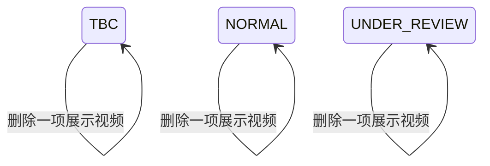

## 一句话价值

移除本人指定档案视频并至少保留一个可展示视频。

## 核心概念

- 个人档案  用户基础资料与网球资料的组合，包含 NTRP、自评状态、评分和展示视频。
- NTRP  用于描述网球水平的等级值，既用于个人展示，也用于约球和赛事准入。
- 核查期  用户修改自评等级后，需要用后续比赛与评价验证新等级的阶段。

## 业务对象

### 展示视频

| 业务名称 | 描述 | 取值说明 |
|---|---|---|
| 视频资源标识 | 标识要从本人档案和文件存储中删除的视频。 | — |
| 展示视频列表 | 删除目标视频后的本人展示视频列表；档案视频只剩一项时不允许删除。 | — |
| 档案状态 | 删除视频不改变个人档案原有状态。 | 待完善：网球档案尚待完善；正常：档案正常可用；核查期：档案正在核查。 |
| 交付结果 | 档案视频管理入口交付更新后的个人档案；上传资源管理入口只确认删除完成。 | — |

## 状态机

| 当前状态 | 触发操作 | 新状态 | 前置条件 | 谁能触发 |
|---|---|---|---|---|
| `TBC` | 删除档案视频 | `TBC` | 本人档案至少有两个视频 | 档案本人 |
| `NORMAL` | 删除档案视频 | `NORMAL` | 本人档案至少有两个视频 | 档案本人 |
| `UNDER_REVIEW` | 删除档案视频 | `UNDER_REVIEW` | 本人档案至少有两个视频 | 档案本人 |

## 主流程

触发源：接口（用户从档案视频管理入口触发）或接口（用户从上传资源管理入口触发）；终态：指定视频已从本人档案移除、对应七牛云文件已删除，档案状态不变且至少保留一个视频。

1. 用户选择本人档案中的一个视频并提交其七牛云存储标识。
2. 确认当前登录用户拥有个人档案，且删除前的展示视频列表多于一项。
3. 从本人展示视频列表中移除存储标识与提交值相同的所有视频项，其他档案资料和档案状态保持不变。
4. 保存删除后的完整展示视频列表，并删除七牛云中具有同一存储标识的视频文件。
5. 从档案视频管理入口触发时，汇总并交付更新后的个人档案；从上传资源管理入口触发时，只确认删除完成。

## 分支与异常

| 什么情况 | 怎么处理 | 对外提示 | 做了一半的怎么收场 |
|---|---|---|---|
| 未携带登录凭据，或登录凭据没有使用约定格式 | 不受理删除 | 登录已过期，请重新登录 | 档案视频列表和七牛云文件保持原样。 |
| 登录凭据无法验证 | 不受理删除 | 登录凭证无效，请重新登录 | 档案视频列表和七牛云文件保持原样。 |
| 档案视频管理入口未提交 `key`、提交空字符串或仅含空白 | 拒绝删除 | `key: 视频 key 不能为空` | 档案视频列表和七牛云文件保持原样。 |
| 档案视频管理入口的请求内容无法解析 | 终止删除 | 系统异常，请稍后重试 | 档案视频列表和七牛云文件保持原样。 |
| 上传资源管理入口没有提交 `key` | 终止删除 | 系统异常，请稍后重试 | 档案视频列表和七牛云文件保持原样。 |
| 上传资源管理入口提交的 `key` 不是以 `videos/{本人用户编号}/` 开头，包括空值或空白值 | 拒绝删除 | 无权操作该视频 | 档案视频列表和七牛云文件保持原样。 |
| 档案视频管理入口对应的登录账户不存在 | 终止删除 | 登录凭证无效，请重新登录 | 不建立账户或个人档案，七牛云文件保持原样。 |
| 档案视频管理入口存在登录账户但没有 `user_tennis_profile` 记录 | 无法取得视频列表，终止删除 | 系统异常，请稍后重试 | 不建立个人档案，七牛云文件保持原样。 |
| 上传资源管理入口没有对应的 `user_tennis_profile` 记录 | 终止删除 | 档案不存在 | 不建立个人档案，七牛云文件保持原样。 |
| `user_tennis_profile.videos` 为空、空列表或只有一项 | 拒绝删除 | 至少需要保留一个视频 | 档案视频列表和七牛云文件保持原样。 |
| `user_tennis_profile.videos` 不是可识别的视频列表 | 无法读取档案，终止删除 | 系统异常，请稍后重试 | 档案视频列表和七牛云文件保持原样。 |
| 提交的 `key` 不在档案视频列表中 | 列表保持不变，仍尝试删除七牛云同标识文件并按成功处理 | 删除成功 | 档案列表不变；七牛云中同标识文件若存在则被删除。 |
| 视频列表中有多项使用相同 `key` | 一次移除所有同标识项并删除一个七牛云文件 | 删除成功 | 可能不再满足至少保留一个视频的承诺。 |
| 档案视频管理入口提交其他用户或其他业务文件的 `key` | 当前不校验归属，列表通常保持不变，并尝试删除七牛云同标识文件 | 删除成功 | 本人档案通常不变；目标七牛云文件若存在则被删除。 |
| 七牛云报告目标文件不存在 | 视为文件已经删除，继续完成服务 | 删除成功 | 档案列表保存删除结果，不再补建文件。 |
| 个人档案保存失败 | 终止删除，不再删除七牛云文件 | 系统异常，请稍后重试 | 档案视频列表和七牛云文件保持原样。 |
| 七牛云删除失败且不是“文件不存在” | 终止删除，不确认成功 | 系统异常，请稍后重试 | 档案视频列表保留原值，七牛云文件未确认删除。 |
| 档案视频管理入口删除文件后，更新后的个人档案无法汇总或交付 | 终止删除，不确认成功 | 系统异常，请稍后重试 | 档案视频列表保留原值，但七牛云文件已经删除，形成待修复的失效视频项。 |
| 档案状态为 `TBC` | 完成删除并保持 `TBC`；档案视频管理入口只返回状态和基础资料，不返回删除后的视频列表 | 删除成功 | 删除结果已经保存，七牛云文件已经删除。 |
| 保留视频的非空存储标识没有文件扩展名，无法形成封面标识 | 档案视频管理入口无法交付更新后的个人档案，不确认删除成功 | 系统异常，请稍后重试 | 档案视频列表保留原值，但目标七牛云文件已经删除，形成待修复的失效视频项。 |
| 正常或核查期档案缺少 NTRP、三项评分等返回结果所需数据 | 档案视频管理入口无法交付更新后的个人档案，不确认删除成功 | 系统异常，请稍后重试 | 档案视频列表保留原值，但目标七牛云文件已经删除，形成待修复的失效视频项。 |
| 城市编码非空但城市名录没有对应城市，或七牛云无法签发头像、保留视频或封面访问地址 | 档案视频管理入口无法交付更新后的个人档案，不确认删除成功 | 系统异常，请稍后重试 | 档案视频列表保留原值，但目标七牛云文件已经删除，形成待修复的失效视频项。 |
| 数字配置内容无法识别 | 对相应整数或小数配置按 `0` 使用，继续形成个人档案 | 删除成功 | 删除已完成，但返回的限制、冻结期或评分可能为零值口径。 |

## 业务边界

- 本服务合并两个用户接口入口：两者都承诺把指定视频从本人个人档案与七牛云移除，触发渠道和返回形式不同不拆成两个业务服务。
- 本服务从用户提交要删除的视频存储标识开始，到档案列表和七牛云文件完成删除为止；档案视频管理入口还负责交付更新后的个人档案。
- 本服务只删除视频，不负责取得上传授权、上传文件、把新视频加入档案或修改视频标题。
- 本服务要求删除前至少有两个已登记视频，正常删除后至少保留一个；不改变档案状态、NTRP、评分或核查期信息。
- 本服务删除列表中所有同标识项，不删除其他视频项。
- 上传资源管理入口只接受本人 `videos/{本人用户编号}/` 前缀内的文件；档案视频管理入口当前没有相同的归属限制。
- 本服务以提交的存储标识执行删除，不要求该标识当前已登记在本人档案中，也不预先确认七牛云文件存在。
- 七牛云中目标文件已经不存在时，本服务仍把终态视为文件已删除。
- 从上传资源管理入口触发时不交付个人档案；用户需另行查询才能看到删除后的列表。

## 遗留与待定

- 两个入口对同一删除承诺交付不同结果：档案视频管理入口返回更新后的个人档案，上传资源管理入口只返回成功确认；需产品负责人统一删除成功的对外交付物。
- 两个入口的视频归属规则不一致：上传资源管理入口要求 `key` 位于本人前缀下，档案视频管理入口可提交任意七牛云存储标识并尝试删除；需产品与安全负责人统一归属校验。
- 两个入口都不确认 `key` 已登记在本人档案中；未登记时仍会删除七牛云同标识文件并返回成功。需产品负责人确定“未找到档案视频”应视为已经达到删除目标还是明确失败，并由安全负责人确定可删除资源范围。
- 两个入口的入参校验不一致：档案视频管理入口拒绝空白 `key`，上传资源管理入口把空白值判为无权操作、缺少参数则返回系统异常；需产品与技术负责人统一参数规则和提示。
- 档案缺失时两个入口分别返回系统异常和“档案不存在”；需产品负责人统一无档案用户的业务提示。
- 删除按 `key` 移除所有匹配项；若多个列表项共用同一 `key`，删除前虽多于一项，删除后仍可能变成空列表。需产品负责人确定存量重复项的处理规则，并保证至少保留一个视频的承诺。
- 档案视频管理入口删除七牛云文件后还要汇总完整个人档案；若后续汇总失败，档案列表恢复原值但文件已经删除。需产品与技术负责人确定一致性修复和对外结果。
- `TBC` 档案可以删除视频，但档案视频管理入口成功结果不展示删除后的视频列表；需产品负责人确定待完善阶段是否允许使用本服务及成功后的交付内容。
- 七牛云文件不存在时固定按删除成功处理；需产品负责人确认这一幂等口径是否作为正式承诺。
- `user_tennis_profile.status` 的建表说明使用小写 `tbc/normal/under_review`，当前业务读取和保存使用大写 `TBC/NORMAL/UNDER_REVIEW`；需技术负责人统一存储取值并确认历史数据兼容方式。
- 返回档案中的“系统建议”固定声称依据近 20 场对战数据评估为 4.5，当前没有读取或计算相应数据；需产品负责人确定真实计算依据和展示条件。
- 返回档案固定提示手动修改后进入 90 天冻结期，但实际冻结期按可信度选择可配置的低、中、高三档；需产品负责人统一对外口径。
- 可信度低于 30、低于 60 和不低于 60 的冻结期档位边界写死在代码中；需产品负责人确定档位边界。
- 启用的数字配置无法识别时按 `0` 使用且仍返回成功，可能造成视频限制、冻结期限或评分失真；需产品负责人确定异常配置的处理方式。
