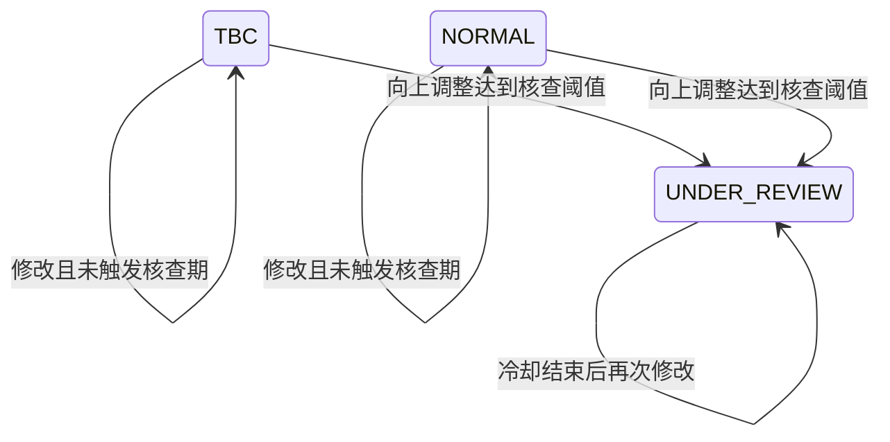

## 一句话价值

让用户更新本人 NTRP 自评并进入相应核查规则。

## 核心概念

- 个人档案  用户基础资料与网球资料的组合，包含 NTRP、自评状态、评分和展示视频。
- NTRP  用于描述网球水平的等级值，既用于个人展示，也用于约球和赛事准入。
- 核查期  用户修改自评等级后，需要用后续比赛与评价验证新等级的阶段。

## 业务对象

### 网球档案

| 业务名称 | 描述 | 取值说明 |
|---|---|---|
| 档案编号 | 唯一标识本人的网球档案。 | — |
| NTRP 自评 | 本次保存后的网球水平自评，允许范围为 1.5 至 7.0，并以 0.5 递增。 | — |
| 冷却期 | 从本次成功修改起计算的下次可修改等待期，具体天数由可信度决定。 | — |
| 档案状态 | 向上调整达到核查阈值时进入核查期，否则保留原状态。 | 待完善：网球档案尚待完善；正常：档案正常可用；核查期：档案正在核查。 |
| 核查剩余场次 | 进入核查期后要求完成的比赛场数；当前保存过程没有写回该值。 | — |

### 档案变更记录

| 业务名称 | 描述 | 取值说明 |
|---|---|---|
| 变更类型 | 标识记录的是 NTRP 自评修改还是核查期触发。 | NTRP 自评变更：每次成功修改都记录；核查期触发：向上调整达到阈值时记录。 |
| 修改前自评 | 本次修改前的 NTRP；核查期触发记录中表示所需完成场次。 | — |
| 修改后自评 | 本次修改后的 NTRP；核查期触发记录中表示所需完成场次。 | — |
| 变更原因 | 表示本次变更由用户手动发起。 | 用户手动修改：本服务当前唯一的变更原因。 |

## 交付内容

类型: 变更类

成功后按主流程改写或撤销既有业务事实；允许变更的内容、前置状态、对外可见结果与原值留痕，以本节下列规则、业务对象及分支与异常为准。

| 当前状态 | 触发操作 | 新状态 | 前置条件 | 谁能触发 |
|---|---|---|---|---|
| `TBC` | 修改 NTRP，向上幅度未达到核查阈值 | `TBC` | 本人已登录；档案存在；不在冷却期；目标值有效 | 档案本人 |
| `TBC` | 修改 NTRP，向上幅度达到核查阈值 | `UNDER_REVIEW` | 本人已登录；档案存在；不在冷却期；目标值有效 | 档案本人 |
| `NORMAL` | 修改 NTRP，向上幅度未达到核查阈值 | `NORMAL` | 本人已登录；档案存在；不在冷却期；目标值有效 | 档案本人 |
| `NORMAL` | 修改 NTRP，向上幅度达到核查阈值 | `UNDER_REVIEW` | 本人已登录；档案存在；不在冷却期；目标值有效 | 档案本人 |
| `UNDER_REVIEW` | 再次修改 NTRP | `UNDER_REVIEW` | 本人已登录；档案存在；上次修改冷却期已结束；目标值有效 | 档案本人 |

`NONE` 没有可修改的网球档案，不能进入上述状态流转。

## 主流程

触发源：接口（用户）；终态：本人 NTRP 与修改时间已更新，必要时档案进入核查期，并交付修改后的完整个人档案。

1. 用户提交 `1.5`～`7.0`、以 `0.5` 为步长的目标 NTRP。
2. 依据当前登录身份取得本人的账户资料和网球档案。
3. 根据上次 NTRP 修改时间、当前可信度档位和全局冷却天数，确认本次允许修改。
4. 计算目标 NTRP 与当前 NTRP 的差值；差值达到当前核查阈值时，将档案标记为核查期，并按配置确定核查所需比赛场数及留下核查触发记录。
5. 将档案 NTRP 改为目标值，以当前时间刷新下次修改的冷却期起点。
6. 留下本次 NTRP 修改前值、修改后值、差值和用户手动修改原因。
7. 重新汇总本人资料、统计、等级、评分与视频，向用户交付修改后的完整个人档案。

## 分支与异常

| 什么情况 | 怎么处理 | 对外提示 | 做了一半的怎么收场 |
|---|---|---|---|
| 未携带登录凭据或凭据格式不符合要求 | 不受理修改 | 登录已过期，请重新登录 | 个人档案与变更记录保持不变。 |
| 登录凭据已过期、签名错误或内容无法验证 | 不受理修改 | 登录凭证无效，请重新登录 | 个人档案与变更记录保持不变。 |
| `ntrpScore` 未提交或为 `null` | 拒绝修改 | `ntrpScore: 自评分值不能为空` | 个人档案与变更记录保持不变。 |
| `ntrpScore` 小于 `1.5` 或大于 `7.0` | 拒绝修改 | `ntrpScore: 自评分值必须在 1.5-7.0 之间` | 个人档案与变更记录保持不变。 |
| `ntrpScore` 不是 `0.5` 的整数倍 | 拒绝修改 | `ntrpScore: NTRP 分值步长必须为 0.5` | 个人档案与变更记录保持不变。 |
| 请求内容无法解析为小数或有效请求 | 终止修改 | 系统异常，请稍后重试 | 个人档案与变更记录保持不变。 |
| 登录身份没有对应账户资料 | 终止修改 | 登录凭证无效，请重新登录 | 不补建账户或个人档案。 |
| 账户存在但没有 `user_tennis_profile` 记录 | 终止修改 | 系统异常，请稍后重试 | 不补建个人档案，也不留下变更记录。 |
| 距上次 NTRP 修改尚未达到当前可信度档位的冷却天数 | 拒绝修改 | 自评修改冷却中，`N` 天后可改 | 个人档案与变更记录保持不变。 |
| 冷却或核查配置无法按所需数值读取 | 终止修改，或按读取结果 `0` 执行 | 系统异常，请稍后重试，或修改成功 | 本次未成功时保持原档案；配置被解析为 `0` 时可能跳过预期限制。 |
| 网球档案或任一变更记录保存失败 | 不确认修改成功 | 系统异常，请稍后重试 | 本次 NTRP、核查状态和变更记录整体保持修改前结果。 |
| 修改后汇总统计、评级、城市或媒体资料失败 | 不交付成功结果 | 系统异常，请稍后重试 | 本次 NTRP、核查状态和变更记录整体保持修改前结果。 |
| 修改后的待完善档案仍为 `TBC` | 仅交付状态和用户基础资料，不交付统计、等级、评分或视频 | 修改成功 | NTRP 与修改时间已经保存，不回退。 |

## 业务边界

- 本服务负责修改当前登录用户本人的 NTRP、启动新的修改冷却期、按向上调整幅度判断是否进入核查期，并立即返回更新后的个人档案。
- 本服务不接受代他人修改，也不创建账户、补建网球档案或完成初始档案提交。
- 本服务不修改昵称、头像、性别、生日、城市、个人简介、展示视频、信誉分、可信度或校准度。
- 本服务只以 NTRP 向上差值判断是否触发核查期；降低、相同值或未达到阈值的提高不会退出或解除既有核查期。
- 本服务只建立核查期及 NTRP 变更记录，不负责以后按比赛与评价推进、重置或解除核查期。
- 本服务返回关注、约球统计、综合评级和视频等完整个人档案内容，但不负责维护这些数据。
- 后续约球或赛事是否按新 NTRP 重新判断准入，不在本次修改范围内。

## 遗留与待定

| 等级 | 待定的是什么 | 要谁来定 |
|---|---|---|
| P2 | 核查期触发时，业务对象会设置 `review_remaining_matches`，但当前保存过程未写回该字段；重新读取的个人档案可能处于 `UNDER_REVIEW` 且没有剩余场数。需技术负责人修正持久化口径，产品负责人确认已产生数据的处理方式。 | 产品与用户运营负责人 |
| P1 | 冷却档位实际按 `credibility_score` 的硬编码阈值 `<30`、`30～59`、`>=60` 划分，而配置说明又称“低分段、中分段、高分段”，代码注释还曾指向 NTRP 分段。需产品负责人确定分档业务依据，技术负责人统一命名与实现。 | 产品与用户运营负责人 |
| P1 | 达到核查阈值只判断 NTRP 的正向差值；降低等级、同值修改或小幅提高均不触发核查。需产品负责人确认是否符合核查目的。 | 产品与用户运营负责人 |
| P1 | 已在核查期的档案没有单独禁止再次修改；只要上次修改冷却期结束即可修改，向上达到阈值时还会重新设置核查所需场数。需产品负责人确定核查期间的修改规则。 | 产品与用户运营负责人 |
| P2 | 提交与当前 NTRP 相同的数值仍会刷新 `ntrp_updated_at`、开始新冷却期并留下零差值记录。需产品负责人确认同值提交应成功、拒绝还是作为无变化处理。 | 产品与用户运营负责人 |
| P1 | 待完善档案也允许修改 NTRP；未触发核查期时状态仍为 `TBC`，返回结果不包含刚修改的等级信息。需产品负责人确认该入口是否只对正常档案开放。 | 产品与用户运营负责人 |
| P2 | 冷却天数由配置决定，内置值分别为 30、60、90 天，但返回档案中的说明固定写“90 天冻结期”。需产品负责人统一对外承诺与实际规则。 | 产品与用户运营负责人 |
| P2 | 没有冻结或核查时，返回档案固定声称“根据近 20 场对战数据”评估等级为 `4.5`，并非本次修改链路计算所得。需产品负责人确定真实建议来源和无建议时的展示。 | 产品与用户运营负责人 |
| P1 | 整数配置内容无法解析时会静默变为 `0`，可能令冷却期或核查所需场数失效；小数阈值配置无法解析时则直接失败。需产品与技术负责人确定无效配置的统一处理方式。 | 产品与用户运营负责人 |
| P2 | `user_tennis_profile.status` 的建表说明和默认值使用小写 `tbc/normal/under_review`，当前业务读写使用大写 `TBC/NORMAL/UNDER_REVIEW`。需技术负责人统一存储取值并确认历史数据兼容方式。 | 产品与用户运营负责人 |
| P2 | 本服务实际把核查期变更记录的 `type` 保存为大写 `UNDER_REVIEW`，后续核查进度查询却按小写 `under_review` 查找，可能无法取得本次触发记录。需技术负责人统一变更类型的存取口径并核查存量记录。 | 产品与用户运营负责人 |
