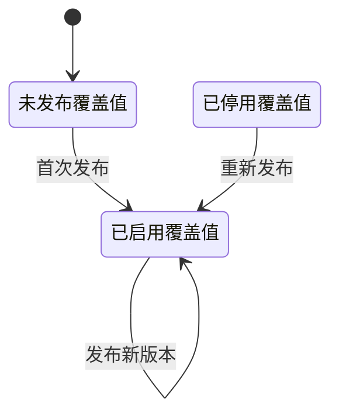

## 一句话价值

让运营校验并发布指定已登记配置的新版本

## 核心概念

- 已登记配置  平台明确列入配置名录、允许运营查看和修改的配置项，不等于数据库中的任意配置记录。
- 配置覆盖  全局作用域中已启用的保存值取代内置默认值；没有启用的保存值时仍采用默认值。
- 配置版本  某个全局配置记录的变更序号，用于阻止旧页面覆盖后来发布的结果。

## 业务对象

### 全局配置

| 业务名称 | 描述 | 取值说明 |
|---|---|---|
| 配置标识 | 指明本次修改的已登记配置。 | 包括用户等级与评分、约球规则、评价规则、用户素材限制、支付规则、赛事规则、城市、公共素材及首页内容配置。 |
| 配置内容 | 本次发布并在全局范围生效的内容；首页配置会先核验并规范化。 | 可表示整数、小数、文本或结构化内容，具体形式由配置标识决定。 |
| 配置版本 | 用于确认运营修改基于哪个版本；首次发布使用零，成功后版本递增。 | — |
| 配置说明 | 配置在登记名录中的中文业务说明。 | — |
| 启用状态 | 表示运营设置是否作为当前值生效；本服务成功后会启用该设置。 | 已启用：采用运营设置；已停用：读取时采用内置默认值。 |
| 当前值来源 | 表示发布后的当前值来自运营设置还是内置默认值。 | 已覆盖：采用已启用的运营设置；未覆盖：采用内置默认值。 |

## 状态机

| 当前状态 | 触发操作 | 新状态 | 前置条件 | 谁能触发 |
|---|---|---|---|---|
| 未发布覆盖值 | 首次发布 | 已启用覆盖值，版本 `1` | 配置已登记、内容校验通过且提交版本为 `0` | 持有有效运营凭据的调用方 |
| 已停用覆盖值 | 重新发布 | 已启用覆盖值，版本加 `1` | 内容校验通过且提交版本等于保存版本 | 持有有效运营凭据的调用方 |
| 已启用覆盖值 | 发布新版本 | 已启用覆盖值，版本加 `1` | 内容校验通过且提交版本等于保存版本 | 持有有效运营凭据的调用方 |

## 主流程

触发源：HTTP（运营）；终态：指定已登记配置的新版本已启用，并交付 64 项配置的最新全量视图。

1. 运营提交配置标识、配置内容和自己读取到的版本。
2. 确认配置标识已列入配置名录，并依据登记内容类型校验配置格式。
3. 首页配置按对应区域或海报结构校验并规范化；整数和小数配置确认可按相应数值读取，其他配置保留原内容。
4. 首次发布时建立启用的全局覆盖值并将版本记为 `1`；已有记录则确认提交版本未落后，保存新值、重新启用覆盖并将版本加 `1`。
5. 发布新版本，使后续业务读取采用新的全局覆盖值。
6. 交付全部 64 项已登记配置各自的当前值、默认值、版本和覆盖状态。

## 分支与异常

| 什么情况 | 怎么处理 | 对外提示 | 做了一半的怎么收场 |
|---|---|---|---|
| 未提供有效运营凭据，运营凭据未配置或凭据不匹配 | 拒绝修改 | `无权限访问` | 不产生配置变更 |
| 配置标识为空、配置内容缺失或版本缺失 | 拒绝修改 | 对应字段不能为空 | 不产生配置变更 |
| 配置标识没有进入配置名录 | 拒绝修改 | `未知的系统配置 key` | 不产生配置变更 |
| 配置内容超过规定长度 | 拒绝修改 | `配置内容不能超过 100KB` | 不产生配置变更 |
| 整数配置无法解析为整数 | 拒绝修改 | 指明该配置必须是整数 | 不产生配置变更 |
| 小数配置无法解析为数字 | 拒绝修改 | 指明该配置必须是数字 | 不产生配置变更 |
| 首页配置不是有效 JSON，或不符合对应区域、标题、海报数量、标识、类型和必填图片规则 | 拒绝修改 | `配置格式无效`，或指出具体首页内容问题 | 不产生配置变更 |
| 首次发布所带版本不是 `0`，或已有记录的版本已被其他修改推进 | 拒绝覆盖现有结果 | `配置已被其他人修改，请刷新后重试` | 不产生配置变更 |
| 首次配置记录保存失败 | 返回失败 | `配置保存失败` | 本次发布整体不成立 |
| 配置资料读取失败，或保存过程中发生系统异常 | 终止发布 | `系统异常，请稍后重试` | 本次修改不作为成功版本交付 |

## 业务边界

本服务只负责修改配置名录中的一项 `global` 配置，到校验内容、发布启用的新版本并返回全部已登记配置的最新视图为止。它不新增配置名录、不修改城市等其他作用域、不停用或删除覆盖值、不提供变更历史，也不负责证明配置数值符合各使用业务的合理范围；首页内容修改可通过独立的首页配置服务获得相同配置结果。

## 遗留与待定

- 内容长度按 100,000 个字符校验并对外称为 100KB，但 `sys_config.config_value` 只有 VARCHAR(2048)；实际可发布上限及计量单位需产品与数据负责人统一。
- 除三类首页配置外，数值配置只校验能否解析，不校验正负、上下限及相互关系；字符串、逗号分隔列表、存储标识和文案也没有内容规则，需各配置所属业务负责人补齐发布约束。
- 配置资料中存在六项已启用但未登记的配置：`review.tag.max_length`、`review.tag.max_custom_per_review`、`review.score.games4_max`、`review.score.games6_max`、`review.score.tiebreak_min`、`review.score.tiebreak_lead`；它们无法由本服务修改，需产品与技术负责人决定登记或移除。
- `score.max` 的登记说明为“用户注册初始校准度”，与配置标识及用途不一致；正确业务定义需产品确认。
- `user.hint.video` 和 `user.hint.ntrp` 的登记说明为空，运营无法从说明辨识用途；说明文案需产品确认。
- 修改已有记录时不重新判定或更新 `value_type`，也不校验原类型与当前登记类型一致；类型口径及历史记录治理方式需数据负责人确认。
- 配置类型口径同时存在 `string`、`integer`、`decimal`、`json`，配置资料中还出现 `int`，而领域类型清单采用 `STRING`、`INT`、`FLOAT`、`BOOL`、`JSON`；统一取值及迁移规则需产品与数据负责人确认。
- 首页配置中的 30 个区域、每区 20 张海报、区域标识 64 位、六种区域类型和两种海报类型均为写死规则，缺少产品规则来源，需产品确认。
- 发布只明确让处理本次修改的运行节点采用新值，多个运行节点何时同步采用新版本没有统一发布口径，需产品与技术负责人确认。
- 配置记录不保存修改人、变更原因和历史版本，运营修改的审计、回滚与追责要求需产品、运营和安全负责人确认。
