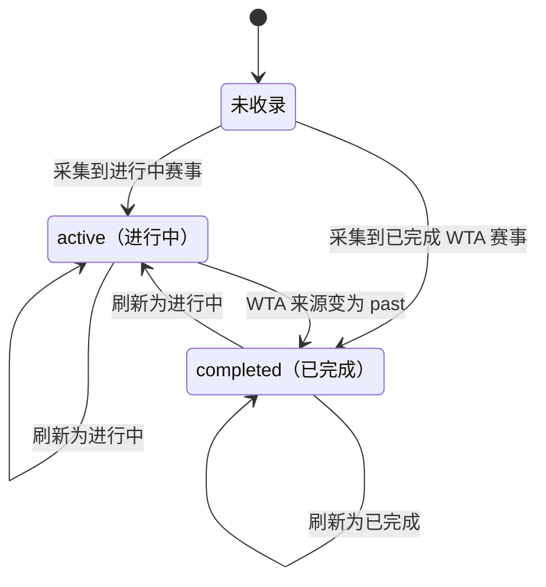

## 一句话价值

为运营按年份刷新 ATP 与 WTA 职业赛事名录

## 核心概念

- 职业赛事  从公开数据源采集的 ATP/WTA 赛事，用于赛程、比分和内容展示，不接受本产品用户报名。
- 赛事名录  某一年度职业赛事的基础档案集合，不包含签表、赛程、赛况、赛果和球员排名。

## 业务对象

### 职业赛事

| 业务名称 | 描述 | 取值说明 |
|---|---|---|
| 赛事编号 | 与赛事年份共同识别一届职业赛事。 | — |
| 赛事年份 | 赛事所属年份。 | — |
| 赛事名称 | 职业赛事名称。 | — |
| 所属巡回赛 | 赛事所属的职业巡回赛。 | ATP：男子职业巡回赛；WTA：女子职业巡回赛。 |
| 赛事级别 | 赛事在所属巡回赛中的级别。 | — |
| 场地表面 | 赛事采用的比赛场地表面。 | — |
| 举办地 | 赛事举办城市及国家或地区。 | — |
| 总奖金 | 赛事总奖金的数值及来源展示文本。 | — |
| 赛事状态 | 来源标记的赛事进展状态。 | 进行中：赛事尚未被来源标记为过往赛事；已完成：来源已标记赛事结束。 |
| 赛期 | 赛事开始日期与结束日期。 | — |
| 赛事图片 | 赛事主图和背景图；刷新既有赛事时保持原图片。 | — |

## 交付内容

类型: 批处理类

一次处理主流程界定的一批业务对象；处理范围、成功失败统计、部分成功口径与失败对象的收场方式，以本节下列规则及分支与异常为准。

| 当前状态 | 触发操作 | 新状态 | 前置条件 | 谁能触发 |
|---|---|---|---|---|
| 未收录 | 采集年度名录 | `active` | ATP 赛事，或 WTA 来源状态不是 `past` | 运营 |
| 未收录 | 采集年度名录 | `completed` | WTA 来源状态为 `past` | 运营 |
| `active` / `completed` | 刷新年度名录 | `active` | 同一 `tournament_id`、`year` 再次出现，且按来源规则归为进行中 | 运营 |
| `active` / `completed` | 刷新年度名录 | `completed` | 同一 WTA 赛事再次出现且来源状态为 `past` | 运营 |

## 主流程

触发源：HTTP（运营）；终态：指定年份的 ATP 与 WTA 赛事名录已新增或刷新。

1. 运营指定要采集的赛事年份。
2. 从 Tennis TV API 取得该年份的 ATP 赛事名录，并统一形成 ATP 赛事档案。
3. 按 `tournament_id` 与 `year` 新增未收录赛事，刷新已收录赛事的名录字段，同时保留已有主图和背景图。
4. 从 WTA API 取得该年份排除 ITF 级别后的 WTA 赛事名录，并统一形成 WTA 赛事档案。
5. 按同一识别规则新增或刷新 WTA 赛事，交付该年度两类巡回赛的最新名录。

## 分支与异常

| 什么情况 | 怎么处理 | 对外提示 | 做了一半的怎么收场 |
|---|---|---|---|
| Tennis TV API 返回空列表 | 不新增或刷新 ATP 赛事，继续采集 WTA 名录 | 无明确提示 | 已有 ATP 名录保持原状，WTA 仍可刷新 |
| Tennis TV API 请求失败并返回空结果 | ATP 名录转换随即失败，本次调用终止，WTA 不再采集 | 返回调用失败 | 已有名录保持原状 |
| WTA API 请求失败、无响应或返回空列表 | 停止 WTA 名录刷新 | 无明确提示，调用仍可结束 | 本次已完成的 ATP 刷新保留，已有 WTA 名录保持原状 |
| 来源日期无法解析，或必填名录字段缺失 | 对应来源的名录无法完成保存 | 返回调用失败 | 前一来源若已刷新则保留；失败来源的既有名录保持原状 |
| 新旧赛事的 `tournament_id` 与 `year` 相同 | 将其视为同一赛事并刷新名录字段 | 无 | 主图和背景图保持原值，其余名录字段采用本次来源值 |

## 业务边界

本服务负责按年份取得 ATP、WTA 职业赛事基础信息，并新增或刷新 `tour_tournament` 名录记录。它不采集签表、赛程、实时赛况、完赛结果和球员排名，不生成或更新赛事图片、翻译和内容文案，也不删除本次来源中未出现的既有赛事。

## 遗留与待定

| 等级 | 待定的是什么 | 要谁来定 |
|---|---|---|
| P1 | 入口未体现运营身份校验，哪些账户可以发起名录采集需要业务负责人确认。 | 产品与职业赛事数据负责人 |
| P2 | 年份没有可采集范围或有效性规则，过早、过晚及负数年份如何处理需要业务负责人确认。 | 产品与职业赛事数据负责人 |
| P2 | Tennis TV API 单次固定最多取 200 条且没有翻页；WTA API 固定只取第 0 页、最多 1000 条并排除 ITF，年度名录完整性标准需要数据负责人确认。 | 产品与职业赛事数据负责人 |
| P1 | ATP 来源赛事状态无论日期和来源信息都固定为 `active`，何时转为 `completed` 需要赛事数据负责人确认。 | 产品与职业赛事数据负责人 |
| P1 | WTA 仅将来源状态 `past` 映射为 `completed`，其他所有值都映射为 `active`；未知状态的处理规则需要赛事数据负责人确认。 | 产品与职业赛事数据负责人 |
| P2 | WTA 级别包含 `Grand Slam` 时写为 `GS`，否则直接移除 `WTA` 前缀；ATP 级别直接照收来源类型，统一的赛事级别口径需要赛事数据负责人确认。 | 产品与职业赛事数据负责人 |
| P2 | `tour` 的数据库说明还列有 `ITF`、`Grand`，但当前业务枚举和本服务仅处理 `ATP`、`WTA`，允许值范围需要数据负责人确认。 | 产品与职业赛事数据负责人 |
| P2 | ATP 奖金文本会删除全部非数字字符后写入 `prize_money`，WTA 奖金数值直接缩窄为 INT；币种换算、超出 INT 范围及无法解析时的口径需要财务或数据负责人确认。 | 产品与职业赛事数据负责人 |
| P2 | `prize_money` 的数据库定义为美元总奖金，但 WTA 来源保留独立币种且未换算，字段含义需要数据负责人确认。 | 产品与职业赛事数据负责人 |
| P2 | 不同巡回赛来源仅以 `tournament_id` 与 `year` 识别同一赛事，未包含 `tour`；ATP 与 WTA 编号碰撞时是否允许互相覆盖需要数据负责人确认。 | 产品与职业赛事数据负责人 |
| P1 | WTA 空结果会被当作本次 WTA 采集结束且不向调用方提示失败，空名录与采集失败的对外结果需要运营负责人确认。 | 产品与职业赛事数据负责人 |
| P2 | 本次来源中缺失的既有赛事不会失效或删除，名录下架与纠错规则需要赛事数据负责人确认。 | 产品与职业赛事数据负责人 |
