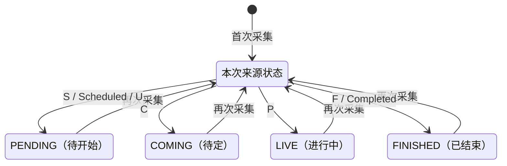

## 一句话价值

更新当前职业赛事的实时比赛与比分

## 核心概念

- 职业赛事  从公开数据源采集的 ATP/WTA 赛事，用于赛程、比分和内容展示，不接受本产品用户报名。
- 赛况  职业比赛当前的对阵、状态、场地、胜方与逐盘比分快照。
- 赛程  职业比赛的日期、时间、场地和对阵安排；与签表结构不是同一份数据。
- 签表  职业赛事的参赛位置、轮次结构和潜在晋级路径。

## 业务对象

### 职业比赛赛况

| 业务名称 | 描述 | 取值说明 |
|---|---|---|
| 比赛编号 | 与所属单打签表共同识别一场比赛。 | — |
| 所属赛事 | 比赛所属的职业赛事及年份。 | — |
| 对阵双方 | 第一方和第二方球员。 | — |
| 胜者 | 来源已经给出的获胜球员。 | — |
| 比赛场地 | 来源给出的场地名称。 | — |
| 比赛状态 | 实时赛况反映的比赛阶段。 | 待开始：已有排期；待定：安排尚不明确；进行中：比赛正在进行；已结束：比赛已经完成。 |
| 逐盘比分 | 实时取得的各盘双方局分和抢七分完整快照。 | — |

## 交付内容

类型: 批处理类

一次处理主流程界定的一批业务对象；处理范围、成功失败统计、部分成功口径与失败对象的收场方式，以本节下列规则及分支与异常为准。

| 当前状态 | 触发操作 | 新状态 | 前置条件 | 谁能触发 |
|---|---|---|---|---|
| 未收录或任一已有状态 | 刷新实时赛况 | `PENDING` | 来源状态为 `S`、`Scheduled` 或 `U` | 运营或 LIVE 阶段定时任务 |
| 未收录或任一已有状态 | 刷新实时赛况 | `COMING` | 来源状态为 `C` | 运营或 LIVE 阶段定时任务 |
| 未收录或任一已有状态 | 刷新实时赛况 | `LIVE` | 来源状态为 `P` | 运营或 LIVE 阶段定时任务 |
| 未收录或任一已有状态 | 刷新实时赛况 | `FINISHED` | 来源状态为 `F` 或 `Completed` | 运营或 LIVE 阶段定时任务 |

## 主流程

触发源：HTTP（运营）或 LIVE 阶段定时任务（每 5 分钟）；终态：当前职业赛事的实时比赛与比分已新增或刷新。

1. 取得开始日期不晚于明日、结束日期不早于昨日的职业赛事。
2. 按每项赛事的外部编号和年份从 ATP Tour API 取得实时比赛。
3. ATP 赛事保留比赛编号以 `MS` 开头的男子单打，WTA 赛事保留以 `LS` 开头的女子单打。
4. 核对来源赛事编号和年份，形成每场比赛的双方球员、状态、场地、胜方与逐盘比分快照。
5. 按赛事、年份和单打类型新增缺失的签表，或关联已有签表；已有签表的人数和总轮数保持不变。
6. 按比赛编号与签表新增未收录比赛；已有比赛只刷新本次来源提供的非空赛况字段。

## 分支与异常

| 什么情况 | 怎么处理 | 对外提示 | 做了一半的怎么收场 |
|---|---|---|---|
| 当前日期范围内没有职业赛事 | 本次采集直接结束 | HTTP 无返回内容；定时任务无提示 | 未产生变更 |
| ATP Tour API 无响应、返回空数据或没有对应单打比赛 | 该赛事不新增或刷新赛况，继续下一项赛事 | HTTP 不区分空数据与采集成功；定时任务无提示 | 其他已完成赛事的刷新保留 |
| ATP Tour API 返回内容无法解析 | 本次调用或 LIVE 阶段终止 | HTTP 返回调用失败；定时任务记录阶段失败 | 此前已完成赛事的刷新保留，后续赛事不再处理 |
| 当前赛事的巡回赛类型不是 `ATP` 或 `WTA` | 本次调用或 LIVE 阶段终止 | HTTP 返回调用失败；定时任务记录阶段失败 | 此前已完成赛事的刷新保留，后续赛事不再处理 |
| 来源赛事编号或年份与请求的赛事不一致 | 丢弃该赛事的整批实时数据，继续下一项赛事 | 无 | 该赛事已有赛况保持原状 |
| 来源比赛编号不是当前巡回赛对应的 `MS` 或 `LS` | 忽略该场比赛 | 无 | 其他符合类型的单打比赛继续刷新 |
| 某盘的盘号为 `0`、盘号缺失或第一方局数缺失 | 不纳入该盘比分 | 无 | 其他有效盘继续形成比分快照 |
| 第二方没有同盘号的局数 | 保留该盘的第一方比分，第二方局数与抢七分为空 | 无 | 该盘仍会进入本次比分快照 |
| 来源状态不在已知映射内 | 不形成新的比赛状态 | 无 | 已有非空状态保留；新比赛的状态可能留空 |
| 比赛缺少赛事编号、年份或比赛编号 | 拒绝保存该批比赛 | HTTP 返回调用失败；定时任务记录 LIVE 阶段失败 | 该签表可能已新增；此前已完成赛事的刷新保留，后续赛事不再处理 |
| 保存签表或比赛失败 | 本次调用或 LIVE 阶段终止 | HTTP 返回调用失败；定时任务记录阶段失败 | 此前已完成赛事的刷新保留，后续赛事不再处理 |

## 业务边界

- 负责识别当前日期窗口内的 ATP、WTA 职业赛事，并从 ATP Tour API 刷新其单打实时赛况。
- 负责为实时比赛关联或新增 `tour_draw`，新增或刷新 `tour_match` 的对阵、状态、场地、胜方和逐盘比分。
- 不负责采集职业赛事名录，也不为来源中未收录的赛事自动建档。
- 不负责补齐签表人数、总轮数和晋级结构，也不更新球员档案或签表参赛资料。
- 不负责预先编排赛程，也不保证补齐所有已完赛果；实时来源当次给出的胜方和完赛状态仍会刷新。
- 不删除本次来源中缺失的既有比赛和比分。

## 遗留与待定

| 等级 | 待定的是什么 | 要谁来定 |
|---|---|---|
| P2 | “当前赛事”固定取开始日期至明日、结束日期自昨日的窗口，这个前后各一天的业务原因未说明，需赛事数据负责人确认。 | 产品与职业赛事数据负责人 |
| P2 | LIVE 阶段固定按绝对分钟每 5 分钟执行，不同赛事阶段的更新频率是否均适用需运营确认。 | 产品与职业赛事数据负责人 |
| P2 | ATP 与 WTA 当前都使用 ATP Tour API 的实时比赛数据，WTA 赛事编号是否与该来源稳定对应需赛事数据负责人确认。 | 产品与职业赛事数据负责人 |
| P1 | `tour_tournament.tour` 的数据库说明还列有 `ITF`、`Grand`，但本服务只识别 `ATP`、`WTA`；允许值及异常数据处理需数据负责人确认。 | 产品与职业赛事数据负责人 |
| P1 | 来源赛事编号必须能转为整数才能完成赛事一致性核对，非数字编号的支持规则需数据负责人确认。 | 产品与职业赛事数据负责人 |
| P1 | 现有实时来源定义将状态 `C` 和 `S` 注释为“已完成”和“暂停”，当前却分别保存为 `COMING`（待定）和 `PENDING`（待开始）；正确状态映射需赛事数据负责人确认。 | 产品与职业赛事数据负责人 |
| P2 | 实时来源的轮次名称、当前局比分、发球方、开赛后耗时和赛况说明未进入业务数据，哪些实时信息应对外交付需产品确认。 | 产品与职业赛事数据负责人 |
| P2 | 实时比分以第一方的盘列表为基准，盘号为 `0`或第一方局数为空时丢弃该盘；这一过滤口径需赛事数据负责人确认。 | 产品与职业赛事数据负责人 |
| P1 | 已有比赛的非空字段才会被新值覆盖；来源将胜方、比分、状态或场地更正为空时无法清除旧值，纠错口径需赛事数据负责人确认。 | 产品与职业赛事数据负责人 |
| P1 | 比赛状态允许任一已有状态被实时来源直接覆盖，没有禁止 `FINISHED` 回退到 `LIVE`、`PENDING` 或 `COMING`；状态回退规则需赛事数据负责人确认。 | 产品与职业赛事数据负责人 |
| P1 | `tour_match.status` 本服务保存大写状态，但部分现有赛事活跃性查询使用小写 `live`、`scheduled`；统一取值口径需数据负责人确认。 | 产品与职业赛事数据负责人 |
| P2 | 实时来源只保留单打编号前缀，双打不会采集；双打赛况的产品范围需赛事数据负责人确认。 | 产品与职业赛事数据负责人 |
| P2 | 实时赛况、赛程和已完赛果都可刷新部分相同比赛字段，三类来源的覆盖优先级需赛事数据负责人确认。 | 产品与职业赛事数据负责人 |
| P1 | HTTP 入口未体现运营身份校验，哪些账户可以手动发起实时赛况采集需业务负责人确认。 | 产品与职业赛事数据负责人 |
| P2 | HTTP 入口无返回内容，无法让运营区分全部成功、部分成功、空数据和跳过；对外结果标准需产品确认。 | 产品与职业赛事数据负责人 |
