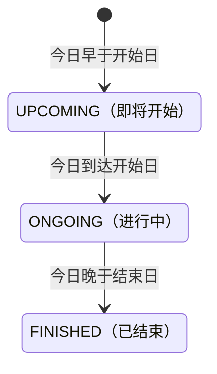

## 一句话价值

按状态、类型和日期范围交付职业赛事

## 核心概念

- 职业赛事  从公开数据源采集的 ATP/WTA 赛事，用于赛程、比分和内容展示，不接受本产品用户报名。
- 翻译条目  某类业务文本、原文和目标语言组成的一项待译或已译内容。
- 展示状态  根据查询当日与赛事起止日期实时推导的即将开始、进行中或已结束，不是赛事主信息中的存储状态。
- 同期分组  将城市相同且赛期相交的职业赛事标记为同一展示组。

## 业务对象

### 职业赛事

| 业务名称 | 描述 | 取值说明 |
|---|---|---|
| 赛事编号 | 唯一标识一项外部职业赛事。 | — |
| 赛事名称 | 优先展示简体中文译名，没有译文时展示原名。 | — |
| 所属巡回赛 | 赛事所属的职业巡回赛。 | ATP：男子职业巡回赛；WTA：女子职业巡回赛；其他来源保持自身巡回赛名称。 |
| 赛事级别 | 赛事在所属巡回赛中的级别。 | — |
| 场地表面 | 场地表面代码及优先本地化的展示名称。 | — |
| 举办城市 | 优先展示简体中文译名，没有译文时展示原名。 | — |
| 赛期 | 赛事开始日期与结束日期。 | — |
| 展示状态 | 根据查询当日与赛期的关系得到。 | 即将开始：查询日早于开始日期；进行中：查询日在赛期内；已结束：查询日晚于结束日期。 |
| 同期分组 | 标识本次结果中赛期重叠的赛事分组。 | — |
| 背景图片 | 赛事背景图的临时访问地址；未绑定图片时为空。 | — |

## 状态机

职业赛事的存储状态不由本服务改变；以下为查询时按日期推导的展示状态。

| 当前状态 | 触发操作 | 新状态 | 前置条件 | 谁能触发 |
|---|---|---|---|---|
| 任意存储状态 | 查询展示 | `UPCOMING` | 今日早于 `start_date` | 用户或匿名访问者 |
| 任意存储状态 | 查询展示 | `ONGOING` | 今日不早于 `start_date`，且不晚于 `end_date` | 用户或匿名访问者 |
| 任意存储状态 | 查询展示 | `FINISHED` | 今日晚于 `end_date` | 用户或匿名访问者 |

## 主流程

触发源：HTTP（用户或匿名访问者）；终态：符合条件的职业赛事已完成展示加工并按日期交付。

1. 查询方可指定展示状态、职业巡回赛类型和日期范围，也可不限定任一条件。
2. 按存储状态、巡回赛类型及赛期与日期窗口的交集取得赛事，并按开始日期升序排列。
3. 按赛事级别规则排除不交付的数字级别赛事。
4. 以每个展示组的首项为基准，将原始城市不区分大小写且赛期相交的赛事归入同一组，组内仍按开始日期升序排列。
5. 根据查询当日与赛事起止日期推导展示状态，并将场地表面代码转为大写。
6. 赛事名称、城市和场地表面有简体中文译文时交付译文；无译文时保留原文并登记待译条目。
7. 背景图已绑定时，交付其七牛云临时访问地址；最终交付全部赛事查询项。

## 分支与异常

| 什么情况 | 怎么处理 | 对外提示 | 做了一半的怎么收场 |
|---|---|---|---|
| 没有赛事命中条件，或命中赛事全部被级别规则排除 | 交付空清单 | 查询成功 | 本服务不改变赛事资料，无需收场 |
| `status` 为空或不是三个已识别值 | 不限定存储状态 | 查询成功 | 无变更 |
| `range` 为空或不是 `recent`、`live` | 不限定日期范围 | 查询成功 | 无变更 |
| `type` 为库中不存在的精确值 | 交付空清单 | 查询成功 | 无变更 |
| 赛事名称、城市或场地表面没有简体中文译文 | 保留原文并登记空译文的待译条目 | 查询成功 | 赛事仍正常交付；已登记条目留待后续翻译 |
| 待译条目因重复或其他原因未能登记 | 保留原文继续交付赛事 | 查询成功 | 已登记的其他待译条目保留 |
| `background_path` 为空 | 不交付背景图访问地址 | 查询成功 | 无变更 |
| 赛事资料读取、翻译读取或七牛云访问地址生成失败 | 终止查询 | `系统异常，请稍后重试` | 赛事资料不变；异常前已登记的待译条目保留 |

## 业务边界

本服务负责向用户或匿名访问者交付按状态、巡回赛类型和日期窗口筛选的职业赛事清单，包含同期分组、展示状态、简体中文文本和背景图访问地址。它只在缺失译文时登记待译条目，不完成翻译；不采集或修改职业赛事，不交付签表、赛程、赛况、赛果、球员或详细内容，也不生成或维护赛事图片。

## 遗留与待定

- 数字型 `category` 低于 `250` 的赛事会被排除，空值和非数字值反而会保留；该门槛、单位及不同格式的业务含义需职业赛事数据负责人确认。
- `ONGOING` 与 `UPCOMING` 会被映射为同一存储状态 `active`，且未另行按日期限定；两个查询条件是否应分别交付即将开始和进行中赛事，需产品与数据负责人确认。
- 存储状态用 `active` / `completed`，交付状态却完全由日期推导；两者冲突时哪个代表业务事实，需职业赛事数据负责人确认。
- `status` 只识别全大写值，`range` 却不区分大小写；查询条件的大小写口径需产品负责人确认。
- `recent` 固定取今日前后各一个月，`live` 只判断赛期是否覆盖今日且强制存储状态为 `active`；命名、时间窗口与覆盖口径的业务意图需产品与数据负责人确认。
- 同期分组只比较城市和赛期，不比较赛事名称；同城同期的不同赛事是否应归为一组，需内容与数据负责人确认。
- 同期分组只将新赛事与组内首项比较，没有用赛期的传递交集合并整组；重叠链赛事的分组标准需内容负责人确认。
- `groupId` 仅按本次查询结果顺序临时生成，条件或数据变化后同一赛事可能获得不同值；它是否可被下游作为稳定标识，需产品负责人确认。
- `tour` 建表说明包含 `ATP`、`WTA`、`ITF`、`Grand`，但职业赛事采集业务只定义 `ATP` 与 `WTA`；查询时又不校验 `type`，有效类型范围需职业赛事数据负责人确认。
- 主信息以 `tournament_id` 与 `year` 共同唯一，查询项却不交付 `year` 且只用 `tournament_id` 作为 `id`；同一外部赛事标识跨年复用时的唯一识别方式需产品与数据负责人确认。
- 背景图七牛云访问地址有效期固定为 3600 秒，该时长与过期后的对外口径需内容与平台负责人确认。
- 查询不分页且没有数量上限；全量结果的交付规模及排序保证需产品与数据负责人确认。
