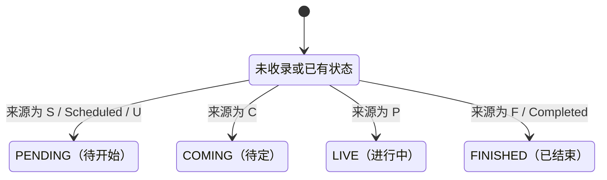

## 一句话价值

为运营补齐指定职业赛事的完赛结果与逐盘比分

## 核心概念

- 职业赛事  从公开数据源采集的 ATP/WTA 赛事，用于赛程、比分和内容展示，不接受本产品用户报名。
- 签表  职业赛事的参赛位置、轮次结构和潜在晋级路径。
- 赛果  职业比赛结束后的胜方、比赛状态和逐盘比分结论。

## 业务对象

### 职业比赛结果

| 业务名称 | 描述 | 取值说明 |
|---|---|---|
| 比赛编号 | 与所属单打签表共同识别一场比赛。 | — |
| 所属赛事 | 比赛所属的职业赛事及年份。 | — |
| 比赛轮次 | 比赛在签表中的轮次。 | 一百二十八强、一百强以内的特殊轮次、六十四强、三十二强、十六强、八强、半决赛或决赛。 |
| 对阵双方 | 第一方和第二方球员。 | — |
| 胜者 | 本场比赛获胜的球员。 | — |
| 比赛场地 | 比赛所在场地。 | — |
| 比赛状态 | 来源结果反映的比赛阶段。 | 待开始：已有排期；待定：安排尚不明确；进行中：比赛正在进行；已结束：比赛已经完成。 |
| 逐盘比分 | 各盘双方局分和抢七分；盘号为零的占位数据不保留。 | — |

## 状态机

| 当前状态 | 触发操作 | 新状态 | 前置条件 | 谁能触发 |
|---|---|---|---|---|
| 未收录或任一已有状态 | 采集完赛结果 | `PENDING` | ATP Tour App 返回 `S`、`Scheduled` 或 `U` | 运营 |
| 未收录或任一已有状态 | 采集完赛结果 | `COMING` | ATP Tour App 返回 `C` | 运营 |
| 未收录或任一已有状态 | 采集完赛结果 | `LIVE` | ATP Tour App 返回 `P` | 运营 |
| 未收录或任一已有状态 | 采集完赛结果 | `FINISHED` | ATP Tour App 返回 `F` 或 `Completed` | 运营 |

## 主流程

触发源：HTTP（运营）；终态：指定职业赛事的单打完赛结果已新增或刷新。

1. 运营指定职业赛事编号和年份，并以该赛事所属 ATP 或 WTA 巡回赛确定单打类型。
2. 从 ATP Tour App 取得该赛事、该年份的已完成比赛，并核对返回的赛事编号和年份。
3. ATP 赛事只保留比赛编号以 `MS` 开头的男子单打，WTA 赛事只保留以 `LS` 开头的女子单打。
4. 将每场比赛整理为轮次、双方球员、胜方、场地、状态和逐盘比分；盘号为 `0` 或第一方局数为空的盘不计入结果。
5. 按赛事、年份和单打类型取得或建立签表，并让本次完赛比赛归入该签表。
6. 按比赛编号与签表新增未收录比赛；已有比赛只刷新本次来源提供的非空结果，不用空值清除既有资料。
7. 完成本次可识别比赛的结果刷新，并向运营返回采集完成。

## 分支与异常

| 什么情况 | 怎么处理 | 对外提示 | 做了一半的怎么收场 |
|---|---|---|---|
| 未提供或无法识别赛事所属巡回赛 | 无法确定采集 `MS` 还是 `LS`，本次调用中断 | 返回调用失败 | ATP Tour App 的结果不会写入签表或比赛 |
| ATP Tour App 无响应、返回空数据或没有对应单打比赛 | 不新增或刷新比赛 | 仍返回采集完成 | 既有签表和比赛保持原状 |
| 返回的赛事编号或年份与请求不一致 | 拒绝采用整批结果 | 仍返回采集完成 | 既有签表和比赛保持原状 |
| 指定赛事编号尚未收录在职业赛事名录 | 跳过该赛事的签表和比赛 | 仍返回采集完成 | 既有数据保持原状 |
| 比赛缺少赛事编号、年份或比赛编号 | 拒绝保存该批比赛 | 返回调用失败 | 本次已建立的签表可能保留，比赛结果不完整 |
| 来源状态不在已知映射内 | 不形成新的比赛状态 | 无明确提示 | 已有比赛保留原状态；新比赛可能因状态必填而保存失败 |
| 来源缺少一方球员、胜方、场地或逐盘比分 | 保存其余可识别结果，不以空值清除已有资料 | 无明确提示 | 缺失字段沿用已有值；新比赛的相应字段为空 |
| 同一批结果重复出现相同比赛 | 合并为一场后保存 | 无 | 采用该批中后出现的非空资料 |
| 比赛身份字段与既有记录冲突 | 拒绝合并该批比赛 | 返回调用失败 | 本次已建立的签表可能保留，既有比赛不被冲突值覆盖 |

## 业务边界

- 负责从 ATP Tour App 取得指定职业赛事和年份的单打完赛结果，并新增或刷新 `tour_draw`、`tour_match`。
- 负责保存可识别的轮次、参赛双方、胜方、场地、比赛状态和逐盘比分。
- 不负责采集职业赛事名录；指定赛事必须已存在于 `tour_tournament`。
- 不负责刷新 `tour_player` 和 `tour_tournament_entry`，也不采集双打结果。
- 不负责删除来源中不再出现的既有比赛，也不能用来源空值清除已有字段。
- 不负责刷新比赛日期、计划时间、实际开始或结束时间及比赛时长。

## 遗留与待定

- 当前 HTTP 入口只传入赛事编号和年份，没有传入或查询 `tour`；后续必须据此在 `MS` 与 `LS` 间分流，因此当前成功路径不可达，需研发确认从赛事名录补齐巡回赛类型。
- 入口未体现运营身份校验，哪些账户可以发起结果采集需要业务负责人确认。
- 赛事编号和年份没有格式、范围或一致性校验，合法输入规则需要赛事数据负责人确认。
- ATP Tour App 的完赛结果同时承载 ATP 的 `MS` 与 WTA 的 `LS`，但支持范围及编号前缀口径没有业务说明，需要赛事数据负责人确认。
- 完赛结果来源若返回 `S`、`Scheduled`、`U`、`C` 或 `P`，现有规则仍会把比赛改为待开始、待定或进行中；已结束状态能否回退需要赛事数据负责人确认。
- 来源提供比赛日期，但当前结果采集不写入 `match_date`；完赛结果是否应补齐比赛日期需要赛事数据负责人确认。
- 来源提供球员姓名，但当前结果采集既不保存姓名也不刷新 `tour_player`；球员资料补齐责任需要赛事数据负责人确认。
- 逐盘比分以第一方盘列表为准，第二方缺少同盘数据时仍保存该盘且第二方局数为空；残缺比分能否作为有效赛果需要赛事数据负责人确认。
- 签表不存在时会建立 `size`、`total_rounds` 均为空的签表；完赛结果能否独立建立不完整签表需要赛事数据负责人确认。
- 双打结果固定不采集，是否需要纳入职业赛事结果需要业务负责人确认。
- 对外完成文案不区分空数据、赛事不匹配、赛事未收录、全部成功或部分成功，运营可见的结果标准需要产品确认。
