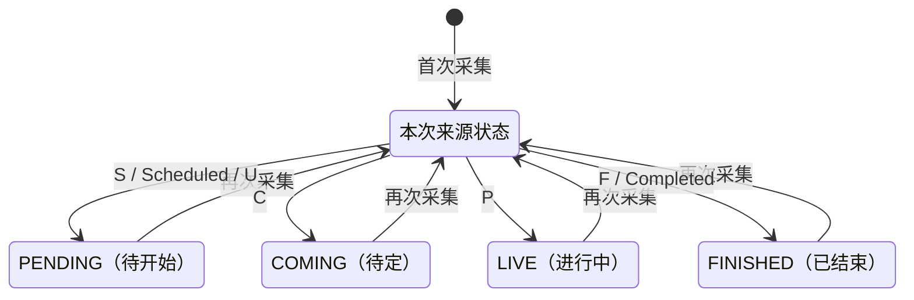

## 一句话价值

为运营持续刷新当前职业赛事的比赛时间与场地安排

## 核心概念

- 职业赛事  从公开数据源采集的 ATP/WTA 赛事，用于赛程、比分和内容展示，不接受本产品用户报名。
- 赛程  职业比赛的日期、时间、场地和对阵安排；与签表结构不是同一份数据。
- 签表  职业赛事的参赛位置、轮次结构和潜在晋级路径。
- 种子  职业赛事中用于体现重点球员及签表排序的编号。

## 业务对象

### 职业比赛赛程

| 业务名称 | 描述 | 取值说明 |
|---|---|---|
| 比赛编号 | 与所属签表共同识别一场比赛。 | — |
| 所属赛事 | 比赛所属的职业赛事及年份。 | — |
| 签表类型 | 比赛所属的单打签表。 | 男子单打或女子单打。 |
| 签表位置 | 比赛在签表中的序号和轮次。 | — |
| 比赛轮次 | 比赛轮次的业务名称。 | 一百二十八强、一百强以内的特殊轮次、六十四强、三十二强、十六强、八强、半决赛或决赛。 |
| 对阵双方 | 第一方和第二方球员；对阵未确定时可为空。 | — |
| 胜者 | 来源已给出时一并保存的获胜球员。 | — |
| 计划开赛时间 | 按中国标准时间形成的计划开赛时间。 | 固定时间：按指定时间开赛；随后：同场上一场结束后开赛；不早于：不得早于指定时间；待定：来源排期无法归类。 |
| 比赛日期 | 比赛所属日期。 | — |
| 比赛场地 | 比赛所在场地及当日场次顺序。 | — |
| 比赛状态 | 来源赛程反映的比赛阶段。 | 待开始、待定、进行中或已结束。 |
| 逐盘比分 | 赛程来源附带的各盘比分快照。 | — |

### 参赛球员

| 业务名称 | 描述 | 取值说明 |
|---|---|---|
| 球员 | 参赛球员的编号、姓名及国家或地区。 | — |
| 种子号 | 球员在签表中的种子顺位。 | — |
| 入围方式 | 球员进入签表的方式。 | 直接入围、外卡、资格赛晋级或幸运落败者。 |
| 参赛状态 | 球员在签表中的参赛状态。 | 已确认：新资料的默认状态；已退出或已退赛：保留既有状态。 |

## 状态机

| 当前状态 | 触发操作 | 新状态 | 前置条件 | 谁能触发 |
|---|---|---|---|---|
| 未收录或任一已有状态 | 刷新赛程 | `PENDING` | 来源状态为 `S`、`Scheduled` 或 `U` | 运营或 OOP 阶段定时任务 |
| 未收录或任一已有状态 | 刷新赛程 | `COMING` | 来源状态为 `C` | 运营或 OOP 阶段定时任务 |
| 未收录或任一已有状态 | 刷新赛程 | `LIVE` | 来源状态为 `P` | 运营或 OOP 阶段定时任务 |
| 未收录或任一已有状态 | 刷新赛程 | `FINISHED` | 来源状态为 `F` 或 `Completed` | 运营或 OOP 阶段定时任务 |

## 主流程

触发源：HTTP（运营）或 OOP 阶段定时任务（每 60 分钟）；终态：当前职业赛事的比赛时间与场地安排已新增或刷新。

1. 取得开始日期不晚于明日、结束日期不早于昨日的 ATP 与 WTA 职业赛事。
2. 按巡回赛和赛事级别选择赛程来源：普通 ATP 读取 Tennis TV API，ATP 大满贯读取 ATP Tour API，普通 WTA 读取 WTA API，WTA 大满贯读取 ATP Tour API 中的 WTA 赛程。
3. 从来源中保留对应巡回赛的单打比赛，形成其比赛日期、计划时间、场地、场序、轮次、对阵和来源状态。
4. 对“随后开赛”的比赛按同一场地的比赛顺序形成计划时间，并将带时区的来源时间统一为中国标准时间。
5. 按赛事、年份和单打类型新增或刷新职业赛事签表，并让本次比赛关联该签表。
6. 按比赛编号与签表新增未收录比赛；已有比赛只刷新本次来源提供的字段，不以空值清除既有资料。
7. 来源包含球员和种子资料时，补齐或刷新职业球员及其签表参赛资料；来源附带胜方、结束时间或比分时一并刷新。

## 分支与异常

| 什么情况 | 怎么处理 | 对外提示 | 做了一半的怎么收场 |
|---|---|---|---|
| 当前日期范围内没有职业赛事 | 本次采集直接结束 | HTTP 仍返回采集完成；定时任务无提示 | 未产生变更 |
| 来源无响应、返回空数据或没有对应单打比赛 | 对应赛事不新增或刷新赛程 | HTTP 未区分空数据与采集成功；定时任务无提示 | 其他已完成赛事的刷新保留 |
| 来源中的赛事编号未收录在职业赛事名录 | 跳过该赛事的签表、比赛、球员和参赛资料 | 无 | 其他已识别赛事继续处理 |
| 比赛缺少赛事编号、年份或比赛编号 | 拒绝保存该批比赛 | HTTP 返回调用失败；定时任务记录该阶段失败 | 此前已经完成的签表或其他赛事变更未见统一撤销规则 |
| 来源日期、时间、轮次或种子无法解析 | 对应字段不刷新；其余可识别资料继续处理 | 无 | 已有非空资料保留；新资料的对应字段为空 |
| 来源状态不在已知映射内 | 不形成新的比赛状态 | 无 | 已有非空状态保留；新比赛能否保存取决于必填状态约束 |
| 同一批来源重复出现相同比赛 | 合并为一条比赛后保存 | 无 | 采用该批数据中最后合并出的非空资料 |
| 某项赛事刷新过程中发生异常 | 本次调用或整个 OOP 阶段终止 | HTTP 返回调用失败；定时任务记录阶段失败 | 此前已完成的赛事刷新保留，后续赛事不再处理 |
| 双打比赛出现在来源中 | 默认不采集；仅启用双打采集时处理 | 无 | 单打赛程照常刷新 |

## 业务边界

- 负责识别当前日期窗口内的 ATP、WTA 职业赛事，并刷新其单打赛程。
- 负责新增或刷新 `tour_draw`、`tour_match`，并在赛程来源提供时补齐 `tour_player` 与 `tour_tournament_entry`。
- 负责将来源时间统一为中国标准时间，并表达固定开赛、随后开赛、不早于指定时间和未知排期。
- 不负责采集职业赛事名录，也不为来源中未收录的赛事自动建档。
- 不负责构建完整签表晋级结构；只保证赛程比赛关联到对应单打签表。
- 不负责持续追踪实时比分或专门补齐完赛结果，但赛程来源附带的状态、胜方、结束时间和比分当前仍会被保存。
- 不删除本次来源中缺失的既有比赛、球员或参赛资料。

## 遗留与待定

- “当前赛事”固定取开始日期至明日、结束日期自昨日的窗口，这个前后各一天的业务原因未说明，需赛事数据负责人确认。
- OOP 阶段按绝对分钟每 60 分钟触发，采集频率是否满足不同赛事日的发布时间与变更频率，需运营确认。
- 普通 ATP 的 Tennis TV API 一次返回全部赛事，却会随每个当前普通 ATP 赛事重复读取并处理；重复采集范围和执行次数需研发确认。
- 普通 ATP 的“随后开赛”按同场上一场计划时间加 100 分钟推算，ATP Tour API 与 WTA API 则加 70 分钟；两种推算时长及业务依据需赛事数据负责人确认。
- WTA 完赛场次把 `ended_at` 写成 `scheduled_at`，该字段是否应表示实际结束时间需赛事数据负责人确认。
- WTA 赛程会附带逐盘比分，全部赛程来源都可能附带比赛状态和胜方，因此本服务与“职业赛事赛况采集”“职业赛事结果采集”的字段归属重叠；各来源的覆盖优先级需赛事数据负责人确认。
- 比赛状态允许任一已有状态被本次来源直接覆盖，没有禁止 `FINISHED` 回退到 `LIVE`、`PENDING` 或 `COMING`；回退规则需赛事数据负责人确认。
- ATP Tour API 的 ATP 球员编号会转为大写，WTA 与 Tennis TV 来源不统一转换；跨来源球员编号的统一口径需赛事数据负责人确认。
- 数据库给 `tour_tournament_entry.entry_type` 定义 `DIRECT`、`WILDCARD`、`QUALIFIER`、`LUCKY_LOSER`，但来源实际可写入 `WC`、`Q`、`LL` 等原始值；是否转换及允许值需赛事数据负责人确认。
- 赛程来源未解释时，已有非空字段保留；来源更正为明确空值时无法清除旧值，纠错口径需赛事数据负责人确认。
- 双打默认不采集，何时启用及启用后的范围需赛事数据负责人确认。
- HTTP 入口未体现运营身份校验，哪些账户可以手动发起赛程采集需业务负责人确认。
- 采集对调用方只返回统一完成文案，无法区分全部成功、部分成功、空数据和跳过；运营可见的结果标准需产品确认。
