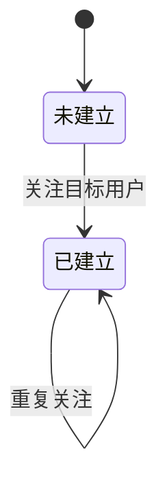

## 一句话价值

让用户建立本人对另一用户的唯一关注关系。

## 核心概念

- 账户  用户获得访问身份的载体，可关联登录凭据、手机号和个人资料。

## 业务对象

### 关注关系

| 业务名称 | 描述 | 取值说明 |
|---|---|---|
| 关注关系编号 | 唯一标识本次建立的关注关系。 | — |
| 关注人 | 发起关注的当前用户。 | — |
| 被关注人 | 本次希望关注的目标用户，不得是本人。 | — |
| 关注状态 | 表示两名用户之间当前是否存在关注关系。 | 已关注：关注关系存在，也是本服务完成时的状态；未关注：关注关系不存在。 |

## 状态机

| 当前状态 | 触发操作 | 新状态 | 前置条件 | 谁能触发 |
|---|---|---|---|---|
| 未建立 | 关注目标用户 | 已建立 | 已登录；目标用户存在且不是本人 | 当前登录用户 |
| 已建立 | 重复关注 | 已建立 | 已登录；同一关注关系已存在 | 当前登录用户 |

## 主流程

触发源：接口（用户）；终态：本人对目标用户的关注关系已建立且保持唯一。

1. 依据当前登录身份确定关注发起人，并取得用户指定的目标用户编号。
2. 确认发起人与目标用户不是同一人。
3. 确认目标用户已有账户记录；目标用户是否已有网球档案不影响关注。
4. 若本人已关注该目标用户，保留现有关系并确认成功。
5. 若关注关系尚未建立，以本人为关注人、指定用户为被关注人建立唯一关系。
6. 向发起人确认关注已建立，不附带交付目标用户资料。

## 分支与异常

| 什么情况 | 怎么处理 | 对外提示 | 做了一半的怎么收场 |
|---|---|---|---|
| 未携带登录凭据，或凭据不是规定格式 | 不受理关注 | 登录已过期，请重新登录 | 不建立关注关系。 |
| 登录凭据已过期、签名错误或内容无法验证 | 不受理关注 | 登录凭证无效，请重新登录 | 不建立关注关系。 |
| 请求内容缺失或无法解析 | 终止关注 | 系统异常，请稍后重试 | 不建立关注关系。 |
| 未提交目标用户编号，或编号为空白 | 终止关注 | `targetUserId: 目标用户不能为空` | 不建立关注关系。 |
| 目标用户就是当前登录用户 | 终止关注 | 不能关注自己 | 不建立关注关系。 |
| 目标用户编号没有对应的 `user` 记录 | 终止关注 | 登录凭证无效，请重新登录 | 不建立关注关系。 |
| 本人已经关注目标用户 | 保留原关系，按成功处理 | 成功，不附带提示文本 | 不新增重复关系，原建立时间不变。 |
| 两次对同一目标的首次关注同时通过前置检查，后一次触发唯一性冲突 | 后一次终止 | 系统异常，请稍后重试 | 已成功建立的那条关系保留，不产生重复关系。 |
| 关注关系读取或保存失败，或发生其他未归类错误 | 终止关注 | 系统异常，请稍后重试 | 本次不确认新关系建立成功。 |

## 业务边界

- 本服务只建立当前登录用户对一个目标用户的单向关注关系，不代表对方也关注本人。
- 本服务不允许关注自己，但不要求发起人或目标用户已完善网球档案。
- 本服务对已存在的相同关注关系按成功处理，不重置关系编号或建立时间。
- 本服务不负责解除关注；解除由“关注解除”服务负责。
- 本服务不负责交付关注列表、粉丝列表、关注数或粉丝数；这些由相应查询服务负责。
- 本服务不向被关注人发送通知，不建立好友关系，不处理对方的审批或确认。
- 本服务不交付被关注人的昵称、头像、NTRP 等资料，只确认关注已建立。

## 遗留与待定

- 目标用户不存在时返回“登录凭证无效，请重新登录”，但失效的是目标用户而非发起人登录凭证；需产品负责人确定正式对外提示。
- “不能关注自己”与“请先完善用户信息”复用了同一业务错误码 `40010`；需产品与技术负责人确定对外错误码口径。
- 连续重复关注会按成功处理，但并发的两次首次关注可能使后一次因唯一性冲突返回系统异常；需产品负责人确定两种重复场景是否都应承诺成功。
- 目标用户编号只校验非空白，不会去除首尾空白，也没有格式或长度规则；需产品负责人确定有效用户编号的输入口径。
- 关注时只校验登录凭据，不再确认发起人的 `user` 记录仍存在；需产品负责人确定账户被删除但凭据仍有效时是否可建立关注。
- 建立关系后没有再确认记录已实际保存；若保存未报错但也未新增记录，仍会返回成功，需技术负责人确认是否存在该场景并补充成功判据。
- 未定义私密账户、拉黑关系、账户停用或关注数上限等关注限制；需产品负责人确定是否需要这些规则。
- `user_follow` 没有与 `user` 的外键或账户删除后的关系处理规则；需产品与数据负责人确定账户删除、注销或失效时关注关系的终态。
