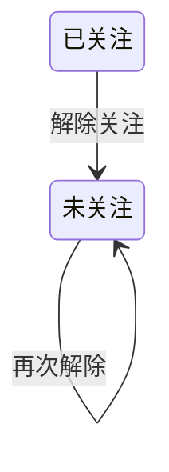

## 一句话价值

解除本人对另一用户的关注关系。

## 核心概念

- 关注关系  用户从本人指向另一用户的单向社交关系，不会自动建立对方对本人的反向关系。

## 业务对象

### 关注关系

| 业务名称 | 描述 | 取值说明 |
|---|---|---|
| 关注人 | 发起解除关注的当前用户。 | — |
| 被关注人 | 本次要解除关注的目标用户。 | — |
| 关注状态 | 表示两名用户之间当前是否存在关注关系。 | 已关注：关注关系存在；未关注：关注关系不存在，也是本服务完成时的状态。 |

## 状态机

| 当前状态 | 触发操作 | 新状态 | 前置条件 | 谁能触发 |
|---|---|---|---|---|
| 已关注 | 解除关注 | 未关注 | 已登录；本人对目标用户存在关注关系 | 关注人本人 |
| 未关注 | 解除关注 | 未关注 | 已登录；目标用户编号非空 | 当前用户 |

## 主流程

触发源：接口（用户）；终态：本人不再关注目标用户，并向本人确认操作成功。

1. 用户提交要解除关注的目标用户编号。
2. 根据当前登录身份确定关注人为用户本人。
3. 解除本人指向目标用户的关注关系；原本未关注时保持未关注。
4. 向用户确认解除关注成功。

## 分支与异常

| 什么情况 | 怎么处理 | 对外提示 | 做了一半的怎么收场 |
|---|---|---|---|
| 未携带登录凭证，或登录凭证未使用约定格式 | 不受理解除 | 登录已过期，请重新登录 | 不改变任何关注关系 |
| 登录凭证签名错误、已失效或内容无法验证 | 不受理解除 | 登录凭证无效，请重新登录 | 不改变任何关注关系 |
| `targetUserId` 为空或只含空白 | 不受理解除 | `targetUserId: 目标用户不能为空` | 不改变任何关注关系 |
| 本人原本未关注目标用户 | 保持未关注状态 | 解除成功 | 无需额外收场，不新建关系记录 |
| 目标用户不存在，或目标用户编号与本人相同 | 仍按本人与该编号的关系执行解除 | 解除成功 | 关系存在时删除，不存在时保持未关注 |
| 解除关注时发生未预期错误 | 终止本次操作 | 系统异常，请稍后重试 | 不承诺本次已解除；用户可重新查看或再次解除 |

## 业务边界

- 本服务从已登录用户提交目标用户编号开始，到本人不再关注该目标并获得成功确认为止。
- 本服务只解除当前用户指向目标用户的单向关注，不解除目标用户对本人的关注。
- 本服务将“原本未关注”视为解除目标已达成，不向用户区分本次是否实际删除了关系。
- 本服务不校验目标用户是否存在，也不阻止以本人编号作为目标。
- 本服务不负责建立关注、查询关注或粉丝名录，也不返回更新后的名录与数量。
- 本服务不向目标用户交付解除通知。

## 遗留与待定

- 解除关注时不校验目标用户是否存在，当前仍返回成功；需产品负责人确定是否需要区分“目标不存在”。
- 解除关注未禁止以本人编号作为目标，与建立关注时的限制不一致；需产品负责人确定是否应统一自关注目标的处理。
