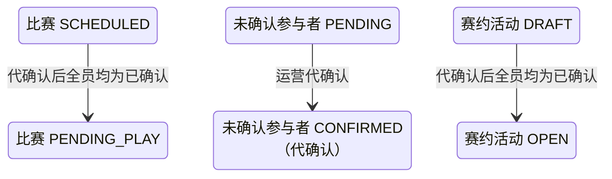

## 一句话价值

赛约迟迟等不到全员确认时，运营人员按赛事和比赛序号一次性代为确认，把比赛推进到待比赛。

## 核心概念

- 自办赛事  由业务方配置规则、接受报名、组织匹配并推进比赛的竞赛活动。
- 赛事比赛  自办赛事中一次由若干参赛单元完成的对阵，经历匹配、订场、确认、比赛和赛果确认。
- 赛约  为一场赛事比赛建立的时间与场地安排，以专属约球承载；全员确认前可重订或拒绝。
- 运营代确认  运营人员在比赛长期卡在待确认赛约时，代替尚未确认的参赛者完成本次赛约确认，不代表参赛者本人真实同意。

## 业务对象

### 赛事比赛

| 业务名称 | 描述 | 取值说明 |
|---|---|---|
| 所属赛事 | 运营代确认所针对的赛事。 | `tournamentId`，非空。 |
| 比赛序号 | 赛事内展示编号。 | `matchNo`，正整数；与赛事编号共同唯一。 |
| 比赛状态 | 代确认前必须是待确认赛约；全员确认状态凑齐后推进为待比赛。 | 已匹配：已完成对阵编排，等待选定订场人；订场中：已选定订场人，等待提交赛约；待确认赛约：已提交赛约，等待参与者确认；待比赛：赛约已确认，等待比赛；待确认赛果：已提交赛果，等待参与者确认；已完成：赛果已确认；已终止：比赛被拒绝或取消。 |

### 比赛参与确认

| 业务名称 | 描述 | 取值说明 |
|---|---|---|
| 参与者 | 本场比赛的全部参赛者。 | — |
| 赛约确认状态 | 本次只把仍为待确认的参与者改为已确认；已确认或已拒绝的参与者保持原状。 | 待确认：尚未确认赛约；已确认：接受当前赛约；已拒绝：拒绝当前赛约。 |

### 赛约

| 业务名称 | 描述 | 取值说明 |
|---|---|---|
| 赛约编号 | 本场比赛关联的时间与场地安排。 | — |
| 赛约状态 | 全员确认状态凑齐后，仍为草稿的赛约开放。 | 草稿：等待比赛参与者确认；开放：赛约已获确认；进行中：活动正在进行；已关闭：活动被终止；已结束：活动正常结束。 |

## 交付内容

类型: 变更类

成功后按主流程改写既有业务事实；允许变更的内容、前置状态、对外可见结果与原值留痕，以本节下列规则、业务对象及分支与异常为准。

| 当前状态 | 触发操作 | 新状态 | 前置条件 | 谁能触发 |
|---|---|---|---|---|
| 比赛 `SCHEDULED`，存在仍为 `PENDING` 的参与者 | 运营代确认赛约 | 全部参与者 `CONFIRMED`；比赛 `PENDING_PLAY`；关联活动为 `DRAFT` 时变为 `OPEN` | 赛事和指定比赛存在；比赛处于 `SCHEDULED` | 运营人员 |
| 比赛 `SCHEDULED`，参与者已全部 `CONFIRMED` | 重复代确认 | 状态不变，按幂等处理 | 赛事和指定比赛存在 | 运营人员 |

## 主流程

触发源：`POST /tournament/admin/match/booking/confirm`；请求为 `tournamentId + matchNo`；终态：本场比赛全部参与者赛约确认状态为 `CONFIRMED`，比赛推进为 `PENDING_PLAY`，关联草稿赛约活动开放为 `OPEN`。

1. 校验赛事编号非空、比赛序号为正整数，并确认赛事存在。
2. 按 `tournamentId + matchNo` 找到最新比赛及其全部参与者；不存在则终止。
3. 确认比赛正处于 `SCHEDULED`；不是则拒绝。
4. 将本场比赛所有仍为 `PENDING` 的参与者赛约确认状态一次性改为 `CONFIRMED`，并记录确认时间；已是 `CONFIRMED` 的参与者保持原状和原确认时间。
5. 全部参与者确认状态凑齐为 `CONFIRMED` 后，将比赛推进为 `PENDING_PLAY`；关联赛约活动仍为 `DRAFT` 时同时开放为 `OPEN`。
6. 返回代确认成功，不交付比赛或赛约活动详情。

## 分支与异常

| 什么情况 | 怎么处理 | 对外提示 | 做了一半的怎么收场 |
|---|---|---|---|
| 请求参数非法或运营凭据无效 | 拒绝 | 参数提示／无权限 | 不读取或修改业务数据。 |
| 赛事不存在 | 拒绝 | 赛事不存在 | 不修改。 |
| 指定比赛不存在 | 拒绝 | 比赛不存在 | 不补建。 |
| 比赛不是 `SCHEDULED`（例如仍在订场中、已在待比赛、已终止或已完成） | 拒绝 | 当前状态不允许代确认赛约 | 比赛、参与者和赛约活动均保持原状。 |
| 比赛为 `SCHEDULED` 但参与者已全部 `CONFIRMED` | 幂等成功，不重复推进 | 代确认成功 | 不重复改写确认时间，不重复开放赛约活动。 |
| 比赛没有关联赛约活动 | 仍推进比赛为 `PENDING_PLAY`，不开放活动 | 代确认成功 | 比赛与赛约活动的关联缺口不在本次调用中补齐。 |
| 关联赛约活动不存在或不为 `DRAFT` | 比赛仍推进，活动保持原状 | 代确认成功 | 不创建、不纠正也不强制开放赛约活动。 |
| 同一场比赛在保存前已被其他操作改变 | 拒绝并要求刷新 | 比赛状态已变更，请刷新后重试 | 不确认本次代确认结果，以先完成的比赛变化为准。 |
| 比赛、参与关系或赛约活动的本次变化未能完整保存 | 失败 | 系统异常，请稍后重试 | 不交付部分代确认结果，各对象保持本次操作前状态。 |

## 业务边界

- 本服务只处理已提交赛约、正等待参与者确认（`SCHEDULED`）的比赛；不处理尚未选定订场人或尚未提交赛约的比赛，也不能代替提交或重订赛约。
- 本服务一次性代确认本场比赛全部仍为 `PENDING` 的参与者，不逐人操作，不区分先后顺序。
- 本服务不判断赛约是否已过开始时间，不受参赛者自助确认时“约球已过期不能确认”的限制。
- 本服务不受理拒绝或重订；参与者已被记为 `REJECTED` 时本服务不覆盖或撤销该拒绝，也不重置为待确认。
- 本服务不创建或修改赛约的时间、场地、费用或订场人。
- 本服务不修改赛事报名的阶段、轮次、状态或拒绝次数，也不重新执行参赛准入判断。
- 本服务不提交或确认赛果，不完成比赛，不结算胜负，也不推进赛事轮次。
- 本服务不发送通知，只返回代确认成功或失败。

## 遗留与待定

| 等级 | 待定的是什么 | 要谁来定 |
|---|---|---|
| P1 | 是否需要记录本次确认为“运营代确认”而非参赛者本人确认（例如独立标记或操作人字段），用于事后区分和追责；不记录则代确认与参赛者自行确认在数据上无法区分。 | 产品与赛事运营负责人 |
| P1 | 是否要求比赛已关联赛约（`meetupId` 非空）才允许代确认；当前设计不做该前置校验。 | 产品与赛事运营负责人 |
| P1 | 已被记为 `REJECTED` 但比赛仍为 `SCHEDULED` 的参与者（例如申请重订未生效前的历史数据），运营代确认时是否应一并改为 `CONFIRMED`；当前设计只处理 `PENDING`，不覆盖 `REJECTED`。 | 产品与赛事运营负责人 |
| P1 | 是否需要通知被代确认的参赛者本场赛约已被运营代为确认。 | 赛事运营负责人 |
| P2 | 是否需要限定可执行运营代确认的操作角色或记录操作留痕，用于审计。 | 产品与赛事运营负责人 |
