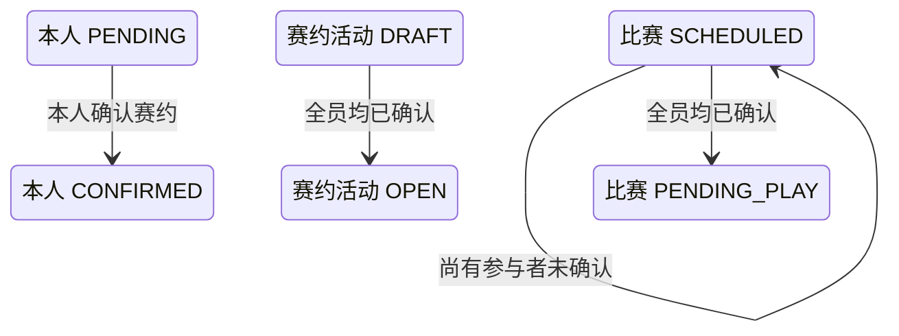

## 一句话价值

仅在关联赛约尚未开始时记录本人确认，并在全员确认后进入待比赛。

## 核心概念

- 自办赛事  由业务方配置规则、接受报名、组织匹配并推进比赛的竞赛活动。
- 赛事报名  用户参加自办赛事的资格与进度载体，记录参赛编号、阶段、轮次、状态和偏好。
- 参赛编号  一支参赛单元的编号；单打通常对应一人，双打队友共享同一编号。
- 赛事比赛  自办赛事中一次由若干参赛单元完成的对阵，经历匹配、订场、确认、比赛和赛果确认。
- 赛约  为一场赛事比赛建立的时间与场地安排，以专属约球承载；全员确认前可重订或拒绝。

## 业务对象

### 赛事比赛

| 业务名称 | 描述 | 取值说明 |
|---|---|---|
| 比赛编号 | 唯一标识本次确认的赛事比赛。 | — |
| 所属赛事 | 本场比赛归属的自办赛事。 | — |
| 关联赛约 | 承载本场比赛时间与场地安排的赛约。 | — |
| 比赛状态 | 全员确认赛约后，由待确认赛约推进为待比赛。 | 已匹配：已完成对阵编排，等待选定订场人；订场中：已选定订场人，等待提交赛约；待确认赛约：已提交赛约，等待参与者确认；待比赛：赛约已确认，等待比赛；待确认赛果：已提交赛果，等待参与者确认；已完成：赛果已确认；已终止：比赛被拒绝或取消。 |

### 比赛参与确认

| 业务名称 | 描述 | 取值说明 |
|---|---|---|
| 参与者 | 本场比赛的参赛者；本次只更新当前确认人。 | — |
| 参赛编号 | 参与者所属参赛单元的编号；双打队友共享编号。 | — |
| 赛约确认状态 | 记录每名参与者对当前赛约的确认结果。 | 待确认：尚未确认赛约；已确认：接受当前赛约；已拒绝：拒绝当前赛约。 |

### 赛约

| 业务名称 | 描述 | 取值说明 |
|---|---|---|
| 赛约编号 | 唯一标识本场比赛的时间与场地安排。 | — |
| 赛约状态 | 全员确认后，仍为草稿的赛约开放。 | 草稿：等待比赛参与者确认；开放：赛约已获确认；进行中：活动正在进行；已关闭：活动被终止；已结束：活动正常结束。 |

## 交付内容

类型: 变更类

成功后按主流程改写或撤销既有业务事实；允许变更的内容、前置状态、对外可见结果与原值留痕，以本节下列规则、业务对象及分支与异常为准。

| 当前状态 | 触发操作 | 新状态 | 前置条件 | 谁能触发 |
|---|---|---|---|---|
| 比赛 `SCHEDULED`，本人 `PENDING` | 确认当前赛约 | 本人 `CONFIRMED`，比赛仍为 `SCHEDULED` | 比赛、所属赛事和本人赛事报名存在；本人属于该场比赛；关联赛约存在时尚未到开始时间；仍有其他参与者未确认 | 该场比赛参赛者 |
| 比赛 `SCHEDULED`，本人 `PENDING` | 确认当前赛约 | 本人 `CONFIRMED`，比赛 `PENDING_PLAY`；关联活动为 `DRAFT` 时变为 `OPEN` | 比赛、所属赛事和本人赛事报名存在；本人属于该场比赛；关联赛约存在时尚未到开始时间；确认后全员均为 `CONFIRMED` | 该场最后一名未确认的参赛者 |

## 主流程

触发源：参赛者发起 HTTP 确认；终态：本人赛约确认为 `CONFIRMED`，全员确认后比赛为 `PENDING_PLAY`，关联草稿约球为 `OPEN`。

1. 识别当前登录参赛者，取得要确认赛约的赛事比赛编号。
2. 找到该场赛事比赛及其全部比赛参与者，并确认比赛正在等待赛约确认。
3. 确认比赛所属赛事、本人赛事报名和本人比赛参与关系仍然存在。
4. 关联赛约记录存在时，确认其开始时间晚于当前时间；已经开始或结束则拒绝确认。比赛未关联赛约或记录缺失时保留原兼容行为。
5. 将本人的赛约确认状态记为 `CONFIRMED`，并记录确认时间。
6. 若仍有人未确认，比赛继续保持 `SCHEDULED`，等待其他参赛者另行确认。
7. 若全体比赛参与者均已确认，将比赛推进为 `PENDING_PLAY`；关联赛约活动仍为 `DRAFT` 时，同时开放为 `OPEN`。
8. 向参赛者返回确认成功；本次调用不交付比赛或赛约活动详情。

## 分支与异常

| 什么情况 | 怎么处理 | 对外提示 | 做了一半的怎么收场 |
|---|---|---|---|
| 未登录、登录凭据缺失或失效 | 拒绝确认 | 登录已过期或登录凭证无效 | 不读取或修改比赛、参与关系和赛约活动。 |
| 未提供比赛编号，或只提供空白字符 | 拒绝确认 | `matchId: 比赛ID不能为空` | 不修改比赛、参与关系和赛约活动。 |
| 未提供确认选择 | 拒绝处理 | `confirm: 确认状态不能为空` | 不修改比赛、参与关系和赛约活动。 |
| 指定赛事比赛不存在 | 拒绝确认 | 报名记录不存在 | 不修改任何赛事数据。 |
| 比赛所属自办赛事不存在 | 拒绝确认 | 赛事不存在 | 比赛和参与关系保持原状。 |
| 当前用户的赛事报名不存在 | 拒绝确认 | 报名记录不存在 | 比赛和参与关系保持原状。 |
| 比赛不是 `SCHEDULED` | 拒绝确认 | 当前状态不允许确认赛约 | 本人确认状态、比赛状态和赛约活动均保持原状。 |
| 关联赛约开始时间已经过去 | 拒绝确认 | 约球已开始或已结束，无法操作 | 本人确认状态、比赛状态和赛约活动均保持原状；仍可申请重订或拒赛。 |
| 当前用户不属于该场比赛参与者 | 拒绝确认 | 报名记录不存在 | 比赛和已有参与关系保持原状。 |
| 本人此前已是 `CONFIRMED` | 再次记录本人确认并刷新确认时间 | 确认成功 | 按全部参与者当前确认状态重新判断是否进入 `PENDING_PLAY`。 |
| 本人参与关系此前为 `REJECTED`，但比赛仍为 `SCHEDULED` | 将本人改为 `CONFIRMED` 并继续判断全员确认 | 确认成功 | 原拒绝状态和时间被本次确认覆盖。 |
| 本人确认后仍有其他参与者未确认 | 保持比赛 `SCHEDULED` | 确认成功 | 本人保持 `CONFIRMED`，由其他参赛者后续独立确认。 |
| 全员确认，但比赛没有关联赛约活动 | 比赛仍进入 `PENDING_PLAY`，不开放活动 | 确认成功 | 比赛与赛约活动的关联缺口不在本次调用中补齐。 |
| 全员确认，但关联赛约活动不存在或不为 `DRAFT` | 比赛仍进入 `PENDING_PLAY`，活动保持原状 | 确认成功 | 不创建、不纠正也不强制开放赛约活动。 |
| 同一场比赛在保存前已被其他操作改变 | 确认失败并要求刷新 | 比赛状态已变更，请刷新后重试 | 不确认本次结果，以先完成的比赛变化为准。 |
| 比赛、参与关系或赛约活动的本次变化未能完整保存 | 确认失败 | 系统异常，请稍后重试 | 不交付部分确认结果，各对象保持本次操作前状态。 |

## 业务边界

- 本服务从参赛者接受已提交的当前赛约开始，到记录本人确认，并在全员确认时将比赛推进到待比赛为止。
- 本服务只处理确认选择为 `true` 的分支；拒赛和重订分别是独立业务服务，不并入本服务。
- 过期赛约不能再接受确认，但仍允许通过 `confirm=false` 进入拒赛或申请重订分支。
- 本服务不创建或修改赛约的时间、场地、费用与订场人；这些内容由赛约提交或重订服务负责。
- 本服务不修改赛事报名的阶段、轮次、状态或拒绝次数，也不重新执行参赛准入判断。
- 本服务不提交或确认赛果，不完成比赛，不结算胜负，也不推进赛事轮次。
- 本服务不发送赛约确认通知。
- 本服务只返回确认成功或失败，不交付更新后的比赛、参与者或赛约活动资料。

## 遗留与待定

| 等级 | 待定的是什么 | 要谁来定 |
|---|---|---|
| P1 | 当前不要求本人确认状态必须为 `PENDING`；重复确认会刷新 `confirm_time`，`REJECTED` 也能被改回 `CONFIRMED`。允许重复确认和拒绝后改认的规则需赛事产品负责人确定。 | 产品与赛事运营负责人 |
| P1 | 当前只要求本人赛事报名存在，不校验其 `status`、`stage` 或 `current_round`；冻结、待支付、已淘汰或已退赛报名仍可能确认赛约。可确认资格需赛事产品负责人确定。 | 产品与赛事运营负责人 |
| P1 | 全员确认时，比赛无 `meetup_id`、对应活动不存在或活动不为 `DRAFT` 都不会阻止比赛进入 `PENDING_PLAY`；比赛与赛约活动的一致性及补救规则需赛事产品与运营负责人确定。 | 产品与赛事运营负责人 |
| P1 | 全员确认时不校验关联活动的 `meetup_type`，误关联的普通约球若为 `DRAFT` 也会被开放；关联对象校验规则需赛事产品与数据负责人确定。 | 产品与赛事运营负责人 |
| P1 | `rally_tournament_match.status` 的建表说明未列出代码实际使用的 `PENDING_PLAY`；比赛状态数据字典需赛事产品与数据负责人统一。 | 产品与赛事运营负责人 |
| P2 | `rally_meetup.status` 的建表缺省值和说明使用小写 `open`，实际持久化按大写枚举读写；存量数据与数据字典的大小写口径需产品与数据负责人统一。 | 产品与赛事运营负责人 |
| P1 | 确认成功后不通知同场其他参赛者，也不返回剩余待确认人或最新比赛状态；是否需要反馈和通知需赛事产品负责人确定。 | 产品与赛事运营负责人 |
