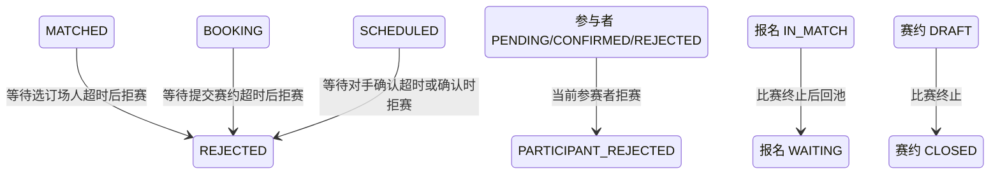

## 一句话价值

允许参赛者终止无法继续的比赛并回到匹配池。

## 核心概念

- 自办赛事  由业务方配置规则、接受报名、组织匹配并推进比赛的竞赛活动。
- 赛事报名  用户参加自办赛事的资格与进度载体，记录参赛编号、阶段、轮次、状态和偏好。
- 匹配池  当前轮次中处于等待匹配、可被编入新比赛的参赛单元集合。
- 赛事比赛  自办赛事中一次由若干参赛单元完成的对阵，经历匹配、订场、确认、比赛和赛果确认。
- 订场人  一场赛事比赛中负责提交比赛时间和场地安排的参赛者。
- 赛约  为一场赛事比赛建立的时间与场地安排，以专属约球承载；全员确认前可重订或拒绝。
- 拒赛  终止当前赛事比赛并把仍有效的参赛者送回当前轮次匹配池；部分场景会累计拒绝次数。

## 业务对象

### 赛事比赛

| 业务名称 | 描述 | 取值说明 |
|---|---|---|
| 比赛编号 | 唯一标识本次拒绝的赛事比赛。 | — |
| 比赛轮次 | 本场比赛所属轮次，拒赛后保持不变。 | 资格赛、64 强、32 强、16 强、8 强、半决赛、决赛。 |
| 订场人 | 本场负责提交赛约的参赛者。 | — |
| 关联赛约 | 本场比赛已有的时间与场地安排。 | — |
| 拒赛理由 | 记录参赛者终止本场比赛的原因。 | 时间或场地冲突：无法协调安排；暂不想参赛：不愿继续本场比赛。 |
| 比赛状态 | 拒赛成功后终止本场比赛。 | 已匹配：已完成对阵编排，等待选定订场人；订场中：已选定订场人，等待提交赛约；待确认赛约：已提交赛约，等待参与者确认；待比赛：赛约已确认，等待比赛；待确认赛果：已提交赛果，等待参与者确认；已完成：赛果已确认；已终止：比赛被拒绝或取消。 |

### 比赛参与确认

| 业务名称 | 描述 | 取值说明 |
|---|---|---|
| 参与者 | 本场比赛的参赛者；拒赛人的确认结果被更新。 | — |
| 参赛编号 | 参与者所属参赛单元的编号。 | — |
| 赛约确认状态 | 拒赛人进入已拒绝，其他参与者保持原结果。 | 待确认：尚未确认赛约；已确认：接受当前赛约；已拒绝：拒绝当前赛约。 |

### 赛事报名

| 业务名称 | 描述 | 取值说明 |
|---|---|---|
| 参赛编号 | 报名所属参赛单元的编号。 | — |
| 报名阶段 | 决定累计资格赛或正赛拒赛次数。 | 资格赛：尚在正赛资格争夺阶段；正赛：已经进入正式淘汰阶段。 |
| 报名状态 | 比赛终止后，仍在比赛中的报名回到等待匹配。 | 等待匹配：处于当前轮次匹配池；已冻结：暂时离开匹配池；比赛中：已编入尚未结束的比赛；待支付：资格赛晋级后等待支付；已淘汰：止步当前赛事；已退赛：退出赛事。 |
| 拒赛次数 | 分别记录资格赛和正赛的累计拒赛次数。 | — |

### 关联赛约

| 业务名称 | 描述 | 取值说明 |
|---|---|---|
| 赛约编号 | 唯一标识本场比赛已有的赛约。 | — |
| 赛约状态 | 拒赛后，仍为草稿的赛约关闭。 | 草稿：等待比赛参与者确认；开放：赛约已获确认；进行中：活动正在进行；已关闭：活动被终止；已结束：活动正常结束。 |

## 状态机

| 当前状态 | 触发操作 | 新状态 | 前置条件 | 谁能触发 |
|---|---|---|---|---|
| 比赛为 `MATCHED` | 等待选订场人超时后拒赛 | `REJECTED` | 当前用户是比赛参与者，且从 `matched_time` 起已达到配置等待时长 | 该场任一参赛者 |
| 比赛为 `BOOKING` | 订场人等待超时后拒赛 | `REJECTED` | 当前用户是订场人，且从订场人确定时间或最近重订时间起已达到配置等待时长 | 订场人 |
| 比赛为 `BOOKING` | 非订场人等待超时后拒赛 | `REJECTED` | 已有订场人，当前用户是其他比赛参与者，且已达到配置等待时长 | 非订场参赛者 |
| 比赛为 `SCHEDULED` | 订场人等待其他参与者确认超时后拒赛 | `REJECTED` | 当前用户是已确认赛约的订场人，且从赛约提交起已达到配置等待时长 | 订场人 |
| 比赛为 `SCHEDULED` | 在赛约确认中拒赛 | `REJECTED` | 当前用户属于比赛、提供拒赛理由，且当前阶段拒赛次数尚未达到赛事上限 | 该场任一参赛者 |
| 拒赛人的确认状态为 `PENDING`、`CONFIRMED` 或 `REJECTED` | 拒赛 | `REJECTED` | 比赛满足对应拒赛入口的前置条件；赛约确认入口当前不限制原确认状态 | 当前拒赛人 |
| 报名为 `IN_MATCH` | 所属比赛被拒绝 | `WAITING` | 报名人属于被终止比赛 | 拒赛操作间接触发 |
| 关联赛约为 `DRAFT` | 所属比赛被拒绝 | `CLOSED` | 比赛已关联该赛约 | 拒赛操作间接触发 |

## 主流程

触发源：HTTP（等待选订场人超时拒绝／订场人等待订场超时拒绝／非订场人等待订场超时拒绝／订场人等待对手确认超时拒绝／赛约确认时拒赛）；终态：比赛为 `REJECTED`，仍在比赛中的报名回到原轮次 `WAITING`。

1. 识别当前已登录参赛者，接收比赛编号和拒赛理由；赛约确认分支同时明确本次选择拒赛而不是重订。
2. 找到赛事比赛及其全部参与者，按触发场景确认比赛状态、当前参赛者身份和允许拒赛的条件：四个等待入口必须达到配置等待时长，赛约确认入口必须尚有当前阶段的拒赛次数额度。
3. 将当前参赛者的赛约确认状态改为 `REJECTED` 并记录拒赛时间，将比赛改为 `REJECTED`，同时保存拒赛理由编码。
4. 若拒赛来自赛约确认，将该参赛者当前阶段的拒赛次数增加一；四个等待超时拒赛入口不增加次数。
5. 若比赛关联的赛约活动仍为 `DRAFT`，将其改为 `CLOSED`。
6. 逐一处理同场参与者的赛事报名，将仍为 `IN_MATCH` 的报名改为 `WAITING`；参赛编号、阶段和当前轮次保持不变，使其重新进入原轮次匹配池。
7. 向同场除拒赛人以外的参与者发起 `TOURNAMENT_REJECTED` 微信订阅消息，消息包含赛事名称和固定的拒赛提示。
8. 向拒赛人确认处理成功；微信订阅消息是否实际送达不改变拒赛结果。

## 分支与异常

| 什么情况 | 怎么处理 | 对外提示 | 做了一半的怎么收场 |
|---|---|---|---|
| 未登录、登录凭据缺失或失效 | 拒绝操作 | 登录已过期或登录凭证无效 | 不读取或修改比赛。 |
| 未提供比赛编号，或只提供空白字符 | 拒绝操作 | `matchId: 比赛ID不能为空` | 不读取或修改比赛。 |
| 未提供拒赛理由 | 拒绝操作 | `rejectReason: 拒绝理由不能为空` 或无效的拒绝理由 | 不修改比赛、参与者、报名或赛约。 |
| 赛约确认分支同时提供拒赛理由和重订理由，或两者都不提供 | 拒绝操作 | 无效的拒绝理由 | 不修改比赛、参与者、报名或赛约。 |
| 指定赛事比赛不存在 | 拒绝操作 | 报名记录不存在 | 不补建比赛或参与关系。 |
| 当前用户不属于该场比赛 | 拒绝操作 | 报名记录不存在 | 比赛及所有参与关系保持不变。 |
| 等待选订场人入口对应的比赛不是 `MATCHED` | 拒绝操作 | 当前不是待选订场人阶段 | 比赛保持当前状态。 |
| 订场人等待订场入口对应的比赛不是 `BOOKING` | 拒绝操作 | 当前不是订场阶段 | 比赛保持当前状态。 |
| 订场人等待订场入口由非订场人发起 | 拒绝操作 | 只有订场人可以提交场地信息 | 比赛保持 `BOOKING`。 |
| 非订场人等待订场入口对应的比赛不是 `BOOKING`、尚无订场人或由订场人发起 | 拒绝操作 | 当前不是等待对方订场阶段 | 比赛保持当前状态。 |
| 等待对手确认入口对应的比赛不是 `SCHEDULED`，或发起人不是已确认赛约的订场人 | 拒绝操作 | 当前不是等待对方确认阶段 | 比赛和参与者确认状态保持不变。 |
| 四个等待入口尚未达到配置等待时长，或缺少对应的起始时间 | 拒绝操作 | 等待超时后可拒绝 | 比赛、报名和关联赛约保持不变。 |
| 赛约确认入口对应的比赛不是 `SCHEDULED` | 拒绝操作 | 当前状态不允许确认赛约 | 比赛保持当前状态。 |
| 赛约确认入口找不到当前用户的赛事报名或所属赛事 | 拒绝操作 | 报名记录不存在或赛事不存在 | 不累计拒赛次数，不终止比赛。 |
| 赛约确认入口中当前阶段的累计拒赛次数已达到赛事上限 | 拒绝操作 | 已达拒绝次数上限 | 比赛、参与者和报名保持原状态。 |
| 比赛在保存前已被其他操作改变 | 拒绝失败并要求刷新 | 比赛状态已变更，请刷新后重试 | 不确认本次拒赛，以先保存的比赛结果为准。 |
| 某位比赛参与者没有对应的赛事报名 | 拒绝失败 | 报名记录不存在 | 本次拒赛涉及的比赛、参与者、报名和赛约均不确认变更。 |
| 某位参与者的报名状态不是 `IN_MATCH` | 保留该报名现有状态，继续完成拒赛 | 拒赛成功 | 不强制覆盖 `WAITING`、`FROZEN`、`PAYING`、`ELIMINATED` 或 `WITHDRAWN`。 |
| 比赛未关联赛约、关联赛约不存在或关联赛约不是 `DRAFT` | 继续终止比赛并让符合条件的报名回池 | 拒赛成功 | 不创建赛约，也不修改非草稿活动。 |
| 其他参与者没有可用的 `TOURNAMENT_REJECTED` 微信订阅授权 | 跳过该参与者的通知 | 拒赛成功 | 比赛、报名和赛约终态不变，授权状态不变。 |
| 微信订阅消息发送失败 | 保留拒赛结果并记录通知失败 | 拒赛成功 | 不撤销比赛终止、报名回池或赛约关闭。 |
| 比赛、参与者、报名、拒赛次数或草稿赛约未能完整保存 | 拒赛失败 | 系统异常，请稍后重试 | 本次拒赛涉及的业务对象保持处理前结果。 |

## 业务边界

- 本服务合并五种触发方式：四种等待阶段达到时限后的主动拒赛，以及参赛者在确认赛约时直接拒赛；它们共享“终止当前比赛并让仍在赛者回池”的承诺。
- 本服务负责到比赛变为 `REJECTED`、拒赛人确认状态变为 `REJECTED`、草稿赛约关闭、仍为 `IN_MATCH` 的报名回到原轮次 `WAITING`，以及向其他参与者发起拒赛通知为止。
- 本服务不重新编排比赛；报名回池后的新对阵由“当前轮次匹配”服务另行触发。
- 本服务不处理重订。重订保留当前比赛并返回 `BOOKING`，由“赛约重订请求”服务负责。
- 本服务不处理赛果拒绝、退赛、未订场比赛撤销或选订场人超时；这些服务虽可能终止比赛，但触发、规则与承诺边界独立。
- 四个等待超时入口不校验赛事的阶段拒赛次数上限，也不累计次数；只有赛约确认时拒赛会校验并累计当前阶段次数。
- 本服务只修改拒赛人的赛约确认状态；同场其他参与者的确认状态保持原值。
- 本服务不改变报名的参赛编号、阶段、当前轮次、搭档、偏好或订场能力，也不推进赛事轮次。
- 本服务不保证微信订阅消息送达，不为接收人补建授权，也不把通知失败反馈为拒赛失败。

## 遗留与待定

- 四个等待超时入口既不校验拒赛次数上限也不累计拒赛次数，而赛约确认时拒赛会校验并累计；这两类拒赛是否应共享同一额度，需赛事产品负责人确认。
- 等待超时阈值使用全局配置，缺省为 `48` 小时，不支持按赛事或比赛阶段设置；正式时长及配置粒度需赛事产品负责人确认。
- 赛约确认拒赛只要求当前用户属于比赛，没有限制其原 `confirm_status`；已为 `CONFIRMED` 甚至 `REJECTED` 的参与者仍会进入拒赛赋值逻辑，允许范围需赛事产品负责人确认。
- 比赛表已有 `reject_phase`、`rejected_by`、`rejected_time`，但当前拒赛流程未把这些字段带入业务对象或写入；拒赛阶段、拒赛人和发生时间的审计口径需赛事运营与数据负责人确定。
- 拒赛终止比赛时不写 `completed_time`；已终止比赛是否需要统一的终止时间字段，需赛事运营与数据负责人确定。
- 当前只把拒赛人的 `confirm_status` 改为 `REJECTED`，其他参与者可能继续保留 `PENDING` 或 `CONFIRMED`；终止比赛后的确认状态口径需赛事产品负责人确定。
- 同场参与者报名只有当前为 `IN_MATCH` 才回到 `WAITING`，其他状态原样保留；比赛终止后出现报名状态不一致时的处置规则需赛事产品负责人确定。
- 关联赛约只有为 `DRAFT` 才关闭；如果关联活动已是 `OPEN` 或 `ONGOING`，比赛会终止但活动继续保留，异常状态的处置规则需赛事与约球产品负责人共同确定。
- 拒赛通知固定写“对手使用拒绝比赛机会”，不展示实际 `reject_reason_code`，且三人资格赛中也使用“对手”单数；通知文案和理由披露范围需赛事运营负责人确认。
- 微信通知接收身份按大写 `WECHAT_MINIAPP` 查询，但 `account.channel` 的数据库枚举和账户持久化使用小写 `wechat_miniapp`；应以哪种存储值为准需账户与通知负责人共同确认，否则可能无法找到接收人的 `openid`。
- `user_notify_subscribe` 的建表说明仍只列约球业务和值域，但本服务实际读取 `TOURNAMENT` 和 `TOURNAMENT_REJECTED`；需通知与数据负责人更新数据字典。
- `rally_tournament_match.status` 的建表说明没有列出业务流程实际使用的 `PENDING_PLAY`；需赛事产品与数据负责人统一字段取值说明。
- `rally_tournament_entry.current_round` 的建表说明没有列出业务枚举支持的 `ROUND_64`；需赛事产品与数据负责人统一字段取值说明。
- `rally_meetup.status` 的建表缺省值和说明使用小写，而当前业务读写只识别并保存大写枚举；正式存储取值及历史数据兼容方式需赛事与约球数据负责人确定。
