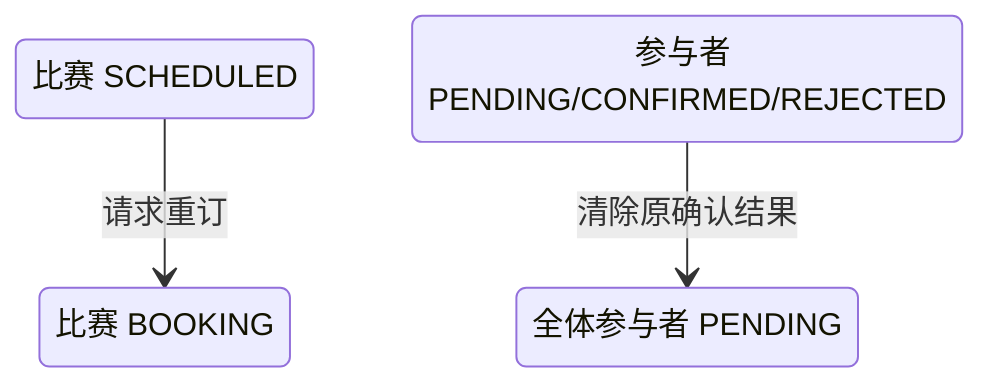

## 一句话价值

打回当前赛约并让订场人重新安排时间或场地。

## 核心概念

- 自办赛事  由业务方配置规则、接受报名、组织匹配并推进比赛的竞赛活动。
- 赛事报名  用户参加自办赛事的资格与进度载体，记录参赛编号、阶段、轮次、状态和偏好。
- 赛事比赛  自办赛事中一次由若干参赛单元完成的对阵，经历匹配、订场、确认、比赛和赛果确认。
- 订场人  一场赛事比赛中负责提交比赛时间和场地安排的参赛者。
- 赛约  为一场赛事比赛建立的时间与场地安排，以专属约球承载；全员确认前可重订或拒绝。
- 重订  不终止比赛，只打回当前赛约并要求订场人重新提交时间或场地。

## 业务对象

### 赛事比赛

| 业务名称 | 描述 | 取值说明 |
|---|---|---|
| 比赛编号 | 唯一标识被打回重订的赛事比赛。 | — |
| 订场人 | 负责重新提交比赛时间与场地的人，重订后不变。 | — |
| 关联赛约 | 被打回重订的原赛约。 | — |
| 重订提出人 | 最近一次要求重新安排赛约的参赛者。 | — |
| 重订理由 | 记录本次打回重订的原因。 | 时间不合适：比赛时间需调整；地点不合适：比赛场地需调整；时长不合适：比赛持续时间需调整。 |
| 比赛状态 | 重订成功后由待确认赛约退回订场中。 | 已匹配：已完成对阵编排，等待选定订场人；订场中：已选定订场人，等待提交赛约；待确认赛约：已提交赛约，等待参与者确认；待比赛：赛约已确认，等待比赛；待确认赛果：已提交赛果，等待参与者确认；已完成：赛果已确认；已终止：比赛被拒绝或取消。 |

### 比赛参与确认

| 业务名称 | 描述 | 取值说明 |
|---|---|---|
| 参与者 | 本场比赛的全部参赛者。 | — |
| 赛约确认状态 | 打回重订后，所有参与者重新进入待确认。 | 待确认：尚未确认赛约；已确认：接受当前赛约；已拒绝：拒绝当前赛约。 |

## 交付内容

类型: 变更类

成功后按主流程改写或撤销既有业务事实；允许变更的内容、前置状态、对外可见结果与原值留痕，以本节下列规则、业务对象及分支与异常为准。

| 当前状态 | 触发操作 | 新状态 | 前置条件 | 谁能触发 |
|---|---|---|---|---|
| 比赛为 `SCHEDULED` | 以一个预设理由请求重订 | 比赛为 `BOOKING` | 比赛、所属赛事及本人赛事报名存在；本人属于该场比赛；明确选择重订而不是拒赛 | 该场任一参赛者 |
| 任一参与者的赛约确认状态为 `PENDING`、`CONFIRMED` 或 `REJECTED` | 当前赛约被打回 | 全体参与者均为 `PENDING` | 比赛重订请求成立 | 重订操作间接触发 |

## 主流程

触发源：参赛者发起 HTTP 重订请求；终态：比赛为 `BOOKING`，全体参与者等待确认尚待重新提交的新赛约。

1. 识别当前登录参赛者，取得要打回的赛事比赛编号，并明确本次不确认当前赛约、选择一个重订理由且不选择拒赛理由。
2. 找到该场赛事比赛及其全部比赛参与者，并确认比赛正在等待赛约确认。
3. 确认比赛所属自办赛事、本人赛事报名和本人比赛参与关系仍然存在。
4. 将比赛退回 `BOOKING`，保留原订场人和原赛约关联，记录最近一次重订请求人、理由及时间。
5. 将全体比赛参与者的赛约确认状态重置为 `PENDING`，并清空各自已有的赛约确认时间。
6. 向请求人返回重订成功；订场人需通过另一次赛约提交重新安排时间或场地。

## 分支与异常

| 什么情况 | 怎么处理 | 对外提示 | 做了一半的怎么收场 |
|---|---|---|---|
| 未登录、登录凭据缺失或失效 | 拒绝重订 | 登录已过期或登录凭证无效 | 不读取或修改比赛及参与关系。 |
| 未提供比赛编号，或只提供空白字符 | 拒绝重订 | `matchId: 比赛ID不能为空` | 不修改比赛及参与关系。 |
| 未提供确认选择 | 拒绝处理 | `confirm: 确认状态不能为空` | 不修改比赛及参与关系。 |
| `confirm` 不为 `false` | 不进入重订处理 | 按赛约确认处理 | 本服务不交付重订结果。 |
| 未提供重订理由、同时提供拒赛理由和重订理由，或两种理由都未提供 | 拒绝重订 | 无效的拒绝理由 | 比赛及参与关系保持原状。 |
| 重订理由不是 `TIME_NOT_SUITABLE`、`PLACE_NOT_SUITABLE` 或 `DURATION_NOT_SUITABLE` | 拒绝请求内容 | 请求参数无效 | 不读取或修改比赛及参与关系。 |
| 指定赛事比赛不存在 | 拒绝重订 | 报名记录不存在 | 不修改任何赛事数据。 |
| 比赛所属自办赛事不存在 | 拒绝重订 | 赛事不存在 | 比赛及参与关系保持原状。 |
| 当前用户的赛事报名不存在 | 拒绝重订 | 报名记录不存在 | 比赛及参与关系保持原状。 |
| 比赛不是 `SCHEDULED` | 拒绝重订 | 当前状态不允许确认赛约 | 比赛及参与关系保持原状。 |
| 当前用户不属于该场比赛参与者 | 拒绝重订 | 报名记录不存在 | 比赛和已有参与关系保持原状。 |
| 同一场比赛在保存前已被其他操作改变 | 重订失败并要求刷新 | 比赛状态已变更，请刷新后重试 | 不确认本次重订，以先完成的比赛变化为准。 |
| 比赛或参与关系的本次变化未能完整保存 | 重订失败 | 系统异常，请稍后重试 | 不交付部分重订结果，各对象保持本次操作前状态。 |

## 业务边界

- 本服务从参赛者否定已提交的当前赛约并选择重订开始，到比赛退回待订场、记录最近一次重订信息、全员重新等待确认结束。
- 本服务只处理不确认赛约且提供重订理由的分支；直接接受赛约和拒赛分别属于“赛约确认”与“赛约拒绝”服务。
- 本服务不终止赛事比赛，不关闭关联赛约，不让报名回到匹配池，也不累计或校验拒赛次数。
- 本服务不改变订场人，不修改或清空原赛约的时间、场地、费用及成员，也不新建赛约。
- 本服务不重新提交赛约；订场人后续修改原关联赛约并将比赛推进为 `SCHEDULED`，属于“赛约提交”服务。
- 本服务不修改赛事报名的阶段、状态、当前轮次、偏好和参赛编号，也不重新执行参赛准入判断。
- 本服务不发送通知，只返回重订成功或失败。

## 遗留与待定

| 等级 | 待定的是什么 | 要谁来定 |
|---|---|---|
| P1 | 当前允许该场任一参与者请求重订，没有排除订场人，也不要求请求人原确认状态为 `PENDING`；可发起重订的角色与状态范围需赛事产品负责人确定。 | 产品与赛事运营负责人 |
| P1 | 当前只要求请求人的赛事报名存在，不校验报名 `status`、`stage` 或 `current_round`；冻结、待支付、已淘汰或已退赛报名仍可能请求重订，操作资格需赛事产品负责人确定。 | 产品与赛事运营负责人 |
| P2 | 每次重订只覆盖 `last_rebook_by`、`last_rebook_reason_code` 和 `last_rebook_time`，不保留历次重订记录；是否需要完整审计历史需赛事运营与数据负责人确定。 | 产品与赛事运营负责人 |
| P2 | 打回时保留旧的 `schedule_submitted_time`，直到订场人重新提交才更新；待订场期间该字段的业务含义与展示口径需赛事产品与数据负责人确定。 | 产品与赛事运营负责人 |
| P1 | 打回时不读取关联赛约，也不校验 `meetup_id` 是否存在、是否属于赛事赛约或是否处于 `DRAFT`；比赛与赛约关联异常时的处理规则需赛事产品与数据负责人确定。 | 产品与赛事运营负责人 |
| P2 | 重订理由仅有三个预设选项，不支持补充说明；是否覆盖实际协调场景需赛事运营负责人确认。 | 产品与赛事运营负责人 |
| P1 | 缺少重订理由时会先返回“无效的拒绝理由”，专门的“请提供打回重订理由”提示当前无法到达；重订校验的对外提示口径需赛事产品负责人确定。 | 产品与赛事运营负责人 |
| P2 | `confirm` 为 `true` 时，即使同时携带重订或拒赛理由，也会按赛约确认处理并忽略理由；是否应拒绝相互矛盾的选择需赛事产品负责人确定。 | 产品与赛事运营负责人 |
| P1 | `rally_tournament_match.status` 的建表说明未列出代码实际使用的 `PENDING_PLAY`；比赛状态数据字典需赛事产品与数据负责人统一。 | 产品与赛事运营负责人 |
