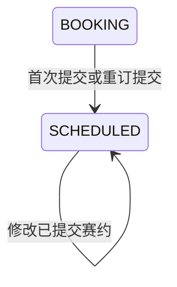

## 一句话价值

让订场人提交时间与场地安排并等待其他参赛者确认。

## 核心概念

- 自办赛事  由业务方配置规则、接受报名、组织匹配并推进比赛的竞赛活动。
- 赛事比赛  自办赛事中一次由若干参赛单元完成的对阵，经历匹配、订场、确认、比赛和赛果确认。
- 订场人  一场赛事比赛中负责提交比赛时间和场地安排的参赛者。
- 赛约  为一场赛事比赛建立的时间与场地安排，以专属约球承载；全员确认前可重订或拒绝。
- 重订  不终止比赛，只打回当前赛约并要求订场人重新提交时间或场地。

## 业务对象

### 赛事比赛

| 业务名称 | 描述 | 取值说明 |
|---|---|---|
| 比赛编号 | 唯一标识本次提交赛约的赛事比赛。 | — |
| 所属赛事 | 本场比赛归属的自办赛事。 | — |
| 订场人 | 负责提交或重新提交赛约的参赛者。 | — |
| 关联赛约 | 本次新建或更新的赛约。 | — |
| 比赛状态 | 首次或重订提交成功后，由订场中推进为待确认赛约。 | 已匹配：已完成对阵编排，等待选定订场人；订场中：已选定订场人，等待提交赛约；待确认赛约：已提交赛约，等待参与者确认；待比赛：赛约已确认，等待比赛；待确认赛果：已提交赛果，等待参与者确认；已完成：赛果已确认；已终止：比赛被拒绝或取消。 |

### 赛约

| 业务名称 | 描述 | 取值说明 |
|---|---|---|
| 赛约编号 | 唯一标识本场比赛的时间与场地安排。 | — |
| 所属比赛 | 赛约所承载的赛事比赛。 | — |
| 创建人 | 创建并负责维护赛约的订场人。 | — |
| 标题 | 赛约展示名称；空白时采用赛事名称。 | — |
| 比赛形式 | 本场比赛采用的对局形式；新建时按实际参赛人数确定。 | 单打：两名参与者进行单打；双打：以双打形式进行；拉球：以拉球形式进行。 |
| 参与人数 | 赛约的参与人数上限和当前已加入人数。 | — |
| 城市与区县 | 赛约所在城市及识别出的区县。 | — |
| 比赛时间 | 包含开始时间、结束时间和持续时长。 | — |
| 场地 | 包含场地名称、地址、位置和场地号。 | — |
| 场地选择方式 | 确定场地资料来源的方式。 | 文字搜索：搜索并引用已有球场；地图选择：从地图引用已有球场；自由填写：直接填写场地资料。 |
| NTRP 要求 | 参与者的水平要求。 | 区间：限定最低值和最高值；精确值：要求等于指定值；不低于：不得低于最低值；不高于：不得高于最高值。 |
| 性别限制 | 参与者的性别要求。 | 不限性别：男性和女性均可；仅限男性：只有男性可参加；仅限女性：只有女性可参加。 |
| 加入方式 | 后续参与者加入活动的方式。 | 直接加入：符合条件即可加入；审批加入：需要创建人审批。 |
| 费用 | 本次赛约的费用项目与金额。 | — |
| 赛约状态 | 新建赛约完成时为草稿，等待参赛者确认。 | 草稿：等待比赛参与者确认；开放：赛约已获确认；进行中：活动正在进行；已关闭：活动被终止；已结束：活动正常结束。 |

### 赛约成员

| 业务名称 | 描述 | 取值说明 |
|---|---|---|
| 所属赛约 | 成员参加的赛约。 | — |
| 参与者 | 被编入本场比赛的参赛者。 | — |
| 成员状态 | 新建赛约时，所有比赛参与者直接成为已加入成员。 | 待审批：等待创建人审批；已加入：已成为活动成员；已拒绝：加入申请被拒绝；已撤回：撤回申请；已退出：退出活动；已评价：完成赛后评价；已跳过评价：跳过赛后评价。 |

## 状态机

| 当前状态 | 触发操作 | 新状态 | 前置条件 | 谁能触发 |
|---|---|---|---|---|
| `BOOKING` | 不提供 `meetupId`，首次建立并提交赛约 | `SCHEDULED` | 比赛与赛事存在；当前用户是订场人；提交内容通过基础校验 | 订场人 |
| `BOOKING` | 提供已关联 `meetupId`，更新并重新提交赛约 | `SCHEDULED` | 赛约存在且与比赛关联；当前用户既是赛约创建人也是订场人 | 订场人 |
| `SCHEDULED` | 提供已关联 `meetupId`，修改已提交赛约 | `SCHEDULED` | 赛约存在且与比赛关联；当前用户是赛约创建人 | 赛约创建人 |

从 `BOOKING` 进入 `SCHEDULED` 时，订场人的 `confirm_status` 同时变为 `CONFIRMED`，其他比赛参与者变为 `PENDING`；关联赛约活动保持 `DRAFT`。在 `SCHEDULED` 内修改时，所有参与者原有确认状态和确认时间均保持不变。

## 主流程

触发源：HTTP（订场人）；终态：赛约活动已建立或更新，比赛等待其他参赛者确认，并返回赛约活动业务编号。

1. 识别当前登录用户，接收赛事比赛编号、可选的既有赛约编号，以及时间、场地、费用和参与限制等赛约内容。
2. 找到赛事比赛及其全部参与者，并按比赛实际所属赛事取得赛事名称。
3. 在文字搜索或地图选择且能找到指定球场时，采用球场的名称、地址、经纬度和区县名称；否则采用提交的场地资料。
4. 首次提交时，确认比赛为 `BOOKING` 且当前用户是订场人，为比赛建立 `DRAFT` 赛约活动，并让全部比赛参与者直接成为 `JOINED` 成员。
5. 更新已有赛约时，确认赛约与比赛关联且当前用户是赛约创建人；若比赛为 `BOOKING`，按重订提交推进，若为 `SCHEDULED`，只更新赛约资料。
6. 确定赛约标题、城市与区县、开始和结束时间、场地、NTRP 要求、性别限制、加入方式及费用；首次建立时，活动类型和人数按实际比赛参与者确定。
7. 从 `BOOKING` 提交时，将比赛改为 `SCHEDULED`，记录本次提交时间，视为订场人已确认，并让其他参与者等待确认；在 `SCHEDULED` 内修改时保留原确认结果。
8. 向除本次提交人外的比赛参与者尝试发送微信订阅消息，告知赛事名称、比赛时间和场地，并引导其确认赛约。
9. 向提交人交付赛约活动业务编号；其他参赛者是否确认由后续独立服务处理。

## 分支与异常

| 什么情况 | 怎么处理 | 对外提示 | 做了一半的怎么收场 |
|---|---|---|---|
| 未登录、登录凭据缺失或失效 | 拒绝提交 | 登录已过期或登录凭证无效 | 不创建或修改赛约、比赛和参与者确认状态。 |
| `matchId`、`tournamentId` 或其他必填内容缺失 | 拒绝提交 | 返回首个无效字段及其校验说明 | 不创建或修改赛约、比赛和参与者确认状态。 |
| 标题、场地名称或场地地址超过长度限制 | 拒绝提交 | 返回对应字段的长度提示 | 不创建或修改赛约、比赛和参与者确认状态。 |
| `maxPlayers` 小于 2 或大于 16 | 拒绝提交 | `maxPlayers: 人数上限至少2人` 或 `maxPlayers: 人数上限不超过16人` | 不创建或修改赛约、比赛和参与者确认状态。 |
| NTRP 数值不在 1.5～7.0 | 拒绝提交 | 返回对应水平值范围提示 | 不创建或修改赛约、比赛和参与者确认状态。 |
| 经度不在 -180～180，或纬度不在 -90～90 | 拒绝提交 | 返回对应经纬度范围提示 | 不创建或修改赛约、比赛和参与者确认状态。 |
| 指定赛事比赛不存在 | 拒绝提交 | 报名记录不存在 | 不创建或修改赛约。 |
| 比赛关联的自办赛事不存在 | 拒绝提交 | 赛事不存在 | 不创建或修改赛约、比赛和参与者确认状态。 |
| 首次创建时比赛不为 `BOOKING` | 拒绝提交 | 当前状态不允许确认赛约 | 不创建赛约，不改变比赛状态或确认状态。 |
| 首次创建或重订提交时当前用户不是订场人 | 拒绝提交 | 只有订场人可以提交场地信息 | 不创建或修改赛约，不改变比赛状态或确认状态。 |
| 提供的赛约活动不存在 | 拒绝更新 | 约球不存在 | 不修改赛约、比赛和参与者确认状态。 |
| 提供的赛约编号不是该比赛当前关联的赛约 | 拒绝更新 | 约球与比赛不匹配 | 不修改赛约、比赛和参与者确认状态。 |
| 当前用户不是赛约创建人 | 拒绝更新 | 仅发布者可操作 | 不修改赛约、比赛和参与者确认状态。 |
| 更新时比赛既不是 `BOOKING` 也不是 `SCHEDULED` | 拒绝更新 | 双方已确认赛约，赛事信息无法修改 | 不修改赛约、比赛和参与者确认状态。 |
| 从 `BOOKING` 提交期间比赛已被其他操作改变 | 拒绝本次提交并要求刷新 | 比赛状态已变更，请刷新后重试 | 不确认本次赛约提交成功，赛约、比赛和参与者保持提交前结果。 |
| `TEXT` 或 `MAP` 指定的 `courtId` 没有对应球场 | 使用本次提交的场地名称、地址和经纬度继续 | 无 | 赛约按提交资料完成。 |
| 其他参与者没有可用的赛事订场通知额度 | 不发送微信订阅消息 | 无 | 赛约提交仍然成功，通知记录保持原状。 |
| 微信订阅消息发送失败 | 记录失败结果，不影响赛约 | 无 | 赛约、比赛与参与者确认状态保持成功结果。 |
| 赛约、比赛或参与者变更未能完整保存 | 提交失败 | 系统异常，请稍后重试 | 不交付赛约编号，本次业务变更均保持提交前结果。 |

## 业务边界

- 本服务负责创建或更新承载赛事比赛安排的赛约活动，并在首次或重订提交时把比赛从 `BOOKING` 推进到 `SCHEDULED`。
- 本服务返回赛约活动业务编号；赛约活动在本服务结束时仍为 `DRAFT`，不会开放为普通活动。
- 本服务在从 `BOOKING` 提交时直接确认订场人的赛约，并让其他参赛者等待确认；不代替其他参赛者作出确认。
- 本服务允许赛约创建人在比赛仍为 `SCHEDULED` 时修改时间、场地、费用等资料，但不重置已有确认结果。
- 本服务尝试向其他比赛参与者发送微信订阅消息，但通知额度是否存在、微信是否成功送达不属于赛约提交成功的条件。
- 本服务不处理其他参赛者的赛约确认、重订请求或拒赛，也不把比赛推进到 `PENDING_PLAY`。
- 本服务不处理赛果提交、赛果确认、比赛完成、轮次推进或参赛者回到匹配池。
- 本服务不创建或维护球场资料，只在特定选择方式下引用已有记录。

## 遗留与待定

- `tournamentId` 被要求必填，但当前业务处理不使用也不校验它，实际始终采用比赛记录中的 `tournament_id`；是否删除该输入或校验二者一致，需赛事产品负责人确定。
- `matchType` 和 `maxPlayers` 被要求必填并校验，但首次建立赛约时会按实际参与人数覆盖，更新时又不会修改；这两个提交字段是否应保留，需赛事产品负责人确定。
- `districtCode` 被接收但不保存，区县名称仅取已有球场资料或从地址识别；区县编码是否应持久化并参与一致性校验，需场地与赛事产品负责人确定。
- `acceptedNoticeScenes` 被接收但当前完全不处理，赛约提交不会登记本次微信授权；授权应在本服务登记、由其他服务登记还是删除该字段，需通知与赛事产品负责人确定。
- 当前只要求开始时间和持续时长非空，没有限制开始时间必须在未来，也没有限制持续时长为正数、固定步长或可选范围；允许规则需赛事产品负责人确定。
- 当前只校验 NTRP 数值范围，没有校验 `RANGE`、`EXACT`、`ABOVE`、`BELOW` 各自的必填边界、最低值不高于最高值或 0.5 步长；完整规则需赛事产品负责人确定。
- 费用项目名称、金额、项目数量均无校验，负金额、空名称或重复项目是否允许，需赛事与财务负责人确定。
- `courtIndex` 没有长度限制，而 `rally_meetup.court_index` 只能保存 64 个字符；超长内容的业务限制与提示需赛事产品负责人确定。
- 引用球场时只按 `courtId` 查找，不要求球场为 `ACTIVE`，也不校验球场城市与提交的 `cityCode` 一致；待审核或停用球场能否用于赛约、跨城资料如何处理，需场地与赛事产品负责人确定。
- 找不到 `courtId` 时静默采用提交的场地资料；是否应提示球场已失效并要求重新选择，需场地与赛事产品负责人确定。
- 新建时城市名称按 `cityCode` 查找，但没有先校验城市是否存在或已开通；无效编码可能导致提交异常，赛事赛约允许的城市范围需赛事产品负责人确定。
- 更新时可修改 `city_code`，却保留原 `city_name`，可能形成编码与名称不一致；城市变更时的更新规则需赛事与数据负责人确定。
- 在 `SCHEDULED` 状态修改赛约不会清空其他参赛者已经作出的确认；已确认人是否应重新确认变更后的时间、场地或费用，需赛事产品负责人确定。
- 重订后的比赛仍保留原 `meetup_id`，但当前允许订场人在不提供 `meetupId` 时另建新赛约并覆盖比赛关联，原草稿不会关闭或删除；重订必须复用原赛约还是允许换新，以及旧赛约如何收口，需赛事与约球产品负责人确定。
- 更新已有赛约时只核对编号关联、创建人和比赛状态，不核对该活动的 `meetup_type` 或 `status`；允许更新的赛约活动类型与状态需赛事产品负责人确定。
- `SCHEDULED` 状态内更新赛约不比较比赛变更版本；同状态并发修改资料的冲突处理口径需赛事与数据负责人确定。
- 比赛不存在时对外提示“报名记录不存在”，没有区分比赛与报名；是否需要改为比赛不存在，需赛事产品负责人确定。
- `rally_tournament_match.status` 的建表说明没有列出业务实际使用的 `PENDING_PLAY`；需赛事产品与数据负责人统一字段取值说明。
- `rally_meetup` 的若干枚举字段在建表缺省值或说明中使用小写，而当前业务读写使用大写；正式存储取值及历史数据兼容方式需赛事、约球产品负责人和数据负责人确定。
- 微信通知内容使用赛约的 `court_name`，但该字段允许为空；无场地名称时应展示地址、占位文案还是不发送通知，需赛事运营负责人确定。
