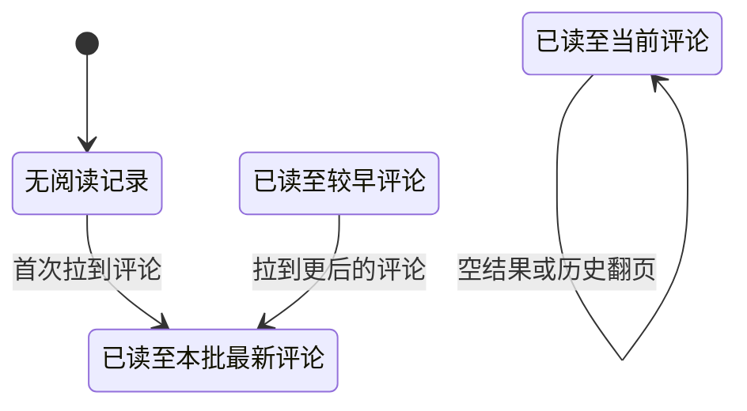

## 一句话价值

向有效参赛者交付赛事评论并推进本人阅读位置。

## 核心概念

- 自办赛事  由业务方配置规则、接受报名、组织匹配并推进比赛的竞赛活动。
- 赛事报名  用户参加自办赛事的资格与进度载体，记录参赛编号、阶段、轮次、状态和偏好。
- 有效参赛者  在赛事评论中，指拥有该赛事报名且报名状态不是 `WITHDRAWN` 的用户；已淘汰者仍在此范围内。
- 赛事评论  关联一个自办赛事、保留发送者当时展示资料的文本、图片或位置内容。
- 评论游标  一条赛事评论的编号；用于继续查询该评论之前的历史内容。
- 已读位置  本人在赛事讨论中已读到的最新评论；只能向后推进，历史翻页不会使它回退。
- 赛事讨论成员  赛事报名者与赛事讨论之间的关系，记录加入时间、最新已读评论和未读数。

## 业务对象

### 赛事评论列表

| 业务名称 | 描述 | 取值说明 |
|---|---|---|
| 评论列表 | 本次交付的赛事评论，按新到旧排列。 | — |
| 评论编号 | 每条评论的业务编号，也是继续向前翻页的游标。 | — |
| 所属赛事 | 评论归属的自办赛事。 | — |
| 发布者 | 评论发布者及其发布时的昵称、头像快照。 | — |
| 评论内容 | 评论的具体内容。 | — |
| 内容类型 | 说明评论内容的表现形式。 | 文本：文字内容；图片：图片内容；位置：地点信息。 |
| 发布时间 | 评论发布的时间。 | — |

### 本人赛事讨论状态

| 业务名称 | 描述 | 取值说明 |
|---|---|---|
| 所属赛事 | 本人正在查看的自办赛事。 | — |
| 最新已读评论 | 本次读取后本人已读到的最新评论。 | — |
| 未读评论数 | 最新已读位置之后仍未读取的评论数量。 | — |

## 交付内容

类型: 查询类

向消费者交付当前业务事实的查询结果；身份与状态造成的展示差异，以及列表的排序、分页和无结果口径，以本节下列规则及主流程、分支与异常为准。

| 当前状态 | 触发操作 | 新状态 | 前置条件 | 谁能触发 |
|---|---|---|---|---|
| 无阅读记录 | 拉取到至少一条评论 | 已读至本批最新评论 | 本人是有效参赛者 | 当前登录参赛者 |
| 已读至较早评论 | 拉取到比原位置更新的评论 | 已读至本批最新评论 | 本批第一条评论晚于原已读位置 | 当前登录参赛者 |
| 已读至当前评论 | 未拉到评论或只翻阅更早评论 | 已读至当前评论 | 本人是有效参赛者 | 当前登录参赛者 |

已读位置推进后，`unread_count` 为新位置之后仍存在的评论数；本次交付物不包含该数值。

## 主流程

触发源：参赛者发起 HTTP 拉取；终态：本批赛事评论已交付，本人阅读位置及未读数按需更新。

1. 识别当前登录用户，接收目标赛事、历史评论游标和本批条数。
2. 找到本人在目标赛事中的报名，确认报名状态不是 `WITHDRAWN`。
3. 将缺省条数定为 `20`，低于 `1` 时按 `1`、高于 `100` 时按 `100` 取用。
4. 未提供评论游标时从最新评论开始；提供游标时只取编号早于该游标的评论。
5. 按评论编号从新到旧交付本批评论；昵称和头像使用评论发布时保存的快照，头像转换为七牛云访问地址。
6. 本批有评论且第一条晚于本人原已读位置时，把已读位置推进到该评论，并把未读数重算为该位置之后的评论数；尚无讨论成员关系时同时建立一条。
7. 交付本批评论列表；没有匹配评论时交付空列表。

## 分支与异常

| 什么情况 | 怎么处理 | 对外提示 | 做了一半的怎么收场 |
|---|---|---|---|
| 未提供登录凭证 | 拒绝拉取 | 登录已过期，请重新登录 | 不交付评论，不改变阅读状态。 |
| 登录凭证无效 | 拒绝拉取 | 登录凭证无效，请重新登录 | 不交付评论，不改变阅读状态。 |
| 本人在目标赛事中没有报名 | 拒绝拉取 | 报名记录不存在 | 不交付评论，不改变阅读状态。 |
| 本人的报名状态为 `WITHDRAWN` | 拒绝拉取 | 只有赛事参与者可以查看或发布评论 | 不交付评论，不改变阅读状态。 |
| `limit` 小于 `1` | 按 `1` 条查询 | 无 | 正常交付至多一条评论并按需推进阅读状态。 |
| `limit` 大于 `100` | 按 `100` 条查询 | 无 | 正常交付至多一百条评论并按需推进阅读状态。 |
| 目标赛事尚无评论，或游标之前没有评论 | 成功交付空列表 | 无 | 不建立讨论成员关系，已读位置、已读时间和未读数保持不变。 |
| 本批第一条评论不晚于本人原已读位置 | 正常交付历史评论，不回退已读位置 | 无 | 已读位置、已读时间和未读数保持不变。 |
| 评论头像标识为空 | 交付空头像地址 | 无 | 其他评论资料和阅读状态正常交付。 |
| 评论或阅读数据取得、保存失败，或七牛云头像地址无法交付 | 拉取失败 | 系统异常，请稍后重试 | 不保留本次阅读状态变更，用户可重新拉取。 |

## 业务边界

- 本服务从有效参赛者请求赛事评论开始，到按倒序交付本批评论并按需推进本人阅读位置为止。
- 本服务只读取已有评论，不发布、修改或删除评论；评论发布属于“赛事评论发布”。
- 本服务按调用方提供的评论游标查询历史，已读位置只用于未读状态，不替代评论游标。
- 本服务首次从最新评论读取时直接把本人视为已读到当前最新评论；继续翻阅历史不会回退已读位置。
- 本服务交付评论发布时保存的昵称和头像快照，不读取或交付发布者当前的个人档案。
- 本服务更新未读数但不在拉取结果中交付未读数，也不交付下一页游标或是否还有更多评论。
- 本服务读取赛事报名判定资格，但不建立或改变赛事、赛事报名、比赛、赛约或赛果。
- 本服务不校验赛事当前状态，也不因报名处于冻结、待支付或已淘汰而收回查看资格。

## 遗留与待定

| 等级 | 待定的是什么 | 要谁来定 |
|---|---|---|
| P1 | `WAITING`、`FROZEN`、`IN_MATCH`、`PAYING` 和 `ELIMINATED` 均可查看评论，只有 `WITHDRAWN` 被拒绝；已淘汰者和冻结报名者是否仍应拥有查看权限，需赛事产品负责人确定。 | 产品与赛事运营负责人 |
| P1 | 查看资格不校验赛事是否存在，也不校验赛事为 `DRAFT`、`ACTIVE` 或 `ABANDONED`；赛事评论的开放期需赛事产品负责人确定。 | 产品与赛事运营负责人 |
| P1 | `tournamentId` 没有单独的非空校验，空值或未知编号均按“报名记录不存在”处理；参数规则与提示文案需赛事产品负责人确定。 | 产品与赛事运营负责人 |
| P1 | `beforeCommentId` 不校验是否存在或属于目标赛事，仅按编号比较；非法游标的处理规则需赛事产品与客户端负责人确定。 | 产品与赛事运营负责人 |
| P2 | 拉取结果没有下一页游标及是否还有更多评论，调用方只能用本批最旧评论的编号继续请求；分页契约需赛事产品与客户端负责人确定。 | 产品与赛事运营负责人 |
| P2 | 阅读位置按评论编号的字符串顺序判断先后，其长期排序保证需数据负责人确认。 | 产品与赛事运营负责人 |
| P2 | 评论展示使用发布时的昵称和头像快照，发布者后续修改档案不会反映到历史评论；展示资料应使用快照还是当前档案需赛事产品负责人确定。 | 产品与赛事运营负责人 |
