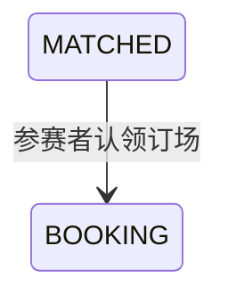

## 一句话价值

由参赛者承担订场并让比赛进入待订场。

## 核心概念

- 自办赛事  由业务方配置规则、接受报名、组织匹配并推进比赛的竞赛活动。
- 赛事比赛  自办赛事中一次由若干参赛单元完成的对阵，经历匹配、订场、确认、比赛和赛果确认。
- 订场人  一场赛事比赛中负责提交比赛时间和场地安排的参赛者。
- 赛约  为一场赛事比赛建立的时间与场地安排，以专属约球承载；全员确认前可重订或拒绝。

## 业务对象

### 赛事比赛

| 业务名称 | 描述 | 取值说明 |
|---|---|---|
| 比赛编号 | 唯一标识本次认领订场职责的赛事比赛。 | — |
| 订场人 | 负责为本场比赛提交时间与场地安排的参赛者。 | — |
| 比赛状态 | 认领成功后由已匹配推进为订场中。 | 已匹配：已完成对阵编排，等待选定订场人；订场中：已选定订场人，等待提交赛约；待确认赛约：已提交赛约，等待参与者确认；待比赛：赛约已确认，等待比赛；待确认赛果：已提交赛果，等待参与者确认；已完成：赛果已确认；已终止：比赛被拒绝或取消。 |

## 交付内容

类型: 变更类

成功后按主流程改写或撤销既有业务事实；允许变更的内容、前置状态、对外可见结果与原值留痕，以本节下列规则、业务对象及分支与异常为准。

| 当前状态 | 触发操作 | 新状态 | 前置条件 | 谁能触发 |
|---|---|---|---|---|
| `MATCHED` | 认领订场职责 | `BOOKING` | 比赛存在，且当前用户属于该场比赛参与者 | 该场比赛参赛者 |

## 主流程

触发源：HTTP（参赛者）；终态：当前参赛者成为订场人，比赛由 `MATCHED` 变为 `BOOKING`。

1. 识别当前已登录参赛者，并接收要认领订场职责的赛事比赛编号。
2. 找到该场赛事比赛及其全部比赛参与者，确认比赛仍处于 `MATCHED`。
3. 确认当前参赛者属于该场比赛。
4. 将当前参赛者记录为订场人，记录订场人确定时间，并将比赛状态改为 `BOOKING`。
5. 向参赛者确认订场人选定完成；比赛等待订场人另行提交赛约。

## 分支与异常

| 什么情况 | 怎么处理 | 对外提示 | 做了一半的怎么收场 |
|---|---|---|---|
| 未登录、登录凭据缺失或失效 | 拒绝认领 | 登录已过期或登录凭证无效 | 不读取或修改赛事比赛。 |
| 未提供比赛编号，或只提供空白字符 | 拒绝认领 | `matchId: 比赛ID不能为空` | 不读取或修改赛事比赛。 |
| 指定赛事比赛不存在 | 拒绝认领 | 报名记录不存在 | 不创建比赛，也不修改任何参与关系。 |
| 比赛状态不是 `MATCHED` | 拒绝认领 | 订场人已被选定 | 比赛及已有订场人保持不变。 |
| 当前用户不属于该场比赛参与者 | 拒绝认领 | 只有待选订场人才能认领 | 比赛保持 `MATCHED`，不选定订场人。 |
| 同一场比赛已被其他参赛者抢先改变 | 认领失败并要求刷新 | 比赛状态已变更，请刷新后重试 | 不确认当前参赛者成为订场人，以先保存的比赛结果为准。 |
| 订场人、确定时间和比赛状态未能完整保存 | 认领失败 | 系统异常，请稍后重试 | 不确认认领成功，比赛保持修改前结果。 |

## 业务边界

- 本服务只负责在一场 `MATCHED` 比赛中选定当前参赛者为订场人，并将比赛推进到 `BOOKING`。
- 本服务不创建或更新赛约活动，不接收比赛时间、场地、费用，也不把比赛推进到 `SCHEDULED`；赛约提交是独立业务服务。
- 本服务不修改赛事报名、比赛参与关系、轮次、参赛编号或赛约确认状态。
- 本服务不处理拒赛、重订、赛约确认、比赛结果与轮次晋级。
- 本服务不向其他参赛者发送订场人选定通知。

## 遗留与待定

| 等级 | 待定的是什么 | 要谁来定 |
|---|---|---|
| P1 | 当前只校验认领者是该场比赛参与者，不校验赛事报名的 `court_ability`；不能订场的参赛者是否也可认领，需赛事产品负责人确认。 | 产品与赛事运营负责人 |
| P2 | 比赛不存在时对外提示“报名记录不存在”，没有区分比赛与报名；是否需要改为比赛不存在，需赛事产品负责人确认。 | 产品与赛事运营负责人 |
| P1 | 任一非 `MATCHED` 状态都提示“订场人已被选定”，其中已终止或已完成比赛并不等同于刚完成选定；各状态是否需要区分提示，需赛事产品负责人确认。 | 产品与赛事运营负责人 |
| P1 | 数据库建表说明中的比赛状态清单未列出代码实际使用的 `PENDING_PLAY`；数据库定义与业务状态清单应以哪一方为准，需赛事产品负责人和数据负责人共同确认。 | 产品与赛事运营负责人 |
| P2 | 当前认领成功后不通知同场其他参赛者；是否需要通知及通知渠道，需赛事运营负责人确认。 | 产品与赛事运营负责人 |
