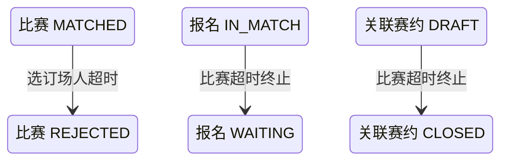

## 一句话价值

终止长期未选订场人的比赛并让参赛者回池。

## 核心概念

- 赛事报名  用户参加自办赛事的资格与进度载体，记录参赛编号、阶段、轮次、状态和偏好。
- 参赛编号  一支参赛单元的编号；单打通常对应一人，双打队友共享同一编号。
- 匹配池  当前轮次中处于等待匹配、可被编入新比赛的参赛单元集合。
- 赛事比赛  自办赛事中一次由若干参赛单元完成的对阵，经历匹配、订场、确认、比赛和赛果确认。
- 订场人  一场赛事比赛中负责提交比赛时间和场地安排的参赛者。
- 赛约  为一场赛事比赛建立的时间与场地安排，以专属约球承载；全员确认前可重订或拒绝。

## 业务对象

### 赛事比赛

| 业务名称 | 描述 | 取值说明 |
|---|---|---|
| 比赛编号 | 唯一标识超时未选定订场人的赛事比赛。 | — |
| 关联赛约 | 异常情况下可能已关联的赛约。 | — |
| 终止原因 | 记录比赛因选定订场人超时而终止。 | 超时：在规定时间内未选定订场人。 |
| 比赛状态 | 超时后由已匹配改为已终止。 | 已匹配：已完成对阵编排，等待选定订场人；订场中：已选定订场人，等待提交赛约；待确认赛约：已提交赛约，等待参与者确认；待比赛：赛约已确认，等待比赛；待确认赛果：已提交赛果，等待参与者确认；已完成：赛果已确认；已终止：比赛被拒绝或取消。 |

### 赛事报名

| 业务名称 | 描述 | 取值说明 |
|---|---|---|
| 参赛编号 | 报名所属参赛单元的编号。 | — |
| 报名状态 | 比赛终止后，仍在比赛中的报名回到等待匹配。 | 等待匹配：处于当前轮次匹配池；已冻结：暂时离开匹配池；比赛中：已编入尚未结束的比赛；待支付：资格赛晋级后等待支付；已淘汰：止步当前赛事；已退赛：退出赛事。 |
| 当前轮次 | 报名回到匹配池时继续停留的轮次。 | 资格赛、64 强、32 强、16 强、8 强、半决赛、决赛。 |

### 关联赛约

| 业务名称 | 描述 | 取值说明 |
|---|---|---|
| 赛约编号 | 异常情况下与比赛关联的赛约。 | — |
| 赛约状态 | 超时终止比赛时，仍为草稿的赛约关闭。 | 草稿：等待比赛参与者确认；开放：赛约已获确认；进行中：活动正在进行；已关闭：活动被终止；已结束：活动正常结束。 |

## 状态机

| 当前状态 | 触发操作 | 新状态 | 前置条件 | 谁能触发 |
|---|---|---|---|---|
| 比赛为 `MATCHED` | 处理选订场人超时 | `REJECTED` | `matched_time` 已达到超时阈值，且处理时仍为 `MATCHED` | 定时任务 |
| 参赛者报名为 `IN_MATCH` | 所属比赛因选订场人超时终止 | `WAITING` | 报名人与被终止比赛的参与者一致 | 定时任务间接触发 |
| 关联赛约活动为 `DRAFT` | 所属比赛因选订场人超时终止 | `CLOSED` | 被终止比赛异常关联了该活动 | 定时任务间接触发 |

## 主流程

触发源：定时任务（每两小时，`MATCHED` 分支）；终态：超时比赛为 `REJECTED`，仍在比赛中的参赛报名回到 `WAITING`。

1. 按当前时间检查仍处于 `MATCHED`、且匹配时间已超过三天的赛事比赛。
2. 对每场符合条件的比赛重新确认其仍处于等待选订场人的状态。
3. 将比赛状态改为 `REJECTED`，并将终止理由编码记为 `TIMEOUT`。
4. 若比赛异常关联了仍为 `DRAFT` 的赛约活动，将该活动改为 `CLOSED`。
5. 找到该场比赛的全部参与者及其赛事报名，将仍为 `IN_MATCH` 的报名改为 `WAITING`；参赛编号、阶段和当前轮次保持不变。
6. 当前批次中的每场比赛独立完成；单场失败不阻止其他超时比赛继续处理。

## 分支与异常

| 什么情况 | 怎么处理 | 对外提示 | 做了一半的怎么收场 |
|---|---|---|---|
| 本次没有达到超时阈值的 `MATCHED` 比赛 | 结束本次处理 | 无 | 不修改任何比赛或报名。 |
| 候选比赛在实际处理前已不再是 `MATCHED` | 跳过该场比赛 | 无 | 比赛、参与者、报名和关联活动保持现状。 |
| 候选比赛在实际处理前已不存在 | 该场处理失败，继续处理其他候选比赛 | 无 | 不为缺失比赛补建记录，也不修改其参与者报名。 |
| 比赛在保存终止状态前已被其他操作改变 | 该场处理失败，等待后续业务按最新状态处理 | 无 | 该场比赛、报名和关联活动不确认本次变更，其他候选比赛继续处理。 |
| 某位比赛参与者没有对应的赛事报名 | 该场处理失败，继续处理其他候选比赛 | 无 | 该场比赛、报名和关联活动不确认本次变更。 |
| 某位参与者的报名状态不是 `IN_MATCH` | 保留该报名现有状态，继续完成该场比赛的超时终止 | 无 | 不强制覆盖 `FROZEN`、`WAITING`、`PAYING`、`ELIMINATED` 或 `WITHDRAWN`。 |
| 比赛未关联赛约活动，或关联活动不存在 | 继续终止比赛并让符合条件的报名回池 | 无 | 不创建或补建赛约活动。 |
| 关联赛约活动不是 `DRAFT` | 保留活动现有状态，继续终止比赛并让符合条件的报名回池 | 无 | 不关闭已开放、进行中、已关闭或已结束的活动。 |
| 该场比赛及关联报名未能完整保存 | 该场处理失败，继续处理其他候选比赛 | 无 | 该场涉及的业务对象保持处理前结果。 |

## 业务边界

- 本服务只处理等待选订场人达到超时阈值的 `MATCHED` 比赛，到比赛变为 `REJECTED`、理由记为 `TIMEOUT`，并让仍为 `IN_MATCH` 的报名回到 `WAITING` 为止。
- 本服务不处理 `BOOKING`、`SCHEDULED`、`PENDING_PLAY` 或 `PENDING_CONFIRM` 阶段的超时；赛果确认超时由独立业务服务处理。
- 本服务保留赛事报名的阶段、当前轮次、参赛编号、搭档关系、匹配偏好和拒赛次数，也不修改比赛参与者的赛约或赛果确认状态。
- 本服务只让报名恢复进入匹配池，不在同一次触发中重新编排比赛；后续匹配由当前轮次匹配服务负责。
- 本服务不删除比赛或比赛参与者，不将超时终止计入参赛者的资格赛或正赛拒赛次数，也不推进赛事轮次。
- 正常的 `MATCHED` 比赛尚无赛约；若异常存在关联草稿赛约，本服务会将其关闭，但不处理其他状态的活动。
- 本服务没有面向参赛者或运营人员的同步返回，也不发送超时终止通知。

## 遗留与待定

- 等待选订场人的超时阈值在当前流程中写死为三天，不读取全局配置；正式时长及能否按赛事配置需赛事产品负责人确定。
- 定时处理默认每两小时触发一次，但触发周期可以在部署时改变；正式处理频率及时间窗口需赛事运营负责人确定。
- 超时判断只检查比赛为 `MATCHED` 和 `matched_time` 达到阈值，不核对 `court_booker_id` 是否为空；异常数据中已写入订场人但状态仍为 `MATCHED` 时也会被终止，需赛事产品与数据负责人确定校验和修复规则。
- 超时终止只写 `status=REJECTED` 与 `reject_reason_code=TIMEOUT`，不写 `reject_phase`、`rejected_by`、`rejected_time` 或 `completed_time`；终止阶段、操作主体和发生时间的审计口径需赛事运营负责人确定。
- 比赛参与者的 `confirm_status` 与 `result_confirm_status` 不随比赛超时终止而改变，可能继续保留 `PENDING`；终止比赛后参与者确认状态的统一口径需赛事产品负责人确定。
- 同场参与者报名只有当前为 `IN_MATCH` 才回到 `WAITING`；其他状态会原样保留，比赛终止后出现报名状态不一致时的处置规则需赛事产品负责人确定。
- 当前不会通知参赛者比赛因选订场人超时而终止，也不会立即重新匹配；是否通知、通知对象、何时重新编排需赛事运营负责人确定。
- `rally_tournament_match.status` 的建表说明没有列出业务流程实际使用的 `PENDING_PLAY`；需赛事产品与数据负责人统一字段取值说明。
- `rally_tournament_entry.current_round` 的建表说明没有列出业务枚举支持的 `ROUND_64`；需赛事产品与数据负责人统一字段取值说明。
- `rally_meetup.status` 的建表缺省值和说明使用小写，而当前业务读写只识别并保存大写枚举；正式存储取值及历史数据兼容方式需赛事与约球数据负责人确定。
