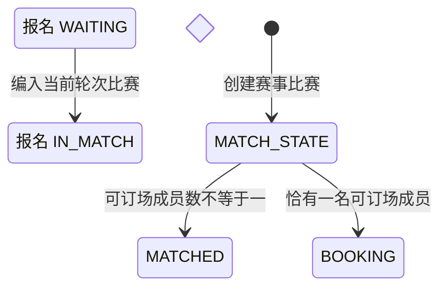

## 一句话价值

将待匹配参赛队编成比赛并进入比赛中状态。

## 核心概念

- 自办赛事  由业务方配置规则、接受报名、组织匹配并推进比赛的竞赛活动。
- 赛事报名  用户参加自办赛事的资格与进度载体，记录参赛编号、阶段、轮次、状态和偏好。
- 参赛编号  一支参赛单元的编号；单打通常对应一人，双打队友共享同一编号。
- 资格赛  自办赛事进入正赛前的筛选阶段，胜者可能先进入待支付。
- 正赛  自办赛事锁定席位后的淘汰阶段，胜者按轮次继续晋级。
- 匹配池  当前轮次中处于等待匹配、可被编入新比赛的参赛单元集合。
- 赛事比赛  自办赛事中一次由若干参赛单元完成的对阵，经历匹配、订场、确认、比赛和赛果确认。

## 业务对象

### 赛事比赛

| 业务名称 | 描述 | 取值说明 |
|---|---|---|
| 比赛编号 | 唯一标识本次编排产生的赛事比赛。 | — |
| 所属赛事 | 本场比赛归属的自办赛事。 | — |
| 比赛序号 | 赛事内用于展示的顺序编号。 | — |
| 比赛轮次 | 本场比赛所属的当前轮次。 | 资格赛、64 强、32 强、16 强、8 强、半决赛、决赛。 |
| 参赛单元数 | 本场比赛需要的参赛编号数量；资格赛按赛事配置，正赛为两个。 | — |
| 订场人 | 组内只有一名可订场成员时直接确定，否则留待认领。 | — |
| 比赛状态 | 按是否已确定订场人创建为已匹配或订场中。 | 已匹配：已完成对阵编排，等待选定订场人；订场中：已选定订场人，等待提交赛约；待确认赛约：已提交赛约，等待参与者确认；待比赛：赛约已确认，等待比赛；待确认赛果：已提交赛果，等待参与者确认；已完成：赛果已确认；已终止：比赛被拒绝或取消。 |

### 比赛参与者

| 业务名称 | 描述 | 取值说明 |
|---|---|---|
| 所属比赛 | 参与者被编入的赛事比赛。 | — |
| 参与者 | 被编入本场比赛的报名用户。 | — |
| 参赛编号 | 参与者所属参赛单元；双打队友共享编号。 | — |
| 赛约确认状态 | 新建比赛时等待参赛者确认后续赛约。 | 待确认：尚未确认赛约；已确认：接受当前赛约；已拒绝：拒绝当前赛约。 |
| 赛果确认状态 | 新建比赛时等待参赛者确认后续赛果。 | 待确认：尚未确认赛果；已确认：接受当前赛果；已拒绝：拒绝当前赛果。 |

### 赛事报名

| 业务名称 | 描述 | 取值说明 |
|---|---|---|
| 参赛编号 | 用于组成单打选手或双打队伍的参赛单元。 | — |
| 场地区域偏好 | 自动匹配时用于寻找整组都可接受的区域。 | — |
| 订场能力 | 表示参赛者能否承担订场职责。 | 可以订场：能够承担订场；不能订场：不能承担订场。 |
| 可比赛时间 | 自动匹配时用于寻找整组共同可参加的时间。 | — |
| 报名状态 | 成功编入比赛后由等待匹配改为比赛中。 | 等待匹配：处于当前轮次匹配池；已冻结：暂时离开匹配池；比赛中：已编入尚未结束的比赛；待支付：资格赛晋级后等待支付；已淘汰：止步当前赛事；已退赛：退出赛事。 |
| 当前轮次 | 只有与赛事当前轮次一致的报名进入匹配。 | 资格赛、64 强、32 强、16 强、8 强、半决赛、决赛。 |

## 状态机

| 当前状态 | 触发操作 | 新状态 | 前置条件 | 谁能触发 |
|---|---|---|---|---|
| 报名 `WAITING` | 编入当前轮次比赛 | 报名 `IN_MATCH`，比赛 `MATCHED` | 报名与赛事轮次一致、未被临时排除并进入一个完整分组；组内可订场成员不是恰好一名 | 运营人员或每日定时任务 |
| 报名 `WAITING` | 编入当前轮次比赛并直接指定订场人 | 报名 `IN_MATCH`，比赛 `BOOKING` | 报名与赛事轮次一致、未被临时排除并进入一个完整分组；组内恰有一名可订场成员 | 运营人员或每日定时任务 |

## 主流程

触发源：运营人员发起 HTTP 匹配或每日定时任务自动匹配；终态：成组报名均为 `IN_MATCH`，并分别形成 `MATCHED` 或 `BOOKING` 的赛事比赛。

1. 自动触发时选出所有 `ACTIVE` 且资格赛开始时间已到的赛事；运营指定赛事时直接读取该赛事及其当前轮次。
2. 从赛事当前轮次的匹配池取出 `WAITING` 参赛单元，跳过本次临时排除的参赛编号和成员未齐的双打队伍。
3. 运营提供手工分组时，先按指定参赛编号组成完整比赛；这些分组不应用自动匹配的地区、时间、性别和历史对阵规则。
4. 对其余参赛单元，按共同可比赛时间和地区交集列出可行分组，并优先形成覆盖参赛单元最多的整体方案。
5. 覆盖数量相同时，依次优先恰有一名可订场成员、至少一名可订场成员、性别构成一致和报名更早的分组；当前轮次已经完成过对阵的参赛单元通常不再重复匹配。
6. 为每个完整分组建立赛事比赛和全部比赛参与关系，分配赛事内比赛编号，并将组内报名改为 `IN_MATCH`。
7. 若一组恰有一名能订场的成员，直接将其设为订场人并把比赛置为 `BOOKING`；否则比赛置为 `MATCHED`，等待后续选定订场人。
8. 向本批新比赛涉及的全部不同参赛者尝试发送微信匹配成功提醒；通知是否送达不改变比赛和报名终态。
9. 自动批量触发继续处理其余赛事；运营手工触发在指定赛事处理完毕后返回成功，不交付比赛明细。

## 分支与异常

| 什么情况 | 怎么处理 | 对外提示 | 做了一半的怎么收场 |
|---|---|---|---|
| 自动扫描发现赛事不是 `ACTIVE` 或资格赛开始时间未到 | 不纳入本次匹配 | 定时任务无对外提示；无参数的运营触发仍返回成功 | 赛事、报名和比赛均不变。 |
| 指定赛事不存在 | 拒绝指定赛事匹配 | 赛事不存在 | 不建立比赛，不改变报名状态。 |
| 赛事 `current_round` 为空 | 无法确定要匹配的轮次 | 参数错误 | 指定赛事不建立比赛；自动批量触发跳过该赛事并继续其他赛事。 |
| 手工分组为空 | 不按手工方式处理，改为指定赛事的自动匹配 | 匹配执行成功 | 按自动匹配结果保存；没有可行分组时数据不变。 |
| 手工分组未指定赛事、某组人数不等于本轮要求、包含空参赛编号，或同一参赛编号在本批重复出现 | 拒绝本次手工匹配 | 赛事不存在或参数错误 | 不保留该指定赛事本次已建立的比赛和报名状态变化。 |
| 手工分组包含不存在、不在当前轮次、不是 `WAITING`、被临时排除或成员未齐的双打参赛编号 | 拒绝本次手工匹配 | 报名记录不存在 | 不保留该指定赛事本次已建立的比赛和报名状态变化。 |
| 当前轮次可用参赛单元少于一组，或没有满足自动匹配条件的完整分组 | 本次不建立比赛，未成组报名继续等待 | 匹配执行成功 | 报名保持 `WAITING`，不发送匹配成功提醒。 |
| 自动匹配后只剩恰好一组参赛单元，且它们曾在当前轮次完成过对阵 | 若时间和地区仍兼容，允许这最后一组重复对阵 | 匹配执行成功 | 建立新比赛并把报名改为 `IN_MATCH`。 |
| 某个自动扫描赛事的数据无法读取、匹配或保存 | 跳过该赛事并继续处理其他赛事 | 定时任务无对外提示；无参数的运营触发仍返回成功 | 该赛事本次变化不保留；此前已完成赛事的匹配结果保留。 |
| 指定赛事的数据无法读取、匹配或保存 | 终止指定赛事匹配 | 系统异常，请稍后重试 | 该指定赛事本次变化不保留。 |
| 参赛者没有可用的 `TOURNAMENT_MATCHED` 微信订阅授权 | 跳过该参赛者的提醒 | 匹配执行成功 | 比赛和报名终态保持成功，通知授权不变。 |
| 参赛者没有可识别的微信小程序接收身份，或微信发送失败 | 记录通知失败，不影响匹配 | 匹配执行成功 | 比赛和报名终态保持成功，已占用授权记为 `FAILED`。 |

## 业务边界

- 本服务从运营人员或每日任务发起当前轮次编排开始，到完整分组形成比赛、组内报名成为 `IN_MATCH` 为止。
- HTTP 与定时任务共享同一承诺；触发方不同不拆成两个业务服务。
- 本服务只读取赛事已有的 `current_round`，不判断本轮是否已经打满，也不推进赛事轮次。
- 本次临时排除只影响当次分组，不冻结、退赛或修改被排除报名；这些报名继续留在匹配池。
- 未能组成完整分组的报名继续保持 `WAITING`，本服务不承诺所有匹配池报名都能得到比赛。
- 本服务只建立比赛并在唯一订场人明确时直接进入 `BOOKING`；后续选订场人、提交和确认赛约、比赛履约、赛果确认及轮次推进均由独立业务服务负责。
- 运营手工分组可以覆盖自动分组约束；手工分组完成后，剩余匹配池仍继续自动编排。
- 本服务尝试消费参赛者已有的微信订阅授权，不负责取得或补充授权；微信通知结果不影响匹配终态，本次调用也不等待实际送达结果。
- 本服务不向触发方交付比赛清单、未匹配原因或通知结果，只返回是否接受本次触发。

## 遗留与待定

- 自动扫描只按赛事 `ACTIVE` 且 `qualifier_start_time` 已到筛选，不检查报名截止、资格赛截止、赛事结束时间或当前轮次是否已完成；自动匹配的有效时间窗口需赛事产品负责人确定。
- 运营指定赛事时不检查赛事状态和任何时间窗口，草稿、已废弃或尚未开始的赛事也可被匹配；手工操作权限和可操作范围需赛事产品负责人确定。
- 资格赛组数取配置的 `qualifier_group_size`，正赛固定为两队；这些组队人数及允许范围属于写死规则，需赛事产品负责人确认。
- 自动匹配把共同可比赛时间和地区交集作为硬条件；任一队地区偏好为空时视为不限制地区，但可比赛时间为空时完全不能匹配。偏好缺失的业务含义和兼容规则需赛事产品负责人确定。
- 双打队伍的地区偏好取两名成员偏好的并集，而可比赛时间取交集；队内地区偏好如何合并需赛事产品负责人确认。
- 自动匹配的方案优先级写死为：覆盖队伍最多、恰有一名可订场成员的场次更多、至少一名可订场成员的场次更多、同性别构成的场次更多、报名时间更早。优先级及冲突取舍需赛事产品负责人确认。
- 当前只把同赛事、同轮次且状态为 `COMPLETED` 的历史比赛视为已交手；进行中或已拒绝比赛不会阻止再次对阵，历史对阵口径需赛事产品负责人确定。
- 严格匹配后若只剩恰好一组，当前允许在时间和地区兼容时重复已完成的历史对阵；重复对阵兜底规则需赛事产品负责人确认。
- 手工分组绕过地区、可比赛时间、性别、订场能力偏好和历史对阵限制，也不会说明为何覆盖这些条件；运营可覆盖的规则及必要告知需赛事产品负责人确定。
- 性别仅作为同等方案的排序偏好，且缺少用户资料或性别时按未知性别参与排序；赛事是否需要性别硬约束、未知性别如何处理需赛事产品负责人确定。
- 报名时间为空时不会参与“更早报名”的时间合计，可能反而优先于有报名时间的方案；缺失报名时间的排序规则需赛事产品与数据负责人确定。
- `match_no` 按赛事当前最大编号加一分配，但只依赖结果查询，没有业务层的编号占用规则；同赛事并行匹配时的编号冲突处置需赛事产品与数据负责人确定。
- `rally_tournament_match.group_size` 实际记录参赛单元数，建表说明却写为本场人数；双打时两者不同，字段业务口径需赛事产品与数据负责人统一。
- `rally_tournament.match_type` 的建表说明只列 `SINGLE/DOUBLE`，业务枚举还包含 `RALLY`；拉球赛事是否允许进入赛事编排及其分组规则需赛事产品负责人确定。
- `rally_tournament_match.status` 的建表说明未列实际使用的 `PENDING_PLAY`；比赛状态数据字典需赛事产品与数据负责人统一。
- 微信通知发送时按大写 `WECHAT_MINIAPP` 查找 `account.channel`，而该字段定义和账户写入使用小写 `wechat_miniapp`；匹配成功提醒能否找到接收身份及兼容口径需账户与通知负责人确认。
- 自动批量匹配单个赛事失败时仍继续处理其他赛事，且无参数 HTTP 触发仍返回成功；运营如何获知部分失败及补处理规则需赛事产品负责人确定。
