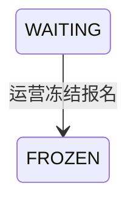

## 一句话价值

让运营将指定待匹配报名暂时移出匹配池。

## 核心概念

- 自办赛事  由业务方配置规则、接受报名、组织匹配并推进比赛的竞赛活动。
- 赛事报名  用户参加自办赛事的资格与进度载体，记录参赛编号、阶段、轮次、状态和偏好。
- 参赛编号  一支参赛单元的编号；单打通常对应一人，双打队友共享同一编号。
- 匹配池  当前轮次中处于等待匹配、可被编入新比赛的参赛单元集合。
- 冻结报名  暂时移出匹配池但没有退赛的赛事报名，满足条件后可由本人解冻。

## 业务对象

### 赛事报名

| 业务名称 | 描述 | 取值说明 |
|---|---|---|
| 报名编号 | 唯一标识本次冻结的赛事报名。 | — |
| 所属赛事 | 报名归属的自办赛事。 | — |
| 报名者 | 被运营冻结报名的参赛者。 | — |
| 参赛编号 | 报名所属参赛单元的编号。 | — |
| 报名阶段 | 冻结后仍保留原阶段。 | 资格赛：尚在正赛资格争夺阶段；正赛：已经进入正式淘汰阶段。 |
| 报名状态 | 只有等待匹配可冻结，成功后进入已冻结。 | 等待匹配：处于当前轮次匹配池；已冻结：暂时离开匹配池；比赛中：已编入尚未结束的比赛；待支付：资格赛晋级后等待支付；已淘汰：止步当前赛事；已退赛：退出赛事。 |
| 当前轮次 | 冻结后仍保留原轮次。 | 资格赛、64 强、32 强、16 强、8 强、半决赛、决赛。 |

## 状态机

| 当前状态 | 触发操作 | 新状态 | 前置条件 | 谁能触发 |
|---|---|---|---|---|
| `WAITING` | 冻结报名 | `FROZEN` | 运营访问有效，且指定赛事与用户对应的报名存在 | 运营人员 |

## 主流程

触发源：HTTP（运营）；终态：指定报名由 `WAITING` 变为 `FROZEN`，暂时移出匹配池。

1. 运营人员提交自办赛事编号和待冻结报名人的用户编号。
2. 确认运营访问有效，并按赛事编号和用户编号找到唯一赛事报名。
3. 确认该报名当前处于 `WAITING`。
4. 将报名状态改为 `FROZEN` 并保存，报名阶段、当前轮次、参赛编号和偏好保持不变。
5. 向运营人员确认报名冻结完成。

## 分支与异常

| 什么情况 | 怎么处理 | 对外提示 | 做了一半的怎么收场 |
|---|---|---|---|
| 运营访问凭据未配置、未提供或不匹配 | 拒绝冻结 | 无权限访问 | 不读取或修改赛事报名。 |
| 未提供赛事编号 | 拒绝冻结 | `tournamentId: 赛事ID不能为空` | 不读取或修改赛事报名。 |
| 未提供用户编号 | 拒绝冻结 | `userId: 用户ID不能为空` | 不读取或修改赛事报名。 |
| 指定赛事与用户下没有赛事报名 | 拒绝冻结 | 报名记录不存在 | 不创建新报名，也不修改其他报名。 |
| 报名状态不是 `WAITING` | 拒绝冻结 | 报名当前状态不允许该操作 | 报名保持原状态。 |
| 冻结状态未能完整保存 | 冻结失败 | 系统异常，请稍后重试 | 不确认冻结成功，报名保持修改前状态。 |

## 业务边界

- 本服务只负责把指定用户在指定赛事中的一条 `WAITING` 报名改为 `FROZEN`，到冻结状态保存为止。
- 本服务按用户冻结报名，不按参赛编号冻结整个参赛单元；即使是双打，也不联动修改搭档的报名。
- 本服务不改变报名的阶段、当前轮次、参赛编号、搭档关系或匹配偏好，也不将冻结视为退赛或淘汰。
- 本服务不创建、撤销或修改赛事比赛与赛约，不处理支付单，也不发送冻结通知。
- 本服务不负责报名解冻；由参赛者另行发起的赛事报名解冻是独立业务服务。

## 遗留与待定

- 当前不检查自办赛事是否存在、是否已激活或已废弃，也不检查赛事进度；哪些赛事状态和阶段允许运营冻结报名，需赛事产品负责人确认。
- 当前只要求报名处于 `WAITING`，资格赛与正赛、所有轮次均可冻结；不同阶段和轮次是否需要不同限制，需赛事产品负责人确认。
- 冻结请求没有原因、期限或操作人业务字段，冻结原因是否必填、是否自动到期以及如何留存运营审计，需赛事运营负责人确认。
- 双打报名由两名用户共享参赛编号，但当前仅冻结指定用户；其搭档仍为 `WAITING` 时，该参赛单元会因成员不完整而不能匹配。冻结是否应按整个参赛单元联动，需赛事产品负责人确认。
- 冻结成功不会通知参赛者；是否需要通知、通知渠道和展示文案，需赛事运营负责人确认。
- 冻结不检查参赛者是否已绑定手机号，而解冻要求本人已绑定手机号；由此造成长期无法自行解冻时的运营处理规则，需赛事产品负责人确认。
