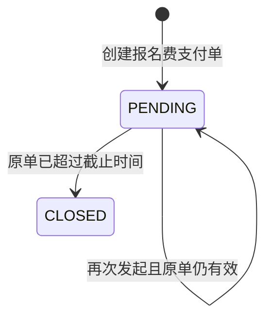

## 一句话价值

为待支付参赛者创建支付单并交付微信付款参数。

## 核心概念

- 自办赛事  由业务方配置规则、接受报名、组织匹配并推进比赛的竞赛活动。
- 赛事报名  用户参加自办赛事的资格与进度载体，记录参赛编号、阶段、轮次、状态和偏好。
- 资格赛  自办赛事进入正赛前的筛选阶段，胜者可能先进入待支付。
- 正赛  自办赛事锁定席位后的淘汰阶段，胜者按轮次继续晋级。
- 支付单  针对一次业务费用建立的付款记录，独立经历待支付、已支付、已关闭或已失败。
- 待支付报名  资格赛晋级后尚未锁定正赛席位的赛事报名；它与支付单的待支付状态是两个对象。
- 支付回执  付款完成后异步到达的结果通知；收到并处理后才推进支付单和关联报名。

## 业务对象

### 报名费支付单

| 业务名称 | 描述 | 取值说明 |
|---|---|---|
| 支付单编号 | 唯一标识本次报名费支付，也是后续查询到账结果的凭据。 | — |
| 关联报名 | 本次支付对应的赛事报名。 | — |
| 付款人 | 发起报名费支付的参赛者。 | — |
| 费用类型 | 说明本次支付对应赛事报名费。 | 赛事报名费：用于锁定正赛席位的报名费用。 |
| 支付渠道 | 完成本次付款所使用的渠道。 | 微信支付：通过微信小程序付款。 |
| 应付金额 | 本次需要支付的报名费，单位为分；不额外收取手续费。 | — |
| 支付状态 | 发起完成时为待支付。 | 待支付：可继续付款；已支付：款项已到账；已关闭：支付单已关闭；已失败：付款未成功。 |
| 支付截止时间 | 超过该时间后不再接受付款；没有有效时限时不设置。 | — |
| 付款凭证 | 供微信小程序调起付款的预支付信息和签名。 | — |

## 交付内容

类型: 受理类

参赛者当场取得待支付单与微信付款参数，此时付款尚未确认、报名仍为待支付；最终付款结果由支付结果回执处理或支付状态同步交付。

| 当前状态 | 触发操作 | 新状态 | 前置条件 | 谁能触发 |
|---|---|---|---|---|
| 无活跃支付单 | 发起报名费支付 | `PENDING` | 本人报名为 `PAYING`，正赛尚有席位，且能取得微信付款参数 | 当前参赛者 |
| `PENDING` 且未超过支付单截止时间 | 再次发起报名费支付 | `PENDING` | 当前用户仍是付款人；已有微信预支付编号仍有效时复用该编号 | 当前参赛者 |
| `PENDING` 且已超过支付单截止时间 | 再次发起报名费支付 | 原单 `CLOSED`，新单 `PENDING` | 本人报名仍为 `PAYING`，正赛尚有席位，且能取得新的微信付款参数 | 当前参赛者 |

本服务不把支付单推进为 `PAID`，也不改变赛事报名状态；付款完成后的状态推进由独立的支付回执处理承担。

## 主流程

触发源：HTTP（参赛者）；终态：报名仍为 `PAYING`，参赛者取得一张 `PENDING` 支付单及微信付款参数。

1. 参赛者选择本人已晋级的自办赛事并发起报名费支付。
2. 确认自办赛事存在，并找到当前参赛者在该赛事中的赛事报名。
3. 确认报名状态为 `PAYING`，且已支付锁定的正赛席位数仍小于总签位数。
4. 以该赛事报名和付款人为单位取得可继续使用的支付单；没有可用支付单时，按赛事报名费建立微信支付单，手续费为 `0`，状态为 `PENDING`。原待支付单已过截止时间时，先将原单关闭，再建立新单。
5. 确认当前参赛者是支付单付款人，并取得其微信小程序 `openid`。
6. 以人民币、支付单实付金额、“Rally 赛事报名费”和支付截止时间向微信支付取得小程序付款参数；已有且仍有效的微信预支付编号可直接生成一组新的付款签名参数。
7. 保存微信预支付编号及其有效期，向参赛者交付 `paymentId`、`prepayId`、`timeStamp`、`nonceStr`、`packageVal`、`signType` 和 `paySign`。

## 分支与异常

| 什么情况 | 怎么处理 | 对外提示 | 做了一半的怎么收场 |
|---|---|---|---|
| 未提供赛事编号 | 拒绝发起支付 | 赛事ID不能为空 | 不建立或改变支付单。 |
| 指定自办赛事不存在 | 拒绝发起支付 | 赛事不存在 | 不建立或改变支付单。 |
| 当前用户在指定赛事中没有报名 | 拒绝发起支付 | 报名记录不存在 | 不建立或改变支付单。 |
| 本人报名状态不是 `PAYING` | 拒绝发起支付 | 报名当前状态不允许该操作 | 报名与既有支付单保持不变。 |
| `current_filled_slots` 已达到或超过 `total_slots` | 拒绝发起支付 | 正赛席位已满，暂无法支付 | 不建立新支付单，既有支付单保持不变。 |
| 当前用户不是所取得支付单的付款人 | 拒绝取得付款参数 | 无权操作该支付单 | 不交付微信付款参数，支付单保持原状态。 |
| 当前用户没有 `wechat_miniapp` 账户或其 `identifier` 为空 | 拒绝取得付款参数 | 微信授权失败 | 不交付微信付款参数，不确认本次支付发起完成。 |
| 微信支付配置不完整、未就绪或没有可用支付渠道 | 拒绝取得付款参数 | 暂不支持该支付渠道 | 不交付微信付款参数，不确认本次支付发起完成。 |
| 微信支付拒绝下单或未返回可用结果 | 本次发起失败 | 系统异常，请稍后重试 | 不确认付款参数已交付；微信侧是否已受理需按其实际结果核实。 |
| 支付单或预支付编号未能完整保存 | 本次发起失败 | 系统异常，请稍后重试 | 不确认支付发起完成，报名仍保持 `PAYING`。 |

## 业务边界

- 本服务负责校验本人待支付报名与剩余正赛席位，建立或复用报名费支付单，并交付微信小程序付款参数。
- 本服务的同步承诺止于付款参数交付；它不确认参赛者已经付款，不处理微信支付回执，也不把支付单推进为 `PAID`。
- 本服务不把赛事报名从 `PAYING` 推进到 `MAIN / WAITING`，不写入 `paid_time`，不增加 `current_filled_slots`，也不推进赛事轮次；这些结果属于独立的支付回执处理。
- 本服务不处理支付查询、超时关单、失败补偿或退款，也不创建、编排或关闭赛事比赛。
- 本服务只为当前登录用户自己的赛事报名发起支付，不接受代他人付款。

## 遗留与待定

| 等级 | 待定的是什么 | 要谁来定 |
|---|---|---|
| P1 | 当前只检查报名状态为 `PAYING`，不同时检查 `stage` 必须为 `QUALIFY`；异常数据中的 `MAIN / PAYING` 也可发起支付，阶段与状态的联合约束需赛事产品与数据负责人确定。 | 产品与赛事运营负责人 |
| P1 | 当前不检查赛事 `status`、报名付费截止时间或赛事结束时间；草稿、已废弃或已过赛事周期但仍有 `PAYING` 报名的数据也可能发起支付，允许付费的赛事范围需赛事产品负责人确定。 | 产品与赛事运营负责人 |
| P1 | `entry_fee` 为 `BIGINT`，建立支付单时按 `INT` 金额使用，且没有校验超出 `INT` 范围的情况；报名费金额上限需赛事产品与财务负责人确定。 | 产品与赛事运营负责人 |
| P1 | 赛事允许配置 `entry_fee = 0`，但本服务仍向微信支付发起金额为 `0` 的订单，没有免费晋级分支；零元赛事的正赛席位锁定方式需赛事产品与财务负责人确定。 | 产品与赛事运营负责人 |
| P1 | 支付时限的代码说明同时出现“`0` 为默认不超时”和默认 `30` 分钟两种口径，而实际默认值为 `30`；待支付时限及已有配置的统一口径需赛事产品与财务负责人确定。 | 产品与赛事运营负责人 |
| P1 | 支付单超过截止时间只会在参赛者再次发起支付时被关闭；报名仍保持 `PAYING`，也没有报名支付截止时间，因此参赛者可在正赛未满时反复重新发起，资格保留期限需赛事产品负责人确定。 | 产品与赛事运营负责人 |
| P1 | 已有活跃支付单可能处于 `PAID`，当前仍会继续尝试取得新的微信付款参数，没有明确返回“支付单已支付”；重复付款的阻断和已支付后的对外反馈需支付产品负责人确定。 | 产品与赛事运营负责人 |
| P1 | 微信付款参数各字段没有完整性校验；微信支付若返回缺失字段的结果，本服务仍可能交付，付款参数最低完整性要求需支付产品负责人确定。 | 产品与赛事运营负责人 |
| P1 | 关闭超时支付单时，即使微信侧关单失败也会继续建立新支付单，可能同时存在两张仍可付款的微信订单；旧单后续付款的资金与资格处理需支付产品和财务负责人确定。 | 产品与赛事运营负责人 |
| P1 | 微信支付下单已受理但本次请求未成功返回时，参赛者可能拿不到付款参数，且本地支付单是否保留取决于失败发生位置；这类不确定结果的查询与恢复方式需支付产品负责人确定。 | 产品与赛事运营负责人 |
| P1 | 双打搭档共享 `entry_no`，但支付单按每条赛事报名的 `biz_id` 和 `user_id` 分别建立；报名费按个人还是按参赛单元收取、正赛签位按人还是按队占用，需赛事产品与财务负责人确定。 | 产品与赛事运营负责人 |
| P1 | `account` 没有“同一用户同一渠道唯一”的约束；若一个用户存在多条 `wechat_miniapp` 记录，当前任取一条且没有固定顺序，付款身份选择规则需账户与支付产品负责人确定。 | 产品与赛事运营负责人 |
