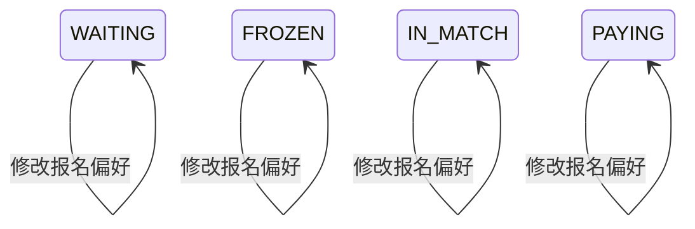

## 一句话价值

让参赛者更新本人赛事报名的匹配偏好。

## 核心概念

- 自办赛事  由业务方配置规则、接受报名、组织匹配并推进比赛的竞赛活动。
- 赛事报名  用户参加自办赛事的资格与进度载体，记录参赛编号、阶段、轮次、状态和偏好。
- 报名偏好  参赛者为后续匹配提供的活动区域、可比赛时间与本人能否订场的信息。
- 匹配池  当前轮次中处于等待匹配、可被编入新比赛的参赛单元集合。

## 业务对象

### 赛事报名

| 业务名称 | 描述 | 取值说明 |
|---|---|---|
| 报名编号 | 唯一标识本人本次修改的赛事报名。 | — |
| 所属赛事 | 报名归属的自办赛事。 | — |
| 报名者 | 修改比赛偏好的当前参赛者。 | — |
| 场地区域偏好 | 本人愿意参加比赛的活动区域。 | — |
| 订场能力 | 本人能否承担订场职责。 | 可以订场：能够承担订场；不能订场：不能承担订场。 |
| 可比赛时间 | 本人可以参加比赛的时间。 | — |
| 报名状态 | 已淘汰或已退赛时不能再修改偏好，其他状态保持不变。 | 等待匹配：处于当前轮次匹配池；已冻结：暂时离开匹配池；比赛中：已编入尚未结束的比赛；待支付：资格赛晋级后等待支付；已淘汰：止步当前赛事；已退赛：退出赛事。 |

## 状态机

| 当前状态 | 触发操作 | 新状态 | 前置条件 | 谁能触发 |
|---|---|---|---|---|
| `WAITING` | 修改报名偏好 | `WAITING` | 找到当前参赛者在指定赛事的报名；活动区域、订场能力、可比赛时间有效 | 报名本人 |
| `FROZEN` | 修改报名偏好 | `FROZEN` | 同上；当前实现允许冻结报名修改 | 报名本人 |
| `IN_MATCH` | 修改报名偏好 | `IN_MATCH` | 同上；当前实现允许比赛中报名修改 | 报名本人 |
| `PAYING` | 修改报名偏好 | `PAYING` | 同上 | 报名本人 |
| `ELIMINATED` | 修改报名偏好 | 不变 | 已淘汰报名禁止修改 | 无人可成功触发 |
| `WITHDRAWN` | 修改报名偏好 | 不变 | 已退赛报名禁止修改 | 无人可成功触发 |

## 主流程

触发源：HTTP（参赛者）；终态：本人赛事报名保存新的活动区域、订场能力和可比赛时间，报名状态保持不变。

1. 识别当前已登录参赛者，并接收赛事编号、活动区域、订场能力和可比赛时间。
2. 确认活动区域和可比赛时间都至少有一项，订场能力为 `CAN_BOOK` 或 `CANNOT_BOOK`。
3. 按赛事编号和当前参赛者找到其唯一赛事报名。
4. 确认报名不是 `ELIMINATED` 或 `WITHDRAWN`。
5. 用本次提交的完整内容替换该报名原有的活动区域、订场能力和可比赛时间，其他报名信息与当前状态保持不变。
6. 保存修改并确认报名偏好更新成功。

## 分支与异常

| 什么情况 | 怎么处理 | 对外提示 | 做了一半的怎么收场 |
|---|---|---|---|
| 未登录、登录凭据缺失或失效 | 拒绝修改 | `登录已过期，请重新登录` 或 `登录凭证无效，请重新登录` | 不读取或修改报名。 |
| 赛事编号为空 | 拒绝修改 | `tournamentId: 赛事ID不能为空` | 不读取或修改报名。 |
| 活动区域未提供或为空列表 | 拒绝修改 | `preferredDistricts: 请选择活动区域` | 不读取或修改报名。 |
| 订场能力未提供 | 拒绝修改 | `courtAbility: 请选择场地能力` | 不读取或修改报名。 |
| 可比赛时间未提供或为空列表 | 拒绝修改 | `availableTimes: 请选择可比赛时间` | 不读取或修改报名。 |
| 订场能力不是 `CAN_BOOK` 或 `CANNOT_BOOK` | 拒绝修改 | 系统异常，请稍后重试 | 不读取或修改报名。 |
| 指定赛事下没有当前参赛者的报名 | 拒绝修改 | 报名记录不存在 | 不创建新报名，也不修改其他人的报名。 |
| 报名状态为 `ELIMINATED` 或 `WITHDRAWN` | 拒绝修改 | 报名当前状态不允许该操作 | 保留原报名状态与原偏好。 |
| 新偏好未能完整保存 | 修改失败 | 系统异常，请稍后重试 | 保留修改前的报名偏好，不交付成功结果。 |

## 业务边界

- 本服务负责修改当前参赛者本人已有赛事报名的活动区域、订场能力和可比赛时间，到三项偏好完整保存为止。
- 本服务采用整组替换，不提供单独增加或删除某个区域、某个时间的承诺。
- 本服务不创建报名，不修改搭档的报名偏好，也不改变参赛编号、赛事阶段、当前轮次或报名状态。
- 本服务不立即执行匹配，不撤销或重排已产生的赛事比赛；新偏好供后续匹配使用。
- 本服务不校验赛事是否存在、是否已激活或已废弃，也不校验报名窗口和赛事进度。

## 遗留与待定

- 盘点承诺和应用层说明均称仅 `WAITING` 或 `PAYING` 可以修改，但实际规则只禁止 `ELIMINATED` 与 `WITHDRAWN`，因此 `FROZEN`、`IN_MATCH` 也可修改；允许状态应由赛事产品确认。
- `preferredDistricts` 和 `availableTimes` 只要求列表非空，没有校验列表元素非空、去重、长度、区域编码是否有效、时间格式及是否已过期；两类偏好的合法值规则应由赛事产品确认。
- `preferred_districts` 与 `available_times` 的字段容量均为 `VARCHAR(512)`，但提交内容没有数量或总长度上限；超限时的业务提示与可接受上限应由赛事产品确认。
- 双打参赛者只修改本人记录；后续匹配会合并队友的区域、取队友可比赛时间交集，但双方偏好冲突时是否应在修改当下提示，应由赛事产品确认。
- 本服务不检查赛事状态和进度；赛事已废弃、报名已关闭或已生成比赛时是否仍允许修改偏好，应由赛事产品确认。
