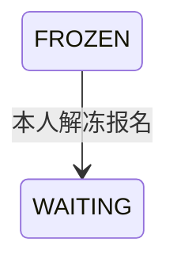

## 一句话价值

让已绑手机号的参赛者将本人冻结报名恢复进匹配池。

## 核心概念

- 账户  用户获得访问身份的载体，可关联登录凭据、手机号和个人资料。
- 自办赛事  由业务方配置规则、接受报名、组织匹配并推进比赛的竞赛活动。
- 赛事报名  用户参加自办赛事的资格与进度载体，记录参赛编号、阶段、轮次、状态和偏好。
- 匹配池  当前轮次中处于等待匹配、可被编入新比赛的参赛单元集合。
- 冻结报名  暂时移出匹配池但没有退赛的赛事报名，满足条件后可由本人解冻。

## 业务对象

### 赛事报名

| 业务名称 | 描述 | 取值说明 |
|---|---|---|
| 报名编号 | 唯一标识本人本次解冻的赛事报名。 | — |
| 所属赛事 | 报名归属的有效自办赛事。 | — |
| 报名者 | 发起解冻的当前参赛者。 | — |
| 参赛编号 | 报名所属参赛单元的编号。 | — |
| 报名阶段 | 解冻后仍保留原阶段。 | 资格赛：尚在正赛资格争夺阶段；正赛：已经进入正式淘汰阶段。 |
| 报名状态 | 成功后由已冻结恢复为等待匹配。 | 等待匹配：处于当前轮次匹配池；已冻结：暂时离开匹配池；比赛中：已编入尚未结束的比赛；待支付：资格赛晋级后等待支付；已淘汰：止步当前赛事；已退赛：退出赛事。 |
| 当前轮次 | 解冻后回到原轮次的匹配池。 | 资格赛、64 强、32 强、16 强、8 强、半决赛、决赛。 |

## 状态机

| 当前状态 | 触发操作 | 新状态 | 前置条件 | 谁能触发 |
|---|---|---|---|---|
| `FROZEN` | 解冻赛事报名 | `WAITING` | 赛事为 `ACTIVE` 且未晚于结束时间，当前参赛者账户存在并已绑定手机号 | 报名本人 |

## 主流程

触发源：HTTP（参赛者）；终态：本人赛事报名恢复为 `WAITING`，重新进入当前阶段、当前轮次的匹配池。

1. 识别当前已登录参赛者，并接收要解冻报名的赛事编号。
2. 取得指定自办赛事，确认赛事为 `ACTIVE`，且当前时间未晚于赛事结束时间。
3. 确认当前参赛者账户存在，且账户资料中已有非空手机号。
4. 按赛事编号和当前参赛者找到其本人唯一的赛事报名，并确认报名状态为 `FROZEN`。
5. 将报名状态改为 `WAITING` 并保存，报名阶段、当前轮次、参赛编号、搭档和匹配偏好保持不变。
6. 向参赛者确认报名解冻成功；该报名重新成为当前阶段、当前轮次的待匹配候选。

## 分支与异常

| 什么情况 | 怎么处理 | 对外提示 | 做了一半的怎么收场 |
|---|---|---|---|
| 未登录、登录凭据缺失或失效 | 拒绝解冻 | `登录已过期，请重新登录` 或 `登录凭证无效，请重新登录` | 不读取或修改报名。 |
| 赛事编号为空 | 拒绝解冻 | `tournamentId: 赛事ID不能为空` | 不读取或修改报名。 |
| 指定赛事不存在 | 拒绝解冻 | 赛事不存在 | 不读取或修改报名。 |
| 赛事为 `DRAFT` 或 `ABANDONED` | 拒绝解冻 | 赛事当前状态不允许该操作 | 报名保持 `FROZEN`。 |
| 当前时间晚于赛事的 `end_time` | 拒绝解冻 | 赛事当前状态不允许该操作 | 报名保持 `FROZEN`。 |
| 登录身份没有对应的 `user` 记录 | 拒绝解冻 | 登录凭证无效，请重新登录 | 不修改报名。 |
| 当前参赛者的 `phone` 为空或空白 | 拒绝解冻 | 请先绑定手机号 | 报名保持 `FROZEN`。 |
| 指定赛事下没有当前参赛者本人的报名 | 拒绝解冻 | 报名记录不存在 | 不创建新报名，也不修改其他人的报名。 |
| 本人报名不是 `FROZEN`，包括 `WAITING`、`IN_MATCH`、`PAYING`、`ELIMINATED` 或 `WITHDRAWN` | 拒绝解冻 | 报名当前状态不允许该操作 | 报名状态保持不变。 |
| 赛事、账户或报名数据无法正确读取，或报名状态未能保存 | 解冻失败 | 系统异常，请稍后重试 | 不确认解冻成功，报名保留修改前状态。 |

## 业务边界

- 本服务负责校验当前参赛者本人冻结报名的解冻条件，到报名恢复为 `WAITING` 并重新进入当前匹配池为止。
- 本服务只处理当前登录参赛者在指定赛事中的唯一报名，不允许代替搭档或其他参赛者解冻。
- 本服务只改变报名状态；报名阶段、当前轮次、参赛编号、搭档、匹配偏好和拒赛次数均保持不变。
- 本服务不负责绑定或变更手机号，只读取既有手机号是否非空；手机号绑定属于独立业务服务。
- 本服务不创建或冻结报名，不修改赛事配置，也不直接执行匹配、建立赛事比赛或推进轮次。

## 遗留与待定

- 当前只校验赛事为 `ACTIVE` 且未晚于 `end_time`，不检查报名窗口、资格赛截止时间、当前轮次或报名阶段；这些条件是否应限制解冻，需赛事产品负责人确定。
- `rally_tournament.end_time` 允许为空，且现有赛事创建、编辑与比赛推进流程均未看到明确写入该字段；赛事何时结束、由谁写入结束时间，需赛事产品与数据负责人确定。
- 当前时间恰好等于 `end_time` 时仍允许解冻，只有晚于该时刻才拒绝；结束时刻是否应包含在可解冻时间内，需赛事产品负责人确定。
- 手机号条件只判断 `user.phone` 是否非空，不在解冻时重新验证号码归属、有效性或微信授权状态；解冻所需的手机号身份强度需账户与赛事产品负责人确定。
- 本服务不检查冻结报名是否已有未结束的赛事比赛；出现冻结状态与比赛状态并存时能否直接回到匹配池，需赛事产品负责人确定。
- `rally_tournament_entry.current_round` 的建表说明没有列出业务枚举支持的 `ROUND_64`；需赛事产品与数据负责人统一字段取值说明。
