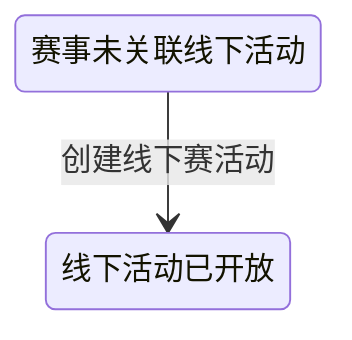

## 一句话价值

为进入线下轮次的参赛者建立专属活动并直接成组。

## 核心概念

- 自办赛事  由业务方配置规则、接受报名、组织匹配并推进比赛的竞赛活动。
- NTRP  用于描述网球水平的等级值，既用于个人展示，也用于约球和赛事准入。
- 赛事报名  用户参加自办赛事的资格与进度载体，记录参赛编号、阶段、轮次、状态和偏好。
- 匹配池  当前轮次中处于等待匹配、可被编入新比赛的参赛单元集合。
- 约球  围绕一次明确时间、场地、人数和参与条件组织的网球活动，不只是两人邀约。
- 线下赛活动  自办赛事进入指定线下轮次后，为该轮仍在匹配池中的参赛者建立的专属约球；它不同于单场赛事比赛的赛约。

## 业务对象

### 线下赛活动

| 业务名称 | 描述 | 取值说明 |
|---|---|---|
| 活动编号 | 唯一标识本次创建的线下赛活动。 | — |
| 所属赛事 | 由该活动承接线下轮次的自办赛事。 | — |
| 创建人 | 由运营指定的线下赛活动负责人。 | — |
| 标题 | 沿用自办赛事名称。 | — |
| 比赛形式 | 沿用赛事配置的对局形式。 | 单打：以单打形式开展；双打：以双打形式开展；拉球：以拉球形式开展。 |
| 参与人数 | 符合线下轮次条件的不同参赛者人数。 | — |
| 城市与区县 | 活动所在的已开通城市及识别出的区县。 | — |
| 活动时间 | 包含开始时间、结束时间和持续时长。 | — |
| 场地 | 包含场地名称、地址、位置和场地号。 | — |
| 场地选择方式 | 确定场地资料来源的方式。 | 文字搜索：搜索并引用已有球场；地图选择：从地图引用已有球场；自由填写：直接填写场地资料。 |
| NTRP 要求 | 采用赛事指定的精确 NTRP 等级。 | 精确值：参与者水平须等于赛事指定值。 |
| 性别限制 | 线下承接活动不再限制性别。 | 不限性别：所有入选参赛者均可参加。 |
| 加入方式 | 后续加入需要审批，但本次入选参赛者直接加入。 | 审批加入：后续加入需要活动创建人审批。 |
| 活动状态 | 创建完成时直接开放。 | 草稿：等待比赛参与者确认；开放：赛约已获确认；进行中：活动正在进行；已关闭：活动被终止；已结束：活动正常结束。 |

### 线下赛活动成员

| 业务名称 | 描述 | 取值说明 |
|---|---|---|
| 所属活动 | 成员参加的线下赛活动。 | — |
| 参与者 | 处于赛事线下轮次且等待比赛的参赛者。 | — |
| 成员状态 | 入选参赛者创建时直接成为已加入成员。 | 待审批：等待活动创建人审批；已加入：已成为活动成员；已拒绝：加入申请被拒绝；已撤回：撤回申请；已退出：退出活动；已评价：完成赛后评价；已跳过评价：跳过赛后评价。 |

## 交付内容

类型: 新增类

成功后形成此前不存在的业务事实，并交付主流程所述标识或结果；初始状态、后续可变更范围和可见范围，以本节下列规则、业务对象及业务边界为准。

| 当前状态 | 触发操作 | 新状态 | 前置条件 | 谁能触发 |
|---|---|---|---|---|
| 赛事 `offline_meetup_id` 为空 | 创建线下赛活动 | 赛事已关联新活动，活动为 `OPEN`，入选成员均为 `JOINED` | 赛事当前轮次等于线下承接轮次；至少有一名该轮 `WAITING` 报名者；活动资料有效 | 运营人员 |

赛事自身的 `current_round` 和参赛报名状态不在本服务中改变。

## 主流程

触发源：HTTP（运营）；终态：赛事关联一个 `OPEN` 线下赛活动，入选参赛者均为 `JOINED`，并返回活动业务编号。

1. 接收自办赛事编号、活动创建人、活动时间和场地资料。
2. 找到自办赛事，确认赛事当前轮次正好等于配置的线下承接轮次，且尚未关联线下赛活动。
3. 从赛事报名中选出当前轮次等于线下承接轮次、状态为 `WAITING` 的报名，并按用户编号去重形成活动成员名单。
4. 确认成员名单非空，并把赛事 NTRP 转为线下活动的精确水平要求。
5. 确认所选城市已开通，开始时间、持续时长和 NTRP 符合约球规则；引用到已有球场时采用球场资料，否则采用提交的场地资料。
6. 以赛事名称和比赛类型建立 `TOURNAMENT` 类型的 `OPEN` 活动；人数上限与当前人数均取成员人数，性别不限，后续加入方式为审批，费用为空。
7. 为名单中的每位用户直接建立 `JOINED` 成员关系，使线下赛活动创建后即满员。
8. 将新活动编号写入赛事的线下活动关联，并向运营人员交付该活动业务编号。

## 分支与异常

| 什么情况 | 怎么处理 | 对外提示 | 做了一半的怎么收场 |
|---|---|---|---|
| 赛事编号、创建人、开始时间、持续时长、场地地址、城市或场地位置缺失，或文本长度、经纬度超出提交限制 | 拒绝创建 | 返回首个无效字段及其校验说明 | 不创建活动、成员关系或赛事关联。 |
| 找不到指定赛事 | 拒绝创建 | 赛事不存在 | 不创建活动、成员关系或赛事关联。 |
| 赛事当前轮次不等于线下承接轮次 | 拒绝创建 | 赛事尚未进入线下赛阶段 | 不创建活动、成员关系或赛事关联。 |
| 赛事已经关联线下赛活动 | 拒绝重复创建 | 线下赛活动已创建 | 保留原有关联，不创建新活动或成员关系。 |
| 线下承接轮次没有状态为 `WAITING` 的报名用户 | 拒绝创建 | 没有达到线下赛阶段的参赛者 | 不创建活动、成员关系或赛事关联。 |
| 赛事 NTRP 为空 | 拒绝创建 | 赛事 NTRP 等级不能为空 | 不创建活动、成员关系或赛事关联。 |
| 赛事 NTRP 不是数值 | 拒绝创建 | 赛事 NTRP 等级不是有效数值 | 不创建活动、成员关系或赛事关联。 |
| 所选城市为空、没有任何已开通城市或城市未开通 | 拒绝创建 | 该城市暂未开通 | 不创建活动、成员关系或赛事关联。 |
| 开始时间早于受理时刻 | 拒绝创建 | 不能发布过去的约球 | 不创建活动、成员关系或赛事关联。 |
| 持续时长不在六个允许值中 | 拒绝创建 | 持续时长必须是0.5的倍数 | 不创建活动、成员关系或赛事关联。 |
| 赛事 NTRP 不是 0.5 的步长 | 拒绝创建 | 水平值步长为0.5 | 不创建活动、成员关系或赛事关联。 |
| `TEXT` 或 `MAP` 提交的 `courtId` 没有匹配球场 | 继续使用提交的场地名称、地址和经纬度创建 | 无 | 按提交资料完成活动。 |
| 并发创建时，另一请求先完成赛事关联 | 拒绝后完成的重复创建 | 线下赛活动已创建 | 后完成请求产生的活动和成员关系不予保留，赛事保留先完成的关联。 |
| 活动、成员关系或赛事关联保存失败 | 创建失败 | 系统异常，请稍后重试 | 不保留本次活动、成员关系或赛事关联的部分变更。 |

## 业务边界

- 本服务负责在赛事到达线下承接轮次时，从该轮匹配池选出用户，建立已开放的赛事型约球、直接建立成员关系并绑定回赛事，到交付活动业务编号为止。
- 本服务创建的是承接整个线下轮次的活动，不是某一场赛事比赛的赛约；不建立或修改赛事比赛、订场人、赛约确认和赛果。
- 本服务不推进赛事轮次，不修改赛事报名的轮次、阶段或状态，也不重新判断参赛者原始报名资格。
- 本服务不创建新报名、不邀请线下轮次之外的用户，也不处理后续申请、审批、退出、比分或评价。
- 本服务不创建或修改球场；引用不到已有球场时仍可按提交的场地资料创建活动。
- 本服务不登记或发送通知，不建立群聊阅读关系，也不处理费用收取或结算。
- 线下赛活动后续的详情、群聊、活动结束和赛后记录分别由其他业务服务负责。

## 遗留与待定

| 等级 | 待定的是什么 | 要谁来定 |
|---|---|---|
| P1 | 创建权限只体现为运营入口，创建内容中的 `creatorId` 可指定任意非空用户编号，未校验该用户是否存在、是否为运营人员或是否属于赛事；创建人选择规则应由产品和权限负责人确定。 | 产品与赛事运营负责人 |
| P2 | 创建条件只比较 `current_round` 与 `offline_from_round`，没有要求赛事为 `ACTIVE` 或尚未超过结束时间；废弃或已结束赛事是否允许创建应由赛事运营确定。 | 产品与赛事运营负责人 |
| P1 | 候选人只按报名 `current_round` 和 `WAITING` 筛选，没有校验报名 `stage`；哪些阶段能进入线下活动应由赛事运营确定。 | 产品与赛事运营负责人 |
| P2 | 只要候选人非空即可创建，未要求至少两人；单人线下赛活动是否有业务意义应由赛事运营确定。 | 产品与赛事运营负责人 |
| P1 | 赛事 NTRP 只要求能转换为数值且为 0.5 步长，没有校验 1.5～7.0 的通常范围；线下活动的等级范围应由产品确认。 | 产品与赛事运营负责人 |
| P2 | 线下活动固定为不限性别，未沿用赛事 `gender_limit`；已晋级人员是否仍应保留赛事性别限制展示应由产品确认。 | 产品与赛事运营负责人 |
| P2 | 活动固定为 `APPROVAL` 且创建后即满员，但本服务没有说明后续是否允许扩员、补位或重新开放报名；线下替补规则应由赛事运营确定。 | 产品与赛事运营负责人 |
| P2 | 活动创建人不自动建立成员关系；当创建人不在候选名单中时，其创建者身份与 `current_players`、成员清单之间的业务口径应由产品确认。 | 产品与赛事运营负责人 |
| P2 | `districtCode` 被接收但不保存，区县名称来自球场资料或地址识别；区县编码是否应持久化应由产品与场地数据负责人确定。 | 产品与赛事运营负责人 |
| P1 | `TEXT`、`MAP` 下引用不到 `courtId` 时不会拒绝，且找到球场后不校验球场状态；是否允许失效、停用或不存在的球场引用降级应由产品确认。 | 产品与赛事运营负责人 |
| P2 | `courtSelectMode` 和 `courtId` 都可不填，也未限制 `FREE` 携带 `courtId`；场地选择方式与球场编号的组合规则应由产品确认。 | 产品与赛事运营负责人 |
| P1 | `courtIndex` 没有业务格式和长度校验，但保存字段为 `VARCHAR(64)`；超长内容及其业务定义应由产品与场地数据负责人确定。 | 产品与赛事运营负责人 |
| P2 | 线下赛活动直接建立为 `OPEN`，没有草稿或二次确认阶段；活动场地和时间由谁复核、误建后如何撤销应由赛事运营确定。 | 产品与赛事运营负责人 |
| P2 | 活动成员没有同步建立群聊阅读关系；赛事参赛者能否直接使用约球群聊以及首次未读口径应由产品确认。 | 产品与赛事运营负责人 |
