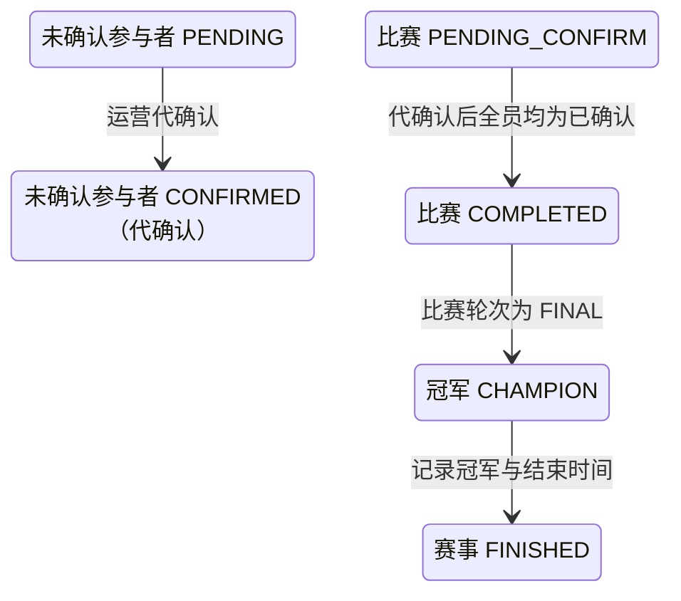

## 一句话价值

赛果迟迟等不到全员确认时，运营人员按赛事和比赛序号一次性代为确认，完成比赛并结算胜负。

## 核心概念

- 自办赛事  由业务方配置规则、接受报名、组织匹配并推进比赛的竞赛活动。
- 赛事报名  用户参加自办赛事的资格与进度载体，记录参赛编号、阶段、轮次、状态和偏好。
- 赛事比赛  自办赛事中一次由若干参赛单元完成的对阵，经历匹配、订场、确认、比赛和赛果确认。
- 赛果  赛事比赛提交的胜方结论，需要其他参赛者确认或由超时规则完成确认。
- 运营代确认  运营人员在比赛长期卡在待确认赛果时，代替尚未确认的参赛者完成本次赛果确认，不代表参赛者本人真实同意。

## 业务对象

### 赛事比赛

| 业务名称 | 描述 | 取值说明 |
|---|---|---|
| 所属赛事 | 运营代确认所针对的赛事。 | `tournamentId`，非空。 |
| 比赛序号 | 赛事内展示编号。 | `matchNo`，正整数；与赛事编号共同唯一。 |
| 比赛轮次 | 决定完成后结算与轮次推进方式的比赛轮次。 | 资格赛、64 强、32 强、16 强、8 强、半决赛、决赛。 |
| 胜方参赛编号 | 已提交赛果认定的获胜参赛单元；代确认前必须已存在。 | — |
| 比赛状态 | 代确认前必须是待确认赛果；全员确认状态凑齐后完成。 | 已匹配：已完成对阵编排，等待选定订场人；订场中：已选定订场人，等待提交赛约；待确认赛约：已提交赛约，等待参与者确认；待比赛：赛约已确认，等待比赛；待确认赛果：已提交赛果，等待参与者确认；已完成：赛果已确认；已终止：比赛被拒绝或取消。 |

### 比赛参与确认

| 业务名称 | 描述 | 取值说明 |
|---|---|---|
| 参与者 | 本场比赛的全部参赛者。 | — |
| 参赛编号 | 用于区分胜方与负方的参赛单元编号。 | — |
| 赛果确认状态 | 本次只把仍为待确认的参与者改为已确认；已确认或已拒绝的参与者保持原状。 | 待确认：尚未确认赛果；已确认：接受当前赛果；已拒绝：拒绝当前赛果。 |

### 赛事报名

| 业务名称 | 描述 | 取值说明 |
|---|---|---|
| 参赛编号 | 报名所属参赛单元，用于确定胜负去向。 | — |
| 报名阶段 | 决定资格赛胜方或正赛胜负方的后续状态。 | 资格赛：胜方进入待支付；正赛：胜方进入下一轮，负方被淘汰。 |
| 报名状态 | 代确认完成比赛后按胜负和阶段更新。 | 等待匹配：处于赛事当前轮次匹配池；冠军：赢得已完成决赛；已冻结：暂时离开匹配池；比赛中：已编入尚未结束的比赛；待支付：资格赛晋级后等待支付；已淘汰：止步当前赛事；已退赛：退出赛事。 |
| 当前轮次 | 正赛非决赛胜方推进到下一轮。 | 资格赛、64 强、32 强、16 强、8 强、半决赛、决赛。 |

### 自办赛事

| 业务名称 | 描述 | 取值说明 |
|---|---|---|
| 赛事编号 | 本场比赛归属的自办赛事。 | — |
| 当前轮次 | 按各轮比赛完成情况向后推进，不会倒退。 | 资格赛、64 强、32 强、16 强、8 强、半决赛、决赛。 |
| 赛事状态 | 决赛代确认完成后进入已结束。 | 草稿、已激活、已结束、已废弃。 |
| 冠军参赛编号 | 决赛胜方的参赛编号。 | 未结束时为空。 |
| 实际结束时间 | 决赛比赛完成时间。 | 未结束时为空。 |

## 交付内容

类型: 变更类

成功后按主流程改写既有业务事实；允许变更的内容、前置状态、对外可见结果与原值留痕，以本节下列规则、业务对象及分支与异常为准。

| 当前状态 | 触发操作 | 新状态 | 前置条件 | 谁能触发 |
|---|---|---|---|---|
| 比赛 `PENDING_CONFIRM`，存在仍为 `PENDING` 的参与者 | 运营代确认赛果 | 全部参与者 `CONFIRMED`；比赛 `COMPLETED`；胜负方报名完成结算 | 赛事和指定比赛存在；比赛处于 `PENDING_CONFIRM`；已记录胜方参赛编号 | 运营人员 |
| 决赛比赛 `PENDING_CONFIRM` | 运营代确认凑齐全员确认 | 决赛 `COMPLETED`；胜方报名 `CHAMPION`；赛事 `FINISHED` 并记录冠军和结束时间 | 已记录合法胜方参赛编号；所属赛事仍为 `ACTIVE` | 运营人员 |
| 比赛 `PENDING_CONFIRM`，参与者已全部 `CONFIRMED` | 重复代确认 | 状态不变，按幂等处理 | 赛事和指定比赛存在 | 运营人员 |

## 主流程

触发源：`POST /tournament/admin/match/result/confirm`；请求为 `tournamentId + matchNo`；终态：本场比赛全部参与者赛果确认状态为 `CONFIRMED`，比赛 `COMPLETED`，胜负方报名完成结算并评估赛事轮次。

1. 校验赛事编号非空、比赛序号为正整数，并确认赛事存在。
2. 按 `tournamentId + matchNo` 找到最新比赛及其全部参与者；不存在则终止。
3. 确认比赛正处于 `PENDING_CONFIRM` 且已记录胜方参赛编号；不满足则拒绝。
4. 将本场比赛所有仍为 `PENDING` 的参与者赛果确认状态一次性改为 `CONFIRMED`，并记录确认时间；已是 `CONFIRMED` 的参与者保持原状和原确认时间。
5. 全部参与者确认状态凑齐为 `CONFIRMED` 后，将比赛置为 `COMPLETED` 并记录完成时间。
6. 完成比赛后，资格赛胜方进入 `PAYING`，资格赛负方回到 `WAITING`；非决赛正赛胜方进入下一轮 `WAITING`，正赛负方进入 `ELIMINATED`。
7. 若已完成比赛的轮次是 `FINAL`，胜方报名进入 `CHAMPION`，赛事进入 `FINISHED`，并写入冠军参赛编号和比赛完成时间。
8. 非决赛根据资格赛完成场数、已支付正赛席位和各正赛轮完成场数评估赛事当前轮次；只有满足该轮完成条件时才向后推进。
9. 返回代确认成功，不交付比赛、报名或轮次详情。

## 分支与异常

| 什么情况 | 怎么处理 | 对外提示 | 做了一半的怎么收场 |
|---|---|---|---|
| 请求参数非法或运营凭据无效 | 拒绝 | 参数提示／无权限 | 不读取或修改业务数据。 |
| 赛事不存在 | 拒绝 | 赛事不存在 | 不修改。 |
| 指定比赛不存在 | 拒绝 | 比赛不存在 | 不补建。 |
| 比赛不是 `PENDING_CONFIRM`（例如仍在待比赛、已终止或已完成） | 拒绝 | 当前状态不允许代确认赛果 | 比赛、参与者、报名和赛事轮次均保持原状。 |
| 比赛为 `PENDING_CONFIRM` 但没有已记录的胜方参赛编号 | 拒绝 | 请先提交赛果获胜方 | 不修改任何赛事数据。 |
| 比赛为 `PENDING_CONFIRM` 但参与者已全部 `CONFIRMED` | 幂等成功，不重复结算 | 代确认成功 | 不重复改写确认时间，不重复结算报名或推进轮次。 |
| 全员确认后，任一胜方或负方参与者没有对应赛事报名 | 失败 | 报名记录不存在 | 不交付部分完成结果，各对象保持本次操作前状态。 |
| 同一场比赛在保存前已被其他操作改变 | 拒绝并要求刷新 | 比赛状态已变更，请刷新后重试 | 不确认本次代确认结果，以先完成的比赛变化为准。 |
| 比赛、参与关系、报名、赛事轮次或冠军结算的本次变化未能完整保存 | 失败 | 系统异常，请稍后重试 | 不交付部分代确认结果，各对象保持本次操作前状态。 |

## 业务边界

- 本服务只处理已提交赛果、正等待参与者确认（`PENDING_CONFIRM`）且已有胜方参赛编号的比赛；不接收或修改胜方认定，也不代替提交赛果。
- 本服务一次性代确认本场比赛全部仍为 `PENDING` 的参与者，不逐人操作，不区分先后顺序。
- 本服务不受理拒绝；参与者已被记为 `REJECTED` 时本服务不覆盖或撤销该拒绝，也不重置为待确认。
- 本服务按每一名比赛参与者逐人代确认；双打同队共享参赛编号，但每名队员仍分别拥有赛果确认状态。
- 本服务不发起报名费支付、不占用正赛席位；资格赛胜方仅进入待支付报名。
- 本服务不发送通知，只返回代确认成功或失败。

## 遗留与待定

| 等级 | 待定的是什么 | 要谁来定 |
|---|---|---|
| P1 | 是否需要记录本次确认为“运营代确认”而非参赛者本人确认（例如独立标记或操作人字段），用于事后区分和追责；不记录则代确认与参赛者自行确认在数据上无法区分。 | 产品与赛事运营负责人 |
| P1 | 已被记为 `REJECTED` 但比赛仍为 `PENDING_CONFIRM` 的参与者（历史数据），运营代确认时是否应一并改为 `CONFIRMED`；当前设计只处理 `PENDING`，不覆盖 `REJECTED`。 | 产品与赛事运营负责人 |
| P1 | 是否需要通知被代确认的参赛者或结算到的报名对象，本场赛果已被运营代为确认。 | 赛事运营负责人 |
| P2 | 是否需要限定可执行运营代确认的操作角色或记录操作留痕，用于审计。 | 产品与赛事运营负责人 |
| P2 | 双打参与者中若部分已 `CONFIRMED`、部分仍 `PENDING`，代确认是否需要提示队内确认不一致；当前设计按参与者逐人处理，不做队内一致性提示。 | 赛事产品负责人 |
